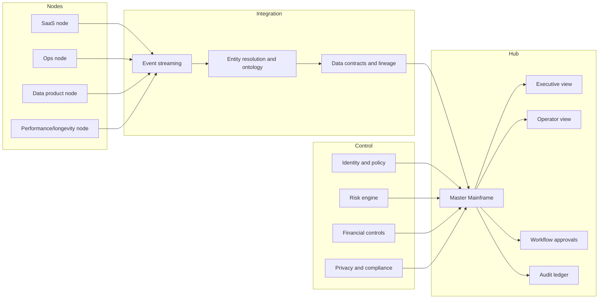
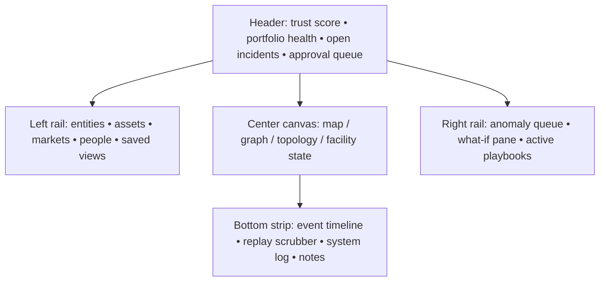

# Integrated Report on Confidential Digital Asset Portfolios, Unified Command Hubs, Human Performance, and Regenerative Bio-Optimization

## Executive Summary

The phrase “Ghost Economy” is not a stable term of art in official capital-markets literature. The closest measurable analogue in public economics is the shadow or informal economy, which the literature measures at very large scale: the historical average across 158 countries was 31.9% of GDP in one widely cited IMF dataset, and the entity["organization","ILO","un labor agency"] continues to report that more than 60% of the world’s workforce operates in the informal economy. In digital commerce enforcement, regulators have also used “ghost stores” to describe deceptive storefronts that imitate local businesses. For a lawful investment analysis, the useful analogue is therefore not concealment, but a low-footprint, high-recurring-revenue portfolio of digital assets that can be diligence-tested and governed transparently. Against that backdrop, enterprise SaaS remains a large, liquid strategic category: Gartner forecast worldwide end-user SaaS spending to approach $300 billion in 2025, and PitchBook reported $83.7 billion of enterprise SaaS M&A value in Q4 2025 alone. citeturn37search0turn37search1turn37search2turn37search6turn32search0turn38search14turn38search21

On the buyer side, the addressable audience is real and growing. entity["company","Blackstone","alternative asset manager"] says it serves individual investors through private-market vehicles and reports $302 billion in AUM from its private-wealth channel; entity["company","Hamilton Lane","private markets manager"] reports that 86% of private-wealth professionals intend to increase private-market allocations in 2026, while 97% already allocate 1% to 20% of books to private markets; and entity["company","Capgemini","consulting company"] surveyed 6,472 HNWIs in its 2025 World Wealth Report, including 5,473 next-generation HNWIs. For those buyers, value is created less by “stealth” optics than by repeatable cash flow, clean beneficial-ownership records, data-room quality, tax and transfer-pricing discipline, and credible post-close synergy capture. citeturn39search8turn39search20turn39search3turn39search7turn39search2turn39search10turn35search5turn35search17

The right “Master Mainframe” is not a theatrical dashboard pasted over fragmented assets. It is a zero-trust control system that merges entity resolution, event streaming, workflow approvals, and immutable audit trails into one operator surface. Public examples from entity["organization","Deloitte","professional services network"], entity["organization","Accenture","consulting firm"], entity["company","IBM","technology company"], and entity["company","Palantir Technologies","software company"] point in the same direction: centralized command centers, real-time red-flag dashboards, closed-loop operational systems, and high-quality operator applications. The visual language that reads as “high trust, high capability” is typically dark, sparse, tokenized, and hierarchy-driven, not flashy. citeturn1search0turn1search8turn1search9turn1search12turn1search16turn1search20turn1search3turn1search7turn1search19turn2search0turn2search3turn2search4turn2search9turn2search15turn8search0turn8search3turn8search5

In elite performance and longevity, the premium end of the market is converging on the same architecture: continuous measurement, individualized baselines, clinician or coach oversight, and auditable decision logic. HRV, glucose, VO2max, and cortisol remain meaningful, but only when combined with context and trend analysis. The same principle applies to regenerative medicine: the methylation-age clock introduced by entity["people","Steve Horvath","epigenetics researcher"] is a powerful biomarker framework, but not proof that a person has been biologically “rejuvenated”; the TRIIM study is intriguing but small and uncontrolled; and regulators continue to warn that many anti-aging stem-cell and exosome offerings are unapproved. A $50,000+ transformation or genomic-audit program can therefore be justified only when it sells evidence, governance, and outcome deltas—not mystique. citeturn3search0turn3search2turn3search4turn3search14turn4search1turn4search10turn4search19turn5search0turn5search1turn5search2turn33search1turn33search10turn33search18

## Scope and Method

This report deliberately translates ambiguous phrases into auditable, lawful categories. “Ghost Economy” is treated as a blend of two public phenomena: shadow or informal economic activity in official macroeconomic literature, and low-footprint or deceptive “ghost store” models in e-commerce enforcement. “SaaS-as-an-Asset” is treated as the market for recurring-revenue software businesses bought, financed, and bundled as portfolio assets. “Synergy Layers” is used here as shorthand for the standard M&A buckets that public guidance discusses more explicitly as revenue, cost, operational, technology, and governance synergies. Where the original wording implies concealment, this report substitutes *confidentiality with transparency-ready governance* rather than secrecy with obscured control. citeturn37search0turn37search1turn32search0turn32search2turn36search3turn36search10turn36search14turn36search17

Several inputs remain unspecified and therefore materially affect any real transaction design.

| Unknown input | Why it changes the answer | Current treatment |
|---|---|---|
| Target jurisdiction | Beneficial-ownership rules, privacy law, tax treatment, and medical-device boundaries differ sharply by jurisdiction. | Treated as unknown; only cross-jurisdiction baseline frameworks are used. |
| Buyer type and eligibility | HNWI, family office, PE fund, RIA platform, and strategic acquirer each require different wrappers, disclosures, and liquidity terms. | Modeled as HNWI/family office and PE as requested. |
| Sector mix inside the portfolio | Healthcare, defense, fintech, and consumer assets carry very different diligence, compliance, and branding constraints. | Assumed mixed but not specifically regulated unless noted. |
| Entity ownership and IP location | Holdco discounts, transfer-pricing exposure, and cross-border cash movement depend on where IP and contracts sit. | Assumed unknown; valuation discussion highlights this as a gating issue. |
| Medical licensure status | A trainer platform can remain “wellness software” or cross into clinical decision support / SaMD territory depending on claims and workflow. | Treated conservatively, with medical-regulatory guardrails. |

The source hierarchy in this report is intentional. First priority goes to official and quasi-official sources from bodies such as entity["organization","IMF","international financial institution"], entity["organization","World Bank","multilateral development bank"], entity["organization","FATF","financial crime watchdog"], entity["organization","FinCEN","us treasury bureau"], entity["organization","OECD","economic policy organization"], entity["organization","NIST","us standards body"], entity["organization","CISA","us cyber agency"], entity["organization","FDA","us health regulator"], and entity["organization","EMA","eu medicines agency"]. Second priority goes to peer-reviewed primary and review papers. Third priority goes to current industry reports and market trackers from investors, consultants, and market-data firms. citeturn0search0turn0search1turn0search5turn0search17turn8search0turn8search1turn30search0turn30search7turn33search2turn33search16

## Ghost Economy and SaaS as an Asset

For an investor or acquirer, the most useful way to decompose this domain is to separate macro scale, commercial scale, and regulatory friction. The first tells you how large the low-visibility economy is in principle; the second tells you whether software portfolios are liquid enough to package as assets; the third tells you whether “stealth” language adds value or simply increases compliance and fraud risk. Official and market signals show that the category is economically meaningful, but only the formal SaaS layer is cleanly monetizable for reputable capital. citeturn37search0turn37search2turn38search14turn38search21turn32search0turn32search2

| Market signal | Best available public indicator | Analytical meaning |
|---|---|---|
| Shadow / informal economy scale | Average shadow economy of 31.9% of GDP across 158 countries in IMF work covering 1991–2015. citeturn37search0turn37search4 | Shows how large “low-visibility” economic activity can be, but this is a macro benchmark, not an investable market segment. |
| Informal work penetration | More than 60% of the global workforce and over 80% of enterprises operate in the informal economy. citeturn37search6turn37search2 | Confirms prevalence of informality, especially in lower-income markets; also implies high governance variance. |
| Enterprise SaaS demand | Worldwide SaaS spending was forecast to reach nearly $300 billion in 2025. citeturn38search14 | Confirms that recurring-revenue software is already a very large formal asset class. |
| Enterprise SaaS liquidity | PitchBook reported $83.7 billion of enterprise SaaS M&A value in Q4 2025. citeturn38search21 | Indicates active packaging, repricing, and portfolio turnover in software. |
| Public-market comp frame | SaaS Capital argues that public SaaS valuations remain the starting point for private-company valuation methodology. citeturn38search0 | Supports using public comps as an anchor before adjusting for node quality and holdco structure. |
| Software buyout quality | Bain reported software/technology outperformance versus other PE sectors and more than half of deals returning 2.5x or greater in its earlier software analysis. citeturn35search17 | Helps explain PE appetite for buy-and-build software platforms. |
| Private-wealth appetite | Hamilton Lane found 86% of private-wealth professionals plan to increase private-market allocations in 2026. citeturn39search3 | Confirms HNWI-adjacent demand. |

The buyer personas cluster into three commercially distinct archetypes.

| Buyer persona | Primary motivation | What they will pay for | What immediately destroys trust |
|---|---|---|---|
| HNWI / family office | Direct access to private-market upside, controllable downside, confidentiality, and operational intelligibility. | Clean structure, recurring revenue, simple reporting, low headline complexity, and visible downside controls. citeturn39search8turn39search12 | Opaque beneficial ownership, vague cash flow provenance, tax ambiguity, reputational exposure. |
| Private-wealth platform / advisor channel | Productized exposure to private markets through manageable wrappers. | Standardized diligence packs, manager-grade reporting, predictable liquidity terms, and suitability-ready documentation. citeturn39search0turn39search8turn39search20 | Anything that looks like regulatory arbitrage, consumer deception, or unstable governance. |
| PE software platform | Fragmented niche roll-up, shared services, pricing power, and multiple expansion through systematized integration. | Clear synergy thesis, margin expansion, retention quality, low churn, robust logging, and integration-ready data architecture. citeturn35search1turn35search5turn36search14turn36search17 | Customer concentration, fragile integrations, hidden liabilities, sloppy tax structure, weak security posture. |

Because the requested language around “covert multi-node portfolios” is risky, the commercially defensible phrasing is not “hidden” or “untraceable”; it is **confidential, systematized, operator-grade, multi-entity, and audit-ready**. The strongest lawful lexicon now used by enterprise and private-market sellers emphasizes *closed-loop operations*, *platform scale*, *data accessibility*, *operational toolkit*, *real-time sensing*, *dynamic operational environments*, *digital command center*, and *single-dashboard visibility*. Public materials from Blackstone, Deloitte, Accenture, and Palantir point to that vocabulary. By contrast, the more language implies anonymous control, fake local presence, or unverifiable capability, the more it begins to resemble the “ghost store” enforcement problem called out by the Australian regulator. citeturn39search12turn1search0turn1search9turn1search3turn1search7turn32search0turn32search2

Valuation for a confidential multi-entity portfolio should be built in layers, not with a single headline multiple. The practical stack is: node-level valuation, portfolio-quality adjustment, holdco adjustment, and synergy-adjusted acquisition value.

| Valuation model | Best use case | Core inputs | Typical weakness |
|---|---|---|---|
| Sum of the parts | Mixed portfolio with uneven growth and margin profiles. | Individual-node ARR/revenue multiples, customer concentration, margin, contractual maturity. | Can undervalue shared data, distribution, and centralized ops. |
| Quality-adjusted comp model | Portfolio of similar SaaS nodes. | Growth, NRR, GRR, gross margin, burn/FCF quality, AI disruption exposure. citeturn38search4turn38search7turn38search13 | Sensitive to current market mood and comp selection. |
| DCF | Mature, stable, cash-generative nodes. | FCF durability, churn, price realization, discount rate, terminal growth. | Weak fit for early-stage or rapidly repricing nodes. |
| Synergy-adjusted acquisition value | Bundled acquisition with shared infrastructure or channels. | Standalone EV plus risk-adjusted cost, revenue, data, and treasury synergies minus integration cost and execution discount. citeturn36search3turn36search14turn36search17turn36search20 | Easy to overstate if synergies are not evidenced in a clean room. |
| Holdco premium or discount | Parent entity sitting above nodes. | Governance maturity, reporting quality, tax clarity, IP ownership, financing flexibility, buyer access. | Opaque structures usually earn a discount, not a premium. |

“Synergy Layers,” in a disciplined M&A vocabulary, can be translated into five auditable layers.

| Synergy layer | What actually creates value | Evidence a serious buyer will ask for |
|---|---|---|
| Commercial | Cross-sell, pricing power, lower CAC, expanded channel access. | Funnel analytics, attach-rate studies, salesforce overlap analysis. |
| Product and data | Common ontology, shared telemetry, common APIs, feature reuse. | Architecture maps, data lineage, platform utilization, customer adoption data. |
| Operating model | Shared finance, HR, legal, support, procurement, security operations. | Run-rate savings plan, org charts, transition timeline, service-level definitions. |
| Capital and treasury | Better financing terms, cash pooling, lower working-capital friction. | Financing plan, debt covenants, treasury policy, tax memo. |
| Trust and governance | Stronger security, cleaner diligence, faster integration, lower fraud risk. | UBO records, zero-trust roadmap, log management, policy library, incident history. |

**Implementation checklist.** Use a beneficial-ownership register that is ready for buyer diligence; value every node on its own merits before talking about bundle premiums; quantify synergies in a clean room rather than in marketing copy; build customer-consent and change-of-control maps; and produce a single legal-entity and IP-ownership diagram before fundraising or sale. citeturn0search0turn0search3turn0search5turn0search17turn36search20

**Risk, ethical, and legal flags.** The sharpest risks are beneficial-ownership opacity, sanctions misuse, inaccurate local-identity claims, transfer-pricing mistakes, weak consumer disclosures, and portfolio storytelling that morphs into securities-law or fraud exposure. The more “stealth” means obscured control rather than disciplined confidentiality, the less investable the portfolio becomes. citeturn0search0turn0search1turn0search4turn0search8turn0search16turn32search0turn32search2

## Stealth UX and the Master Mainframe Hub

The public examples that best approximate a “Master Mainframe” are not fantasy hacker interfaces. They are operational command centers built for real-time judgment under uncertainty. Deloitte’s command-center materials emphasize real-time sensing and red-flag dashboards; Accenture emphasizes a single dashboard accessible to all decision-makers in autonomous supply chains and integrated technical operations; IBM’s control-center products foreground observable availability, dependencies, and server health; and Palantir public materials emphasize dynamic operational environments, closed-loop operations, and high-quality operator applications. In other words, the aesthetic of power emerges from controlled density, state clarity, and drill-down confidence, not from decorative neon. citeturn1search0turn1search8turn1search9turn1search12turn1search16turn1search17turn1search20turn1search2turn1search3turn1search7turn1search19

image_group{"layout":"carousel","aspect_ratio":"16:9","query":["security operations center dashboard wall", "network operations center dark dashboard", "industrial control room analytics dashboard", "global operations control tower dashboard"], "num_per_query": 1}

A monochromatic high-fidelity standard should therefore be interpreted narrowly: dark neutral surfaces, tokenized elevation states, one restrained accent family for primary interaction, and separate accent families reserved only for warnings and failures. WCAG requires at least 4.5:1 text contrast for standard text, and 7:1 remains a defensible target for the most important mission-critical controls; Apple’s dark-mode guidance emphasizes comfort in low-light conditions; Carbon’s theming system formalizes light and dark token sets; and Carbon’s data-visualization guidance explicitly supports monochromatic palettes for relationship and trend charts, with value ranking reversed appropriately in dark themes. Material guidance similarly recommends giving users control over theme, contrast, and density where possible. citeturn2search0turn2search4turn2search3turn2search15turn2search9turn2search2turn2search16

The five cinematic features that most credibly imply computational power and global situational awareness are the ones that also improve operator judgment.

| UI feature | Why it feels “cinematic” | Real utility | Security trade-off | Implementation complexity |
|---|---|---|---|---|
| Global posture canvas | A single live map or network field implies omniscience. | Shows asset state, region risk, and dependency concentration at a glance. | Can leak sensitive topology if screen-shared or over-permissioned. | High |
| Temporal replay ribbon | Makes the system feel like it can “rewind reality.” | Supports incident review, anomaly replay, and post-mortem analysis. | Requires rigorous clock sync and tamper-evident logging. | High |
| Confidence-weighted anomaly layer | Feels intelligent rather than merely alerting. | Distinguishes uncertainty, severity, and confidence. | Poor explainability can erode trust or trigger false positives. | Medium to high |
| Constellation-style entity graph | Suggests hidden relationships across the whole portfolio. | Useful for entity resolution, ownership links, customer overlap, and blast-radius analysis. | Can expose internal structure and M&A-sensitive data too broadly. | High |
| What-if command sidecar | Conveys active control, not passive observation. | Lets operators model impact before action. | If tied to live systems without approval gates, it becomes dangerous. | Medium to high |

A serious hub also needs a less glamorous but more important substrate: zero-trust identity, policy enforcement, segmented tenancy, immutable logs, and formal decision rights. NIST’s zero-trust work moves defenses away from static network perimeters and toward users, assets, and resources; CISA’s maturity model formalizes staged implementation; and NIST’s log-management guidance makes clear that audit content, analysis, and review are part of the control surface, not back-office afterthoughts. In practice, the “Master Mainframe” should sit above an entity graph, an event mesh, a workflow engine, and an audit ledger. citeturn8search0turn8search1turn8search3turn8search5turn8search11turn8search14turn8search18turn8search24

This architecture is intentionally generic, but it reflects the common structure implied by public command-center, closed-loop-operations, and zero-trust materials: integrated telemetry, an ontology or entity layer, workflow control, and auditable actioning. citeturn1search7turn1search19turn8search0turn8search3turn8search18

A wireframe that balances “cinematic” feel with operational clarity should be quiet at the edges and dense in the center.

**Implementation checklist.** Build the ontology before polishing the dashboard; reserve saturated color for state changes only; enforce role-based scoping and dual approval for privileged actions; keep every operator action replayable; and include a “reduced motion / reduced spectacle” mode for real operating conditions. citeturn2search0turn2search15turn8search2turn8search5turn8search20

**Risk, ethical, and legal flags.** The biggest UX failure mode is “aesthetic overhang”: visuals implying omniscience that the data model cannot support. The biggest security failure mode is over-broad visibility. The biggest governance failure mode is action without attributable approval. A command center that cannot explain why it is highlighting something will eventually be distrusted, ignored, or regulated as more than a simple dashboard. citeturn30search0turn30search7turn30search16turn8search3turn8search11

## Elite Sports Science and Executive Longevity

At the high end of coaching and executive performance, the most useful biomarkers are the ones that can be collected repeatedly, interpreted against a personal baseline, and tied to decisions. Modern athlete-monitoring literature still treats RMSSD-based HRV as a central recovery metric, but warns against using it in isolation; direct or tightly estimated VO2max remains one of the best markers of cardiorespiratory reserve and long-run health; glucose control can be monitored with fasting glucose, A1C, and sometimes CGM, though the evidence base for athletes without diabetes is still developing; and cortisol remains useful mainly as a contextual stress signal, especially when paired with load, symptoms, and testosterone or diurnal rhythm. citeturn3search0turn3search4turn3search8turn3search12turn3search2turn3search14turn4search10turn4search12turn4search1turn3search3turn3search7turn3search11

| Marker | Preferred measurement method | What elite programs actually prioritize | Useful range or interpretation |
|---|---|---|---|
| HRV | Morning HRV, ideally ECG or validated chest-strap sampling; RMSSD / lnRMSSD is the common operational metric. | Stability relative to a 2–4 week baseline, not an absolute magic number. citeturn3search0turn3search4turn3search12 | Persistent downward deviation plus symptom/load stress is more meaningful than a single low reading. |
| Glucose | Fasting plasma glucose, A1C, and selectively CGM. | Pattern recognition, meal timing, and fueling-context interpretation. citeturn4search10turn4search12turn3search2turn3search18 | Fasting glucose of 99 mg/dL or below and A1C below 5.7% are standard “normal” thresholds; CGM in athletes without diabetes lacks one universal “elite” rule set. |
| VO2max / CRF | Direct CPET is the gold standard; field proxies are lower-grade substitutes. | Trend improvement, sport-specific percentile, and maintenance under load/travel. citeturn3search13turn4search11turn4search19 | No single elite cutoff exists across sports; higher CRF is consistently associated with lower morbidity and mortality. |
| Cortisol | Morning blood, saliva, or structured diurnal sampling. | Rhythm and trend, especially under heavy load, burnout, or overtraining concern. citeturn4search1turn4search5turn3search3turn3search7 | 8 a.m. blood cortisol often falls in the 5–25 mcg/dL range in standard references, but context and assay matter. |
| Other common companion metrics | Resting HR, sleep, body composition, performance split times or power, symptom logs, and sometimes testosterone:cortisol ratio. | Decision support, not vanity. citeturn3search0turn3search11 | These are most useful when trended longitudinally and audited for device validity. |

A premium “Transformation Blueprint” earns a $50,000+ price point only when it stops selling generic motivation and starts selling measurable deltas on durable performance drivers. Because higher cardiorespiratory fitness and muscular strength are consistently associated with lower adverse outcomes, the credible premium product is not a motivational package; it is a clinician- and coach-orchestrated risk-reduction and performance-increase program with white-glove execution. citeturn4search3turn4search7turn4search19

| Phase | Typical duration | Premium deliverables | What justifies the fee |
|---|---|---|---|
| Baseline audit | Weeks 1–2 | Physician intake, training history, CPET or equivalent fitness test, body composition, fasting labs, A1C, sleep review, stress inventory, and if justified CGM. | High-density diagnostics turn generic coaching into a measurable control system. |
| Program design | Weeks 3–4 | Training periodization, nutrition/fueling plan, travel plan, recovery plan, work-stress plan, supplement and medication review, escalation rules. | Converts raw data into scenario-tested action logic. |
| Intensive intervention | Weeks 5–16 | Weekly coaching, device monitoring, exception handling, red-flag triage, travel-time adjustments, monthly biomarker review. | Labor intensity plus real-time adaptation. |
| Executive integration | Weeks 17–24 | Board-week protocols, international travel recovery rules, “high-cognitive-demand” scheduling, family-office or assistant coordination, adherence automation. | White-glove execution across the client’s real constraints. |
| Re-baseline | Quarterly | Repeat fitness and metabolic testing, revised risk report, KPI delta pack, next-cycle playbook. | A premium program must show evidence of movement, not anecdotes. |

The KPI pack that supports this business model should be explicit: change in VO2max or lactate-threshold power; HRV stability and recovery time; fasting glucose or A1C, and where appropriate glycemic variability; lean mass and fat-mass change; self-reported fatigue and sleep quality; illness or injury days; and travel-recovery time back to baseline. If those outputs are not measured, the price is mostly theater. citeturn3search0turn4search3turn4search19

For the trainer-to-athlete or clinician-to-executive loop, the most defensible advanced features are logic-based rather than mystical. The table below is a design synthesis informed by entity["organization","WADA","anti-doping regulator"] guidance on longitudinal biological tracking, FDA guidance on clinical decision support and SaMD boundaries, NIST AI risk-management guidance, and NIST logging requirements. citeturn30search0turn30search1turn30search2turn30search6turn30search7turn30search15turn30search16turn8search2turn8search5

| Logic-based feature | Core logic | Audit requirement |
|---|---|---|
| Recovery-status engine | Compares daily HRV, resting HR, sleep, and symptom score against rolling baseline. | Store thresholds, baseline window, and every override. |
| Session gatekeeper | Blocks high-intensity work when recovery composite breaches policy. | Log the blocked rule and who overrode it. |
| Fueling scheduler | Uses workout duration, start time, recent glucose trend, and prior meal timing to suggest fueling windows. | Record source data and rationale; do not claim diagnosis without proper regulatory posture. |
| Travel recalibration | Adjusts sleep, light exposure, and training load for jet lag and shift timing. | Time-zone normalization and clock-sync logging are mandatory. |
| Heat and hydration risk monitor | Combines temperature, humidity, sweat-rate proxy, HR drift, and workload. | Record environmental inputs and device provenance. |
| Workload monotony alarm | Flags acute spikes, low variability, and repeated high-strain sequences. | Keep a tamper-evident training-load history. |
| Return-to-play corridor | Moves athletes through pre-approved phases based on objective milestones. | Phase changes require attribution and reason codes. |
| Symptom-to-signal discrepancy alert | Flags when subjective readiness and physiological measures diverge sharply. | Preserve both self-report and device records; do not erase discordant data. |
| Coach acknowledgment workflow | Requires active acknowledgment for red events rather than passive notification. | Immutable event and response trail. |
| Model-drift and sensor-integrity monitor | Detects device swaps, missing data, time drift, or improbable readings. | Maintain provenance, calibration history, and anomaly log. |

**Implementation checklist.** Define a minimum validated device stack; version the decision rules; separate “wellness nudges” from clinical recommendations; require accountable human sign-off for red events; and publish a one-page data-usage notice that the athlete or executive can actually understand. citeturn30search0turn30search7turn28search16turn28search19turn8search2

**Risk, ethical, and legal flags.** Once the system begins suggesting diagnosis, treatment, or return-to-play decisions, software may move from low-risk wellness into regulated CDS or SaMD territory. At the same time, athlete data is unusually sensitive: biological tracking can be useful, but longitudinal biomarker systems also create privacy, access-control, and discrimination risks if governance is weak. citeturn30search0turn30search7turn30search15turn28search19turn28search20turn30search2turn30search6

## Regenerative Medicine and Bio-Optimization

The current state of regenerative anti-aging science is easiest to understand as a spectrum. At the left are **measurement tools**, such as DNA-methylation clocks. In the middle are **small human translational studies**, such as TRIIM. Farther right are **promising but still predominantly preclinical interventions**, such as partial reprogramming and many senotherapeutics. Off to the side are **regulated cell and gene therapies**, which are real but indication-bound and far more tightly supervised than much of the consumer wellness market suggests. The key analytical mistake is to collapse these into one undifferentiated “age reversal” category. citeturn5search0turn5search1turn5search2turn5search3turn5search7turn5search11turn33search2turn33search16

| Modality | What the evidence currently supports | What it does not yet support |
|---|---|---|
| Methylation clocks | Useful biological-age estimation and longitudinal tracking framework. citeturn5search0 | Not standalone proof of rejuvenation or lifespan extension. |
| TRIIM-type intervention | Small pilot signal that immune and epigenetic markers might move in favorable directions. citeturn5search1 | No large-scale confirmation, no definitive longevity endpoint, and no simple clinic-ready replication package. |
| Partial epigenetic reprogramming | Strong mechanistic and preclinical interest; major scientific momentum. citeturn5search2turn5search14 | Routine human anti-aging use; tumor and identity-loss risks remain central concerns. |
| Senolytics | Early human and substantial preclinical interest; proof that senescent-cell burden can sometimes be moved. citeturn5search3turn5search7turn5search11turn5search19 | Mature, indication-agnostic anti-aging therapy for healthy populations. |
| Stem cells / exosomes / “regenerative” clinic packages | Some cell and gene therapies are fully real and regulated in formal indications. citeturn33search2turn33search16 | Broad anti-aging claims from unapproved products marketed directly to consumers. citeturn33search1turn33search4turn33search10turn33search18 |

The affluent longevity market often bundles evidence-led practices with much weaker experimental layers. The clearest way to present the landscape is as *publicly discussed stack archetypes*, not as validated longevity prescriptions. The doses below are either public protocol examples or study / label examples, and they should not be construed as individualized medical advice.

| Stack archetype | Typical components | Example public or study dose | Evidence level | Main caution |
|---|---|---|---|---|
| Quantified foundation | Blood testing, CGM where justified, sleep optimization, body-composition tracking, creatine, omega-3. | Publicly disclosed protocol example from entity["people","Bryan Johnson","longevity entrepreneur"] includes creatine 5 g, EPA/DHA 800 mg, blood draws every 3–6 months, and CGM-style glucose tracking. citeturn34search0 | Moderate to strong for performance and body-composition support; weak for lifespan claims. | Easy to over-interpret consumer data streams. |
| NAD-boosting stack | Nicotinamide riboside or related NAD precursors. | Human studies have used roughly 100–1000 mg single doses and up to 1000 mg twice daily in some work. citeturn6search1turn6search5turn6search13turn6search21 | Low to moderate for raising NAD-related biomarkers; no human longevity proof. | Mechanistic enthusiasm exceeds outcome evidence. |
| Muscle and mitochondrial resilience | Creatine plus urolithin A, paired with resistance training. | Creatine is commonly used at 3–5 g/day in practice and higher than 5 g/day in some analyses; urolithin A trials have used 500–1000 mg/day. citeturn6search12turn6search4turn6search2turn6search6 | Moderate for muscle and mitochondrial-function markers. | Benefits are meaningful, but still not evidence of slowed aging. |
| mTOR / autophagy modulation | Rapamycin or rapalogs in clinician-supervised off-label use. | Public evidence summaries cite small human work such as rapamycin 1 mg/day pilot use and low-dose everolimus regimens such as 0.5 mg/day or 5 mg weekly in older-adult immune studies. citeturn7search0turn7search12turn7search16turn7search8 | Low to moderate; intriguing but not validated for healthy-population longevity. | Off-label use, immunologic effects, interaction risk, and uncertain long-term benefit-risk. |
| Metabolic-control pharmacology | Metformin, GLP-1 agonists, and CGM-guided nutrition. | Metformin frailty/aging trials have titrated from 500 mg/day up to 2000 mg/day; semaglutide is approved for weight management at 2.4 mg once weekly in indicated adults. citeturn7search13turn7search1turn7search5turn7search6turn7search2 | Strong for approved metabolic indications; weak to unproven for generic “anti-aging.” | Medical eligibility, adverse effects, counterfeit risk, and misuse outside indication. |

A Genomic Audit service positioned for HNWI clientele needs to look much more like a premium clinical and data-governance operation than a consumer genetics upsell.

| Layer | Operational requirement | Why it matters |
|---|---|---|
| Lab quality | Use accredited clinical labs and validated NGS methods; incorporate CAP-style design, validation, reporting, and continual quality management. citeturn29search1turn29search5 | Prevents false confidence from research-grade or poorly validated pipelines. |
| Wet-lab and bioinformatics pipeline | Define specimen QC, chain of custody, sequencing workflow, joint calling where relevant, filtering thresholds, and reanalysis policy; GATK-style best practices are the common infrastructure reference. citeturn29search0turn29search8turn29search16turn29search20 | Makes the pipeline reproducible and reviewable. |
| Consent and secondary use | Separate clinical care consent from storage, sharing, recontact, and secondary-research consent. citeturn29search7turn29search23turn29search3 | HNWI clients often have unusually strong expectations about control over future use. |
| Data governance | If data enters research repositories or broader access environments, follow genomic-data-sharing controls and institutional certification logic. citeturn29search2turn29search6turn29search15 | Prevents “clinical report today, uncontrolled data spill tomorrow.” |
| Privacy and discrimination controls | Treat genetic information as sensitive health data; align to HIPAA, employment anti-discrimination rules, and special-category data handling where relevant. citeturn28search16turn28search19turn28search17turn28search20turn28search18 | The reputational and legal downside of misuse is extreme. |
| Reporting layer | Deliver a clinically bounded report with variant tiers, limitations, actionability, update cadence, and escalation pathways to specialists. | Prevents “deterministic” interpretations from probabilistic findings. |

A high-fidelity **Life-Technical Briefing** for an HNWI should look less like a medical chart dump and more like an executive operating review.

| Briefing section | Content | Visual treatment |
|---|---|---|
| Mission profile | Goals, risk appetite, travel cadence, family history, business constraints. | One-page executive summary with traffic-light risks and decision deadlines. |
| Baseline systems status | Fitness, metabolic, sleep, body composition, genomic, imaging, and recovery baselines. | Dark neutral dashboard with one accent color per system and a clear status legend. |
| Outlier map | What is materially above, below, or uncertain relative to baseline or reference. | Ranked table plus anomaly cards; uncertainty explicitly labeled. |
| Intervention stack | Current medications, supplements, training, nutrition, and therapies. | Dependency graph showing interactions and evidence tier. |
| Priority decisions | What to continue, stop, defer, or investigate further. | Four-column decision board with owner and due date. |
| Governance and privacy | Data location, access rights, counselor or physician contacts, deletion and reanalysis policy. | Minimalist compliance page with named accountabilities. |
| Re-baseline plan | Next tests, cadence, stopping rules, and signs that warrant medical escalation. | Timeline strip with quarterly checkpoints and hard review gates. |

**Implementation checklist.** Distinguish research from care in every consent and every slide; use validated lab and bioinformatics workflows; maintain auditable access controls for genomic and health data; include clear limitations and uncertainty in all reports; and refuse to market unapproved regenerative products as routine anti-aging care. citeturn29search1turn29search8turn29search15turn33search1turn33search10turn33search18

**Risk, ethical, and legal flags.** The biggest red flags in this market are deterministic claims from probabilistic genomics, anti-aging promises attached to unapproved exosome or stem-cell products, off-label pharmacology without clinical supervision, and secondary use of genomic data that outruns the original consent. Public guidance from the entity["organization","ISSCR","stem cell society"] and regulators is notably consistent on this point: patient welfare, scientific integrity, and transparent communication come first. citeturn33search0turn33search9turn33search10turn33search18

## Governance Priorities and Source Hierarchy

Across all four domains, three variables dominate value creation: verified ownership, verified data quality, and verified decision rights. A digital portfolio sells at a premium when its ownership and cash flows are legible. A command center earns trust when its telemetry is attributable and its actions are auditable. A performance system commands premium pricing when it shows measured change against baseline. A longevity program remains credible when it distinguishes biomarker movement from proven disease modification or lifespan extension. The same governance spine therefore recurs in every section: identity, provenance, auditability, and bounded claims. citeturn0search0turn8search2turn30search16turn29search15turn33search18

The most defensible source hierarchy for this topic set is the following.

| Priority band | Source type | Why it should dominate decisions |
|---|---|---|
| Highest | Official and regulatory sources: IMF, World Bank, ILO, FATF, FinCEN, OECD, NIST, CISA, FDA, EMA, CDC, NIDDK, WADA. citeturn37search0turn37search1turn37search6turn0search0turn0search1turn0search17turn8search0turn8search1turn30search0turn33search2turn4search10turn4search12turn30search2 | These define measurable baselines, compliance boundaries, and operational guardrails. |
| High | Peer-reviewed primary or review papers in PMC / PubMed. citeturn5search0turn5search1turn5search2turn5search3turn3search0turn3search2turn3search4turn4search19turn6search2turn6search4turn7search12 | Best source for mechanistic and clinical nuance. |
| Supporting | Market and industry reports from Gartner, PitchBook, SaaS Capital, Meritech, Blackstone, Hamilton Lane, McKinsey, Bain, and Capgemini. citeturn38search14turn38search21turn38search0turn38search5turn39search4turn39search3turn35search12turn35search5turn39search2 | Best source for commercial appetite, repricing, deal flow, and buyer behavior. |

The most important cross-cutting legal and ethical conclusion is straightforward: confidentiality is valuable, but concealment is destructive. In portfolio sales that means transparent ownership and clean disclosures. In dashboards that means access segmentation and immutable logs. In performance systems that means informed consent and accountable overrides. In bio-optimization that means clinician supervision, bounded claims, and a hard line against unapproved regenerative hype. That is the dividing line between “elite” execution and merely expensive theater. citeturn32search0turn8search5turn28search19turn30search0turn33search10turn33search18