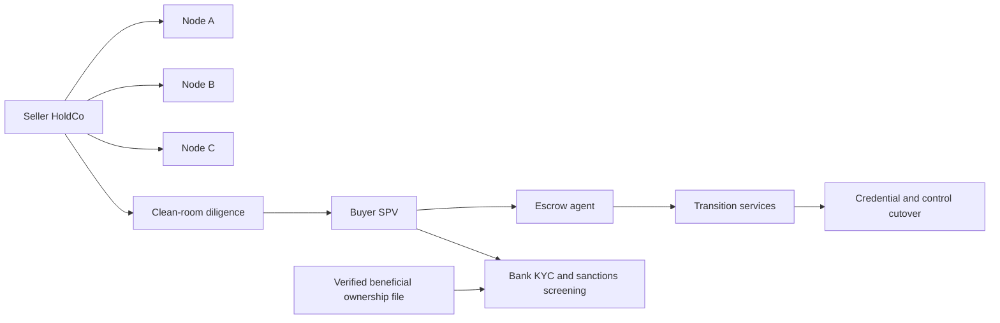
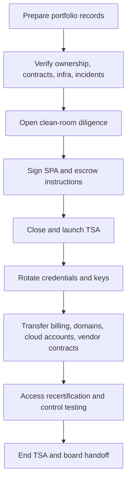

# Ghost Economy and High-End SaaS as an Asset Markets

## Executive summary

This report treats **“Ghost Economy”** as a working term for the confidentiality-driven segment of digital-asset commerce in which software assets are marketed quietly, with limited public signaling, but **not** through concealment of beneficial ownership, source of funds, sanctions exposure, or reportable interests. For analytical rigor, “covert” and “stealth” are therefore interpreted here as **lawful confidentiality**, invitation-only process design, and low-publicity branding. Anything intended to hide true ownership or evade AML, sanctions, or tax obligations materially changes the risk profile and is outside a defensible transaction model. citeturn37view4turn37view3turn40view5

The nearest measurable market is not an official “SaaS-as-an-asset” category but the intersection of software buyouts, private-market recurring-revenue investments, and direct private-capital allocations. On that basis, three facts matter most. First, global buyout value rebounded to **$602 billion in 2024**, with **technology representing 33% of buyout value**, implying roughly **$199 billion** of tech buyout volume as an upper-bound lens for the control-oriented software market. Second, in North America, technology’s share of PE deals rose to **22% by July 2025**, up from **19%** at end-2024, showing sustained sponsor appetite. Third, private SaaS valuations normalized rather than collapsed: the entity["company","SaaS Capital","software finance firm"] index began 2025 at **7.0x current run-rate revenue**, after stabilizing in a **6–7x** band. citeturn19view0turn14view2turn14view3

Capital supply from wealthy buyers is also large and growing. entity["company","Capgemini","IT consulting company"] reports that the global HNWI population rose **2.6% in 2024**, with the UHNWI population up **6.2%**, and that HNWIs now allocate **15%** of portfolios to alternatives, including private equity. entity["company","UBS","Swiss bank"] reports that global wealth covered by its 2025 study reached **$471 trillion**, that the world added more than **680,000** new USD millionaires in 2024, and that around **$83 trillion** is expected to transfer over the next 20–25 years. Its 2025 family-office survey shows alternatives at **44%** of average portfolios and private equity at **21%** overall, while its billionaire survey shows **49%** of billionaires planning to increase direct private-equity exposure over the next 12 months. citeturn17view0turn14view4turn23view0turn15view0

Buyer motives split cleanly by archetype. Single-family offices and direct UHNW buyers care most about capital preservation, discretion, downside control, yield quality, and understandable operating mechanics. PE firms care more about repeatable value-creation levers, speed of diligence, quality of recurring revenue, leverage capacity, and post-close integration or platform expansion. Public filings from entity["company","Vista Equity Partners","private equity firm"], entity["company","TPG","private equity firm"], entity["company","The Carlyle Group","private equity firm"], and entity["company","Blackstone","alternative asset manager"] all emphasize the same cluster of drivers: mission-critical software, recurring revenue, operational control, sector specialization, and certainty of execution. citeturn20view0turn24view0turn24view1turn21search1turn21search7

Legally and operationally, the decisive distinction is **confidentiality versus concealment**. The defensible model is: verified beneficial ownership, source-of-wealth and source-of-funds evidence, sanctions look-through, structured digital identity proofing, bankable documentation, auditable access controls, and staged transfer mechanics. The indefensible model is: nominee opacity, undisclosed controllers, sham divestments, disguised related-party structures, or messaging that implies the asset can be held “off-book” or beyond screening. Global AML standards from the entity["organization","Financial Action Task Force","global aml body"], current U.S. BOI developments at the entity["organization","Financial Crimes Enforcement Network","US treasury bureau"], and sanctions guidance from the entity["organization","Office of Foreign Assets Control","US treasury sanctions office"] all point in the same direction: ownership opacity has become a primary risk signal, not a luxury feature. citeturn37view4turn37view3turn37view2turn40view5turn38search1

For multi-node portfolios, the operating baseline should look like an institutional carve-out rather than an “anonymous web property” sale: zero-trust access, phishing-resistant MFA, central logging, incident-response playbooks, SBOM-backed software inventories, escrow or cloud-continuity arrangements, clean-room diligence, staged credential rotation, and well-documented TSA-style transition support. Guidance from the entity["organization","National Institute of Standards and Technology","US standards agency"], the entity["organization","Cybersecurity and Infrastructure Security Agency","US cyber agency"], and software-escrow procurement guidance all support this operating posture. citeturn39view1turn39view2turn39view3turn39view4turn8search2turn11search11turn11search19turn11search3

Valuation works best as a layered stack rather than a single multiple: a DCF or FCF view for intrinsic cash generation; an ARR or EBITDA market check; customer-based valuation for retention and future gross profit; and explicit synergy modeling across technical, commercial, data, and customer-base layers. The sharpest mistake in portfolio sales is to talk about “synergy” rhetorically rather than allocate it to specific, auditable drivers and then discount it for execution risk. OECD guidance on intangibles and corporate synergies, research on customer-based corporate valuation, and government work on data-asset valuation all support this layered approach. citeturn14view3turn19view0turn30view0turn30view1turn31view0turn29search16turn28search3

## Scope and assumptions

The user did not specify jurisdiction, transaction size, sector focus, or whether the contemplated buyer is acquiring **direct control of operating entities**, **economic interests in pooled vehicles**, or **a portfolio of standalone software assets**. This report therefore assumes a cross-border, English-language, enterprise-software context and uses major-market reference points: FATF AML standards, U.S. sanctions and beneficial-ownership examples, NIST/CISA cyber-control baselines, and OECD transfer-pricing and intangible-asset principles. U.S. rules are used where public primary sources are unusually clear, but they are presented as examples rather than universal law. This is **not legal, tax, accounting, or investment advice**. citeturn37view4turn37view3turn39view1turn39view4turn10search10turn10search2

I also assume that a **multi-node portfolio** means one or more of the following held together as a sale package: multiple legal entities, multiple products under a single HoldCo, multiple tenant environments with separable contracts, or multiple codebases sharing a common control plane. In practice, that means buyers care less about whether the portfolio looks elegant in a teaser and more about whether each node has unambiguous rights, replicable operating controls, separable economics, and assignable contracts. This framing follows how large software sponsors describe investment selection and value creation in recurring-revenue software. citeturn20view0turn24view0turn24view1

A final assumption is methodological: the phrase “covert portfolio” is analytically useful only if narrowed to **quietly marketed, brand-minimal, invitation-only** processes. Once the word means hidden controller chains, disguised asset provenance, or sanctions-evasive structuring, the transaction ceases to be a premium confidential sale and begins to resemble an AML, sanctions, securities, or tax-enforcement problem. FATF’s beneficial-ownership guidance and OFAC’s 2026 sham-transaction advisory make that distinction unusually explicit. citeturn37view4turn40view5turn37view2

## Market size and growth

There is no official database category called “high-end SaaS-as-an-asset,” so the market has to be triangulated. The most defensible upper-bound lens is **technology buyout activity**. entity["company","Bain & Company","management consulting firm"] reports that global buyout investment value reached **$602 billion in 2024**, up **37%** year over year, and that technology remained the largest buyout sector at **33% of buyout value** and **26% of volume**. That yields an implied technology-buyout value of about **$199 billion** in 2024. Because technology includes non-SaaS software, services, and other subsectors, that figure should be treated as an upper-bound lens rather than a direct measure of SaaS-only transactions. citeturn19view0

The more current momentum signal is sponsor appetite in 2025. Bain’s 2025 technology report says technology’s share of North American PE deals reached **22% as of July 2025**, versus **19%** at the end of 2024. That does not prove a broad bull market in every software niche, but it does show that buyers remain willing to underwrite technology platforms despite tighter financing conditions and more selective diligence. citeturn14view2

Pricing signals also support a real, functioning market rather than a distressed one. SaaS Capital started 2025 with a median valuation multiple of **7.0x current run-rate annualized revenue** and described the market as stabilized in the **6–7x** range, even though that is far below 2021 peak levels. In other words, the market reset from speculative growth pricing to a narrower band centered on recurring revenue quality, defensibility, and profitability discipline. That is exactly the environment in which “SaaS as an asset” becomes legible to wealthy direct buyers and value-creation-focused PE firms. citeturn14view3

On the capital-supply side, affluent buyer capacity is increasing. Capgemini reports that HNWIs now allocate **15%** of portfolios to alternatives, while UBS reports that family offices held **44%** of portfolios in alternatives in 2024 and **21%** in private equity, split between **11% direct PE** and **10% funds/funds of funds**. The billionaire survey is even more direct: **49%** of respondents planned to increase direct PE exposure over the next 12 months. That does not mean all of that capital is available for direct software acquisitions, but it does indicate a substantial and growing pool of buyers already conditioned to underwrite private, illiquid, operating-asset risk. citeturn17view0turn23view0turn15view0

The practical conclusion is that the **investable high-end SaaS-control market** is best described today as a **tens-of-billions to low-hundreds-of-billions annual opportunity**, depending on how narrowly one defines “enterprise SaaS” inside broader technology buyouts. That range is an inference from observed buyout volumes, persistent sponsor appetite, stabilized SaaS multiples, and expanding wealthy-buyer allocations to private assets. It is more rigorous than pretending the category has a formally published market size. citeturn19view0turn14view2turn14view3turn17view0turn23view0

## Buyer personas and decision drivers

Two buyer classes dominate this market: **direct wealthy buyers** and **institutional private-capital buyers**. Within wealthy buyers, the most relevant subtypes are single-family offices, founder-investors, and advisor-led UHNW syndicates. Within institutional capital, the most relevant subtypes are software-specialist PE firms, diversified buyout funds with technology teams, and continuation-vehicle or co-investment buyers. Public filings from Vista, TPG, Carlyle, and Blackstone all show the same pattern: bidders want predictable recurring cash flow, mission-critical customer use cases, operational control, and credible post-close improvement paths. citeturn20view0turn24view0turn24view1turn21search1turn21search7

Wealthy direct buyers arrive from a different emotional and institutional basis than PE sponsors. Capgemini’s 2025 report finds that next-generation HNWIs are willing to assume more risk for higher-growth and niche products, while also placing high value on cyber-protection services and high-quality digital platforms. UBS’s family-office report shows that family offices remain deeply allocated to private assets but have become more selective on direct private equity because liquidity, exits, and financing costs matter. In short, wealthy buyers can be patient, but they still demand legibility, controls, and prestige-compatible operating quality. citeturn17view0turn23view0

PE firms, by contrast, buy through an operating model. Vista describes its target universe as mission-critical enterprise software with recurring revenue, sticky customers, attractive cash-flow characteristics, and room for operational transformation. TPG emphasizes sector expertise, hands-on operational improvement, and certainty of execution. Carlyle emphasizes specialist value creation across geographies and secondary access. These are not cosmetic preferences. They translate directly into diligence checklists, bid/no-bid decisions, deal pacing, and post-close governance. citeturn20view0turn24view0turn24view1

| Buyer type | Typical entry path | Core decision drivers | Highest tolerance | Lowest tolerance | What wins the deal |
|---|---|---|---|---|---|
| Direct UHNWI / single-family office | Direct acquisition, club deal, adviser-led SPV | Wealth preservation, understandable cash flow, discretion, low operational drama, tax sensitivity, prestige of proprietary access | Illiquidity, longer hold period, bespoke structuring | Opaque controls, regulatory ambiguity, unstable teams, messy carve-outs | Clean ownership file, simple legal map, premium reporting, strong TSA, sober branding |
| Advisor-led HNWI platform buyer | Perpetual/private vehicle, feeder, co-investment | Access, diversification, manager quality, lower execution burden | Less direct control | Complex asset-level diligence, unusual governance rights | Institutional wrapper, vetted GP/manager, clear valuation narrative |
| Software-specialist PE firm | Control buyout, take-private, platform roll-up | Recurring revenue, product criticality, margin expansion, add-on logic, leverage support | Operational complexity if fixable | Weak net retention, unresolved compliance or data issues, unverifiable synergy story | Fast diligence, control rights, measurable value-creation plan |
| PE continuation / co-invest buyer | GP-led secondaries, continuation vehicle, structured minority | Known asset quality, governance clarity, liquidity engineering, downside protection | Partial liquidity events | Pricing divorced from cash-flow evidence, cap-table friction | High-quality reporting, clean governance, credible rollover case |

The table above synthesizes direct-buyer allocation behavior from Capgemini and UBS with sponsor selection criteria disclosed by Blackstone, Vista, TPG, and Carlyle. citeturn17view0turn23view0turn15view0turn21search1turn21search7turn20view0turn24view0turn24view1

## Legal, regulatory, compliance, and tax

The legal center of gravity in this market is straightforward: **confidentiality is compatible with law; concealment is not**. FATF’s updated beneficial-ownership guidance calls for competent authorities to have access to **adequate, accurate, and up-to-date** information on true owners and explicitly frames anonymous shells and similar structures as an abuse vector. OFAC’s 2026 sanctions advisory goes further, warning that sham transfers, proxy ownership chains, and opaque legal structures may be treated as **sham transactions** when they conceal rather than extinguish a blocked person’s interest. OFAC’s 50 Percent Rule also requires look-through screening of indirect ownership chains. citeturn37view4turn40view5turn37view2

Jurisdictional divergence matters. In the United States, FinCEN’s March 2025 interim rule sharply narrowed BOI reporting so that domestic U.S. entities are now exempt, while certain foreign entities doing business in the U.S. still face BOI filing obligations. That means a seller cannot safely infer that “beneficial ownership is no longer a diligence issue.” It remains a bank, sanctions, and counterparty diligence issue even where one registry regime has narrowed. In cross-border deals, the buyer’s KYC bank, administrator, escrow agent, insurer, and acquirer counsel will still ask for controller-chain evidence, source-of-funds support, and often source-of-wealth support. citeturn37view3turn37view4turn38search0

The correct mitigation stack is therefore procedural rather than rhetorical: a verified UBO package; certified cap table; source-of-funds and source-of-wealth memoranda; sanctions and adverse-media screening on all direct and indirect controllers; PEP checks where applicable; transaction-rationale memo; bankability review before launch; and digital identity verification calibrated to assurance levels suited for onboarding and ongoing due diligence. FATF’s digital-ID guidance explicitly treats reliable digital identity as useful for customer due diligence when assurance levels, governance, and independence are properly assessed. citeturn37view5turn39view3

Where the transaction is marketed to individuals through pooled structures rather than through direct asset purchases, securities law enters quickly. Blackstone and Carlyle both describe private vehicles for **eligible individual investors**, with Carlyle’s 2025 filing specifically limiting its offering to investors who are both **accredited investors** and **qualified purchasers**. That is a reminder that “SaaS as an asset” can shift from M&A into securities regulation the moment economic interests are pooled, fractionalized, or continuously offered. citeturn21search1turn21search7turn24view1

Tax and structuring are equally sensitive to legal form. In the U.S. example, the entity["organization","Internal Revenue Service","US tax agency"] requires buyers and sellers in asset acquisitions of a trade or business to allocate consideration across assets when goodwill or going-concern value attaches, using Form 8594. The IRS also notes that a business purchase typically requires basis allocation across tangible assets and Section 197 intangibles. At the cross-border level, the entity["organization","OECD","intergovernmental organisation"] transfer-pricing guidance stresses that intangibles must be identified with specificity, that combinations of intangibles may be more valuable together than separately, and that returns need to align with value creation. In practice, the main high-level tax questions are: asset sale versus equity sale; basis step-up versus seller leakage; withholding on royalties, services, or intercompany payments; transfer-pricing support for IP and shared services; indirect taxes on software or IP transfers; and permanent-establishment or CFC exposure if management and control sit in a different jurisdiction from formal ownership. citeturn34search8turn34search5turn30view1turn30view2turn10search10turn10search2

The most useful legal slogan for this market is therefore not “stealth.” It is **“controlled disclosure, verified ownership, low-publicity execution.”** That language is compatible with FATF, bank KYC, sanctions screening, and tax documentation. Language that promises “hidden controllers,” “quiet beneficial ownership,” “shadow exposure,” or “off-record control” is not premium positioning; it is a liability magnet. citeturn37view4turn40view5turn37view3

The diagram above reflects a legally defensible confidential-sale architecture: buyer SPV, clean-room diligence, bank screening, escrow, and post-close transition support rather than hidden ownership pathways. citeturn37view4turn37view3turn37view2turn38search1

## Operating model for confidential multi-node portfolios

A premium multi-node software portfolio should be run like a portfolio of **institutional assets**, not a loose bundle of websites or code repositories. The minimum control plane includes: legal-entity map; customer-contract ledger; software and infra inventory; source-code custody; identity and credential directory; cloud-account register; data-flow map; incident history; security exceptions register; financial reporting pack; and transferability memo covering assignment, consent, and licensing issues node by node. That is an inferential operating model built from NIST control families, zero-trust guidance, incident-response guidance, and software supply-chain practice. citeturn39view4turn39view2turn39view1turn8search2

Zero trust is especially important in this context because portfolio sales create unusual identity risk. NIST defines zero trust as a paradigm that shifts defenses away from static network perimeters toward users, assets, and resources, with no implicit trust based solely on network location or asset ownership. That posture is a natural fit for multi-node portfolios whose engineers, outsourced vendors, and buyers may all require temporary, scoped access during diligence and transition. Authentication and authorization should therefore be discrete, strongly enforced functions rather than inherited privileges inside a flat admin estate. citeturn39view2turn39view3

Incident response must also be treated as part of deal readiness, not just security operations. NIST’s April 2025 incident-response revision explicitly frames incident response as part of broader cyber risk management and stresses preparation, impact reduction, and recovery efficiency. For a portfolio sale, that translates into a ready-to-share incident pack: material incidents, open remediation items, forensic retention status, notification history, cyber-insurance notices, and unresolved customer commitments. Buyers discount sharply when incident history exists but cannot be narrated coherently. citeturn39view1

Software supply-chain transparency is now part of operational credibility. CISA’s software-supply-chain guidance positions the SBOM as a building block for software security and risk management. In a portfolio sale, the equivalent practical requirement is a **machine-readable asset bill** for every node: repositories, dependencies, containers, artifacts, third-party APIs, signing keys, deployment environments, and backup locations. Without that, “platform synergy” is usually just a euphemism for undocumented complexity. citeturn8search2

Business continuity mechanisms matter disproportionately in high-end deals. UK procurement guidance notes that escrow arrangements are a matter for agreement, while enterprise procurement practice from NCC/Escode and commercial SaaS escrow providers emphasizes that software escrow and cloud escrow can shorten enterprise sales cycles, protect business continuity, and verify rebuildability of a critical application. For a portfolio sale, the serious version is not merely source-code deposit. It is **verified continuity**: code, environment descriptors, build instructions, key material handling, and restoration testing. citeturn11search11turn11search19turn11search3turn11search1

| Operating domain | Minimum institutional standard | Transaction-specific requirement |
|---|---|---|
| Identity and access | MFA, role-based access, least privilege, joiner/mover/leaver discipline | Separate diligence roles, no shared admin accounts, day-one credential reset plan |
| Logging and monitoring | Centralized audit logging and retention | Exportable diligence log pack, evidence of privileged-access logs, customer-impact timeline capability |
| Incident response | Documented IR plan and tested workflows | Pre-close disclosure schedule, open-remediation list, breach-notification decision log |
| Software inventory | SBOM/dependency map, repository governance | Node-by-node transfer manifest, license and OSS obligations memo |
| Backups and recovery | Verified backups, restore testing, immutable copies where feasible | Buyer-observable recovery evidence for key nodes |
| Continuity and escrow | Code/build/environment custody | Escrow or cloud-continuity schedule covering release triggers and verification scope |
| Transfer mechanics | Structured change management | Key rotation, cloud-account transfer, certificate rollover, billing migration, TSA timetable |

This table is a synthesized operating checklist grounded in NIST, CISA, and software-escrow practice. citeturn39view1turn39view2turn39view4turn8search2turn11search19turn11search3

That timeline is the right mental model for onboarding or offboarding nodes: preparation first, then verification, then controlled access, then staged transfer, not an instantaneous swap of passwords and dashboards. citeturn39view1turn39view2turn11search19

## Valuation, synergy layers, and deal structures

A rigorous SaaS-portfolio valuation should be built in layers. **Layer one** is intrinsic cash generation, usually through DCF or cash-flow-oriented underwriting for mature nodes. **Layer two** is market comparables, usually ARR/revenue multiples for subscription-heavy nodes and EBITDA multiples where profitability is stable. **Layer three** is customer economics, where churn, expansion, payback, and lifetime value explain whether current revenue deserves the multiple. **Layer four** is intangible and synergy value, which should be allocated explicitly across technical, commercial, data, and customer-base layers and then haircut for execution risk. citeturn14view3turn19view0turn29search16turn30view0turn30view1

The most important pricing fact in the current market is normalization. SaaS Capital’s median private SaaS valuation multiple of **7.0x run-rate revenue** gives a practical middle-market reference for high-quality recurring-revenue businesses, while Bain shows PE deal multiples in 2024 at **11.9x EBITDA in North America** and **12.1x EBITDA in Europe**. Those figures should never be applied mechanically. They are context-setting anchors. In a multi-node portfolio, the right question is not “What is the portfolio multiple?” but “Which nodes deserve a revenue lens, which deserve an earnings lens, and which deserve a rebuild or wind-down discount?” citeturn14view3turn19view0

Synergy claims need discipline. OECD guidance says that some intangibles are more valuable **in combination** than separately and that corporate synergies arising from deliberate group actions require identifying the nature of the advantage, the amount of benefit, and how it should be allocated. That maps neatly onto a four-layer synergy model for software portfolios:
- **Technical synergy**: shared infra, common auth, consolidated observability, reduced duplicated engineering.
- **Commercial synergy**: cross-sell, bundled pricing, shared channels, stronger enterprise coverage.
- **Data synergy**: richer benchmarking, better product analytics, lower model-training or rule-engine cost, more effective fraud/risk or workflow optimization.
- **Customer-base synergy**: lower CAC, lower churn, greater NRR, better contract durability, and cross-product wallet share. citeturn30view0turn30view1turn31view0turn29search16

The data layer deserves its own valuation logic. A UK government-commissioned report on data-asset valuation groups methods into **cost-based**, **market-based**, and **use-based** approaches and emphasizes that data characteristics are best valued as a **bundle**, not in isolation. That is highly relevant to enterprise SaaS portfolios: the data value is rarely the dataset alone. It is the dataset plus permissions, quality, interoperability, product embedding, and customer trust. A buyer paying for “data synergy” without validating those conditions is usually overpaying for an idea rather than an asset. citeturn31view0

Customer-base value is also not ornamental. Research on customer-based corporate valuation links customer lifetime value and future customer economics to firm value. In recurring-revenue software, this is where retention quality, expansion dynamics, concentration risk, and renewal mechanics enter valuation in a way plain ARR multiples miss. Two companies at 7x ARR can have radically different economic value if one has durable negative net churn and low logo concentration while the other is maintained only by aggressive discounting and founder-led renewals. citeturn29search16turn14view3

| Valuation method | Best use case | What it captures well | What it misses if used alone |
|---|---|---|---|
| DCF / FCF underwriting | Mature, profitable, stable cohorts | Cash conversion, capex-light economics, downside cases | Near-term market sentiment, scarcity premiums |
| ARR / revenue multiple | Subscription businesses with strong retention | Growth quality, recurring revenue, comparability | Margin dispersion, customer concentration, hidden technical debt |
| EBITDA multiple | Efficient, mature nodes or carved-out units | Operating leverage, sponsor financing logic | Early-stage compounders, deferred infrastructure needs |
| Customer-based valuation | Portfolio with meaningful retention and expansion variance | CLV, churn, NRR, cohort durability | Engineering moat and data-rights quality |
| Data-asset valuation | Analytics-heavy, workflow, risk, benchmark, or AI-adjacent products | Bundled data usefulness, monetization leverage, quality of embedded information | Full platform economics if separated from product and permissions |
| Synergy overlay | Multi-node portfolios or strategic buyers | Explicit value of integration and combinability | Execution risk if not discounted and phased |

The table reflects the literature and market practice cited above, not mutually exclusive methods. In credible deals, multiple methods are used together. citeturn14view3turn19view0turn29search16turn31view0turn30view0

Deal structure should follow the same layered logic. Where asset separability is clean and tax leakage is manageable, **asset sales** can work well for software/IP portfolios because they isolate liabilities and allow precise purchase-price allocation. Where customer consents, licenses, and tax leakage make asset sales unattractive, **equity sales** or HoldCo sales preserve continuity better. **Earn-outs** belong where upside relies on measurable post-close execution rather than already-existing performance. **Escrows and holdbacks** protect against indemnity, working-capital, or compliance surprises. **Seller notes** help bridge price gaps. And for PE owners with one or more trophy nodes, **continuation vehicles** now represent a genuine mainstream tool: Bain reports **$102 billion** raised in secondaries in 2024 and **$601 billion** in total secondaries AUM. citeturn34search8turn34search1turn35search10turn35search13turn19view0

| Structure | When it fits | Main advantage | Main drawback | Tax/structuring watchpoint |
|---|---|---|---|---|
| Asset sale | Cleanly separable IP, contracts, code, customer lists | Liability ring-fencing, precise asset allocation | Consent and transfer friction | Purchase-price allocation, goodwill/intangible treatment |
| Equity sale | Operational continuity is critical | Preserves contracts, billing, licenses, teams | Inherits more legacy risk | Historic liabilities, representations, jurisdictional filings |
| Earn-out | Value depends on future milestones | Bridges pricing gaps | Disputes over control and measurement | Metric design, tax timing, governance of post-close decisions |
| Escrow / holdback | Indemnity, compliance, working-capital uncertainty | Downside protection | Delays seller proceeds | Release triggers, tax ownership of escrowed funds |
| Seller note | Financing gap or alignment need | Improves cash-to-close for buyer | Adds credit risk to seller | Subordination, interest, enforceability |
| Continuation vehicle / rollover | PE exits with partial liquidity or concentrated trophy assets | Liquidity plus continued upside | Governance and conflicts scrutiny | Fairness, disclosure, valuation support, investor eligibility |

The transaction terms above reflect common M&A usage, U.S. asset-allocation rules, classic earn-out logic, and the growth of continuation vehicles in private equity. citeturn34search8turn34search1turn35search10turn35search13turn19view0

## Go to market, UX and UI, design system, playbooks, and risk

### Safer go-to-market language

For this market, the best sales language is **minimal, quiet, and compliance-forward**. It should signal scarcity, operational maturity, and controlled disclosure without implying hidden ownership or evasive intent. The tonal model is not “dark market.” It is **“institutional quiet.”**

Good phrasing:
- “Confidentially marketed enterprise software portfolio.”
- “Invitation-only diligence under clean-room controls.”
- “Verified ownership chain and bankable transaction workflow.”
- “Operationally quiet, governance-ready.”
- “Premium reporting, limited distribution, measured disclosures.”
- “Low-visibility brand posture, high-visibility controls.”

Bad phrasing:
- “Hidden portfolio.”
- “Anonymous beneficial ownership.”
- “Untraceable nodes.”
- “Shadow control.”
- “Off-book software estate.”
- “Sanctions-safe through structure.”

The first group is compatible with the legal and compliance posture described earlier. The second group creates obvious AML, sanctions, securities, and bankability problems. citeturn37view4turn40view5turn37view3

### Stealth-tech UX and UI patterns

The design language that best communicates exclusivity in this category is **monochrome, restrained, and information-dense without feeling busy**. Official design-system guidance supports several practical choices. Material’s dark-theme guidance prefers **dark gray over pure black** because it better expresses depth and elevation. WCAG 2.2 requires accessible contrast and visible keyboard focus. WAI-ARIA practices require correct dialog and interaction semantics. Carbon’s patterns show when to use data tables, modals, side panels, forms, and loading states in enterprise workflows. citeturn32search19turn32search4turn32search20turn32search1turn33search0turn33search1turn33search3turn33search15

The resulting “stealth-tech” pattern language should look like this:
- Palette: graphite, slate, iron, ash, bone. One restrained accent reserved for confirmations or focus.
- Density: high information density, but with disciplined spacing and group separation.
- Motion: short, low-amplitude transitions; no decorative parallax; skeleton states over spinners where loading is predictable.
- Emphasis: typography, edge contrast, and hierarchy rather than bright color.
- Security signaling: use structure, labels, audit cues, and deterministic flows instead of padlock theater.
- Accessibility: strong text contrast, visible focus ring, keyboard-complete dialogs, predictable table navigation. citeturn32search23turn32search20turn32search16turn32search5turn33search12

### Sample design-system guidelines

| Token or component | Recommended pattern | Rationale |
|---|---|---|
| Surface colors | Very dark gray base with stepped neutrals | Preserves depth better than pure black and keeps components distinct |
| Accent color | One cold metallic accent for focus, selected states, primary confirmation | Signals control without looking promotional |
| Typography | Sans serif, medium contrast hierarchy, generous numeric/tabular figures | Supports dashboards, valuation tables, and diligence logs |
| Buttons | Primary, secondary, ghost, destructive only | Keeps calls to action sparse and premium |
| Dialogs | Modal for critical confirmations, side panel for larger edit flows | Matches Carbon and ARIA guidance on focus and task containment |
| Data tables | Sortable headers, expandable rows, search in toolbar, batch actions only where necessary | Fits portfolio inventories and diligence views |
| Status indicators | Limited set: ready, restricted, pending, exception, revoked | Makes compliance state legible without noise |
| Loading | Skeletons for deterministic loads, progress only for long-running operations | Lowers perceived volatility and preserves control |
| Audit UI | Immutable event feed, signed export, actor/time/object triad | Security is conveyed through evidence, not metaphor |

This sample system is an adaptation of WCAG, WAI-ARIA, Material, and Carbon principles to a monochrome enterprise M&A context. citeturn32search4turn32search1turn32search3turn33search0turn33search3turn33search15

A simple component library for this market would include: authenticated data room shell; deal-permissions matrix; portfolio node inventory table; consent and novation tracker; incident register; document vault; escrow tracker; credential-rotation checklist; post-close board pack; and exception-approval drawer. Carbon’s guidance on data tables, forms, dialogs, and loading patterns is particularly well suited to this kind of operational UI. citeturn33search0turn33search1turn33search3turn33search5turn33search15

### Operational playbooks

**Onboarding a new node** should run in five gates. Gate one is legal and rights verification. Gate two is control-plane discovery: repos, infra, identities, logs, backups, vendors. Gate three is clean-room diligence and red-flag remediation. Gate four is signing, escrow, and TSA mobilization. Gate five is cutover: rotate secrets, transfer domains and billing, recertify access, and verify restore capabilities. That sequence is an inference from NIST identity, control, and incident frameworks plus software-escrow continuity practice. citeturn39view1turn39view2turn39view3turn39view4turn11search19

**Offboarding a node after sale** should mirror onboarding but with tighter evidentiary discipline. Freeze the diligence corpus. Snapshot the production environment and billing state. Export immutable audit logs. Rotate seller-tied credentials. Revoke orphaned users. Rebind certificates, DNS, payment processors, and observability agents. Re-paper vendor access. Deliver escrowed materials and rebuild instructions. Then certify end of TSA with joint sign-off. For premium deals, the offboarding pack should be clean enough that a buyer can survive a regulator, a bank, or a post-close dispute using the same evidence bundle. citeturn39view1turn39view4turn11search3turn11search19

**Post-sale governance** should remain intentionally boring. The best model is a 30-day hypercare window, a 100-day control remediation plan, monthly compliance review, quarterly board pack, and explicit thresholds for customer-notice needs, spend approvals, security exceptions, and data-rights changes. In software portfolios, governance value is often just the absence of surprises delivered repeatedly. citeturn39view1turn39view4turn20view0turn24view0

### Risk matrix

| Risk | Why it matters | Likelihood | Impact | Mitigation |
|---|---|---:|---:|---|
| Hidden or disputed beneficial ownership | Banks, regulators, and counterparties treat this as a primary red flag | Medium | Very high | Verified UBO pack, cap-table certification, controller-chain memo, adverse-media and PEP checks |
| Sanctions look-through failure | Indirect ownership and sham transfers can invalidate a deal or freeze assets | Medium | Very high | 50% rule screening, jurisdictional counsel review, prohibited-party screening, transaction-rationale file |
| Source-of-funds / source-of-wealth deficiency | Bankability fails late, even when legal docs look complete | Medium | High | Pre-launch KYC package, bank pre-clearance, escrow-agent onboarding early |
| Contract non-assignability | Value collapses if key customer or vendor contracts cannot transfer | Medium | High | Node-by-node consent matrix, novation plan, fallback TSA |
| Technical debt mispriced as synergy | Buyers overpay, then discover integration drag | High | High | SBOM, architecture review, duplicated-stack map, integration-cost reserve |
| Data-rights weakness | Analytics and AI upside disappears if permissions are incomplete | Medium | High | Rights audit, DPA review, dataset provenance schedule, use-case-specific valuation |
| Incident-history opacity | Unpriced cyber liabilities and customer notice exposure | Medium | High | Structured incident register, remediation status pack, log retention evidence |
| Tax leakage or misallocation | Proceeds and basis outcomes diverge sharply from headline price | Medium | High | Early structuring memo, purchase-price allocation model, cross-border tax review |
| Earn-out governance disputes | Value bridge becomes litigation bridge | Medium | Medium to high | Narrow metrics, audit rights, decision-rights schedule, dispute mechanism |
| Reputational over-positioning | “Stealth” branding can sound evasive and spook buyers, banks, and counsel | Medium | Medium | Use confidentiality language, avoid concealment language, emphasize verified controls |

This matrix is derived from the combined evidence base in FATF, OFAC, FinCEN, NIST, IRS, OECD, and sponsor operating practice. citeturn37view4turn40view5turn37view3turn39view1turn39view4turn34search8turn10search10

The strategic bottom line is clear. The premium end of the market does **not** reward theatrical secrecy. It rewards **low-publicity deal execution plus high-verifiability operations**. If the asset is genuinely good, the branding can be monochrome, quiet, and exclusive. But the ownership chain, control environment, and transfer mechanics must be bright, explicit, and auditable. That is the only version of “stealth” that compounds value instead of risk. citeturn20view0turn24view0turn24view1turn37view4turn39view1