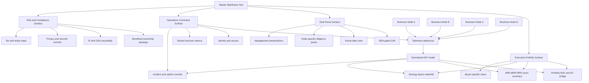
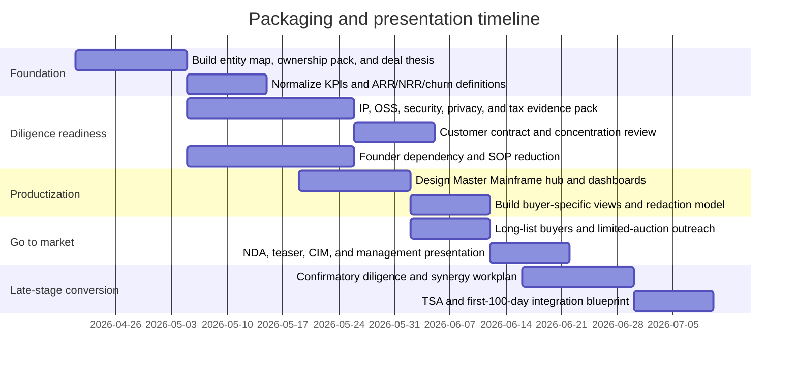

# Ghost Economy and SaaS-as-an-Asset

## Executive summary

“Ghost Economy” is not a standard investment or industry taxonomy. In the context of digital asset sales, the most defensible meaning is a portfolio of low-headcount, software-mediated, subscription businesses whose delivery layer is highly automated, whose labor and infrastructure are partly abstracted from the end user, and whose sale process is intentionally private rather than broadly marketed. Public sources do recognize the adjacent realities that make this idea plausible: software has moved toward cloud-delivered subscriptions; AI and middleware frequently sit “invisible to the end-user”; and software businesses increasingly combine intangible IP, remote operations, and recurring revenue. The broad software economy is already very large, with OECD citing WIPO data that global software spending reached about $675 billion in 2024, while the directly observable SaaS M&A market hit a record 2,698 transactions in 2025. citeturn33view0turn38view0

At the high end of the market, buyers are not paying for secrecy as such. They pay for durability, auditability, embedded workflow relevance, data moats, operational leverage, and credible integration upside. Research from entity["organization","McKinsey & Company","management consulting"] and entity["organization","Bain & Company","management consulting"] consistently points to software’s attraction for private equity because recurring revenue, gross margins, and buy-and-build opportunities can drive superior returns, but also because investors now reward margin discipline, not just top-line growth. The best language for selling a private SaaS portfolio therefore sounds institutional and thesis-driven: **mission-critical**, **embedded in customer workflows**, **low-churn**, **compliance-ready**, **founder-light**, **platform plus add-ons**, **single pane of governance**, and **clear post-close value creation plan**. citeturn6search3turn6search4turn26search0turn31search2turn31search6

There is a strict legal boundary here. “Covert” can only mean **low-publicity, limited-auction, NDA-gated, or off-market**. It cannot mean obscured beneficial ownership, sanctions evasion, deceptive disclosures, hidden control, or noncompliant data processing. FATF guidance, privacy regulators, and software due-diligence frameworks all point in the same direction: if ownership, data handling, software provenance, or cross-border tax posture are not legible, sophisticated buyers will either discount the asset heavily or walk away. citeturn12search4turn12search16turn19search15turn33view0

## Market definitions and size estimates

A practical definition of **SaaS-as-an-Asset** is not “any software company,” but a software business underwritten primarily as a cash-flowing, transferable asset: it has recurring revenue, measurable churn and retention, portable code and infrastructure, documented operating procedures, and a path to ownership transfer without heroic founder dependence. That is the economic logic behind lower-middle-market marketplaces, software consolidators, and sponsor-backed buy-and-build platforms. OECD’s 2026 software due-diligence guidance also reinforces why SaaS is especially asset-like: code is intangible, cloud delivery turns software into a subscription service, and traceability, SBOMs, and version control make the asset inspectable in diligence. citeturn33view0

Because “Ghost Economy” is not an official category, the best size estimate is a triangulation across adjacent measurable markets: broad software spending, SaaS M&A, lower-middle-market online-business marketplaces, and software-focused private capital. That triangulation is more rigorous than pretending there is a single published TAM for “ghost” portfolios. citeturn33view0turn38view0

| Observable market proxy | What it captures | Public size signal |
|---|---|---|
| Broad software spending | Total software economy in which SaaS portfolios sit | OECD cites WIPO data showing global software spending at about **$675B in 2024**. citeturn33view0 |
| SaaS M&A market | Directly comparable market for acquisition-ready SaaS assets | SEG recorded **2,698 SaaS M&A deals in 2025**, **+28% YoY**, with SaaS representing about **58% of software M&A**. citeturn38view0 |
| Public SaaS valuation baseline | Exit-context pricing anchor for private bundles | SEG’s 4Q25 median EV/TTM revenue multiple was **4.8x** for the overall SaaS index, with stronger categories such as security and ERP/supply chain above that. citeturn38view0 |
| Small and mid-sized SaaS marketplace flow | The “internet business” layer where many quiet, founder-led SaaS assets trade | Acquire reports **$500M+** in closed deal volume, **2,000+ startups sold**, and **$2B+ in verified buyer funds**. Its 2025 SaaS report also shows buyers favored SaaS in **68%** of deals on-platform. citeturn11search7turn34view0 |
| Curated online-business marketplace flow | Additional evidence of a real lower-middle-market market for digital cash-flow assets | Empire Flippers reports **$580M+** of online businesses sold. citeturn28search13 |

The useful conclusion is that the “Ghost Economy” is best treated as a **style of ownership and operation inside the much larger software and SaaS transaction market**, not as a standalone sector. The transaction substrate is very real; what is “ghostly” is the light public footprint, not the economics. citeturn33view0turn38view0turn11search7turn28search13

## Buyers, motivations, language, and valuation

High-net-worth buyers and family offices are relevant here because they continue to maintain material private-market exposure even after trimming from recent peaks. entity["company","UBS","investment bank"] reported that family offices’ average private-equity allocation was about 21% in 2024, split roughly between direct deals and funds, while those changing allocations in 2025 still expected to hold sizable exposure. That matters because the buyer persona is not just “PE vs. everyone else.” There is a meaningful buyer class that wants concentrated, understandable, cash-generating digital assets they can hold for long periods without public-market noise. citeturn21search3turn21search7

Private equity buyers, by contrast, want platform economics. McKinsey has noted that software PE investments have outperformed other PE sectors for more than a decade, with roughly 500-plus deals and more than $100 billion in software PE value in 2022, while Bain’s buy-and-build work stresses that the model works best where there is an ample supply of targets, stable cash flow, and room for both synergy capture and multiple arbitrage. That is why a “covert multi-node portfolio” only becomes compelling to a sponsor when the nodes can be governed as one operating system rather than merely warehoused together. citeturn6search3turn26search0turn31search2turn31search6

The language that resonates with these buyers is therefore sober and institutional. A private deck should describe the portfolio as a **software holding platform**, **vertical software group**, **recurring-revenue enterprise portfolio**, or **mission-critical workflow stack**. It should emphasize **clean ARR bridges**, **NRR durability**, **gross-margin resilience**, **customer embed**, **compliance posture**, and **integration optionality**. By contrast, phrases such as **ghost portfolio**, **covert network**, **anonymous ownership**, **black-box stack**, or even **Master Mainframe** should be avoided in legal documents and only used, if at all, as internal creative shorthand. That recommendation is a synthesis of the language used by software acquirers and marketplaces such as entity["company","Tiny","canadian holding company"], entity["company","Everfield","european software investor"], and entity["company","Constellation Software","vertical market software"], all of which present their strategies in plain terms: mission-critical software, recurring revenue, founder-friendly acquisition, long-term hold, and vertical-market expansion. citeturn30search4turn30search7turn30search2turn30search14turn30search3turn30search18

A bundle valuation for SaaS-as-asset holdings should start from stand-alone value, then adjust for what this report calls **Synergy Layers**. This is not a standard market term; it is a practical synthesis of Bain’s buy-and-build logic and McKinsey’s distinction between combinational and transformational synergies. The usable formula is:

**Bundle EV ≈ Σ stand-alone EV of each node + PV of realizable synergies + platform premium − integration costs − concentration / transition discounts − legal / cyber / tax risk adjustments.**

That formula matters because the market does **not** automatically award a bundle premium. McKinsey has warned that scale by itself can devolve into a conglomerate discount, while Bain notes that multiple arbitrage only works if add-ons actually improve the resulting platform. In other words, synergy claims need evidence, not adjectives. citeturn31search3turn31search7turn31search19turn26search1turn26search0turn31search6

A rigorous synergy stack for a private software bundle usually has six layers. The first is **shared services**: finance, data warehousing, cloud procurement, compliance tooling, and RevOps. The second is **commercial leverage**: shared ICPs, cross-sell motions, channel overlap, and common retention playbooks. The third is **data / model leverage**: common schemas, telemetry, identity graphs, and risk signals. The fourth is **engineering leverage**: shared authentication, billing, analytics, observability, and API governance. The fifth is **capital-allocation leverage**: tuck-ins, debt capacity, and more efficient reinvestment. The sixth is **strategic option value**: the right to repackage, carve out, or sell category clusters separately later. Evidence-backed versions of those layers increase value; vague promises create diligence friction and often reduce it. citeturn31search2turn31search3turn25search9turn26search11turn26search15

For lower-middle-market SaaS specifically, practical valuation anchors now sit far below 2021 exuberance. Acquire’s marketplace data indicates median MicroSaaS profit multiples in the mid-3x to mid-4x range depending on revenue band, while SaaS Capital’s 2025 private SaaS valuation work placed predicted private SaaS revenue multiples in the roughly 4.8x to 5.3x range depending on capital profile. SEG’s public SaaS medians in late 2025 were lower than early-2025 levels, but premium categories still traded above the broader index. The implication is straightforward: a bundle can earn a premium over small stand-alone nodes only when it looks less like a pile of apps and more like a coherent operating platform. citeturn35view1turn9search0turn9search2turn38view0

## Legal, compliance, and operational risks

The first legal red line is ownership transparency. FATF’s beneficial-ownership guidance makes clear that regulators care about **who ultimately owns and controls** a legal person, not just the nominal shareholder chain. Any attempt to market a portfolio as “covert” while leaving beneficial ownership opaque will alarm serious buyers, lenders, and counsel. In lawful practice, the right model is: private process, not hidden control. citeturn12search4turn12search16turn12search12

The second is privacy and cyber diligence. OECD’s 2026 software due-diligence guidance highlights that data collection, bias, surveillance, cybersecurity, and fragmented cross-jurisdiction regulation are core software-sector risks, while the ICO’s Marriott enforcement notice remains the classic cautionary example that an acquirer can inherit cybersecurity and data-protection failures if diligence is weak. NIST’s CSF 2.0 and its due-diligence quick-start guidance point toward a practical mitigation model: documented controls, vendor and dependency review, supply-chain diligence, incident response evidence, and a clear inventory of systems and data flows before close. citeturn33view0turn19search15turn12search6turn12search2

The third is software provenance and open-source compliance. OECD emphasizes traceability, issue management, component tracking, and SBOMs as key control points. The Linux Foundation’s OpenChain M&A checklist goes further and treats open-source review as a standard diligence exercise, not an optional technical courtesy. For a portfolio seller, that means each node should have a code provenance package: repository history, dependency inventory, license review, contributor/IP assignment evidence, and vulnerability management records. Without that, “asset-light” quickly becomes “rights-uncertain.” citeturn33view0turn19search0turn19search4turn19search13

The fourth is tax and structuring. OECD transfer-pricing guidance and broader intangible-capital work make clear that software groups create value through IP, intercompany services, and data-rich intangible assets that attract scrutiny in cross-border structures. For an unspecified-jurisdiction portfolio, the mitigation is not to pre-engineer an aggressive structure in the pitch deck; it is to prepare a clean entity map, IP ownership map, transfer-pricing narrative, and nexus analysis that a buyer can diligence jurisdiction by jurisdiction. citeturn12search1turn12search9turn12search17

The fifth is contractual portability. Many SaaS deals fail or reprice because contracts include change-of-control clauses, key-customer concentration, reseller dependence, weak data-processing terms, or unassignable third-party software rights. Acquire, FE International, and software acquirer guidance all point to the same operational requirement: monthly P&Ls, clean ARR/MRR bridges, concentration schedules, churn cohorts, and customer-contract summaries ready before LOI. citeturn34view0turn36view0turn20search7

The sixth is founder and hidden-labor dependency. OECD’s software guidance and ILO work on invisible labor both matter here. A business that looks automated from the outside may still rely on under-documented contractors, offshore content moderation, or founder tacit knowledge. Serious buyers discount that heavily. The mitigation is explicit operating documentation: SOPs, handoffs, escalation trees, team retention plan, and a named transition manager for each node. citeturn33view0turn32search3turn32search7

The operational standard that emerges is clear: each node in the bundle should be presented like a mini public company. The portfolio needs normalized KPIs, a common data dictionary, security evidence, IP evidence, beneficial-ownership evidence, and role-based disclosure controls. That is what converts “private and discreet” into “institutional and financeable.” citeturn33view0turn12search4turn12search6turn19search0

## Stealth Tech UX and monochromatic design standards

“Stealth Tech” is also not a standard design taxonomy. The most useful meaning is a visual system that borrows from enterprise SOCs, fusion centers, and high-assurance dashboards: dark neutral canvases, sparse accent color, dense but hierarchical information, drill-down-first interactions, visible provenance, and tightly controlled motion. That design language exists because SOC environments punish ornamental UI. Analysts deal with false positives, burnout, and cognitive overload; they need contextual depth and evidence-backed explanations, not theatrical chrome. citeturn18search1turn18search3turn18search15turn18search23

The monochromatic standard is already mature in enterprise design systems. IBM’s Carbon guidance uses Gray 100 and Gray 90 for dark themes and explicitly grounds layering and data-viz palettes in accessibility and harmony; Microsoft’s Fluent 2 system supports light, dark, and high-contrast theming through design tokens and warns that semantic colors should carry meaning rather than decoration; Material guidance similarly recommends limiting color so the few colored elements command attention. These systems converge on the same pattern: a neutral base for sustained analytical work, with status colors used sparingly and consistently. citeturn16search6turn16search2turn16search15turn17search3turn17search5turn17search2turn17search10

For a private portfolio pitch, that means the UI should feel less like a videogame and more like an executive-grade command surface. Use charcoal or graphite backgrounds, layered panels, thin separators, restrained shadows or edge-lighting, one accent color for “active focus,” and semantic colors only for states such as risk, outage, breach, or approval. Keep typography narrow and regular, align every card to a grid, and let motion explain transitions rather than advertise them. In investor terms, monochrome implies control, while saturated color implies marketing. citeturn16search6turn17search3turn17search12turn39view0

Five cinematic UI features can imply scale and global situational awareness **without** destroying usability:

- **A global topology or operations map with drill-down to regions, business nodes, and incidents.**  
  **Implementation:** Use vector tiles, aggregation clusters, and click-through layers for asset class, customer region, or threat surface. Keep the map optional, not the only navigation surface.  
  **UX rationale:** Humans quickly grasp geographic spread and blast radius when the map is tied to real data, but decorative “world maps” without functional drill-down become noise. citeturn24search7turn39view0turn14search4

- **A persistent event ribbon and temporal scrubber.**  
  **Implementation:** Stream material events into a compact top ribbon, with a timeline bar that can replay incidents, KPI shifts, and deal milestones across nodes.  
  **UX rationale:** Timelines reduce analyst memory load and make causality legible, which matters in security and portfolio operations alike. citeturn13search6turn23search8turn18search15

- **An entity-relationship graph for customers, systems, vendors, identities, and incidents.**  
  **Implementation:** Render relationship graphs only for the selected slice; expose provenance and filters for every edge.  
  **UX rationale:** Graphs are one of the clearest ways to convey hidden interdependence, but only when they show evidence, not abstract webs. Microsoft’s incident graph is a strong real-world model. citeturn13search5turn13search13turn18search3

- **Layered monochrome depth with semantic accents and limited glow.**  
  **Implementation:** Use elevation tokens, strokes, or subtle edge glows to distinguish layers; reserve bright accents for active state and risk status.  
  **UX rationale:** This produces the “high-computation” feel people associate with advanced control rooms while preserving contrast and readability on long sessions. Carbon and Fluent both support this restrained approach. citeturn16search15turn17search9turn17search12turn16search6

- **A command palette with cross-filtering and keyboardable analyst actions.**  
  **Implementation:** Add a universal search / command bar for finding nodes, customers, incidents, or metrics; preserve context when users jump between views.  
  **UX rationale:** “Power” is communicated less by animation than by a feeling that the interface can answer immediately from anywhere. Fast command surfaces also reduce clicks in high-density dashboards. citeturn23search16turn13search18turn14search18

## Public visual references and dashboard comparison

For a lawful “single hub” presentation, the most relevant public artifacts are not startup landing pages but actual enterprise security and fusion-center UIs. Public visual examples are available on the cited official pages, and they show a consistent pattern: dense neutral dashboards, incident queues, timeline-first triage, drill-down analytics, and a “single pane of glass” narrative used to unify many systems without pretending they are literally one system. citeturn39view0turn40view0turn27search7turn27search10

A few especially useful official visual references are worth studying directly:

- entity["company","Microsoft","software company"] Defender’s **incident queue** and **incident graph**: a queue-first analyst surface with entity relationship views and unified investigation context. citeturn13search1turn13search5turn13search17  
- entity["company","Splunk","security observability"] Mission Control: analyst queue, charts, timeline, and SOAR-connected workflows. citeturn13search6turn22search1turn22search13  
- entity["company","IBM","technology company"] QRadar dashboards and Grafana plugin pages: a modular, panel-based analytics approach that can mix QRadar data with other sources. citeturn13search3turn22search2turn22search10  
- entity["company","Palo Alto Networks","cybersecurity company"] Cortex XSIAM Command Center: default command-center dashboard, tenant activity overview, and drill-down dashboards. citeturn14search4turn14search0turn14search8  
- entity["company","Elastic","search analytics company"] Security Overview dashboard: high-level alert/event picture built on the Elastic/Kibana idiom. citeturn14search6turn14search14turn22search3  
- entity["company","Datadog","observability platform"] Cloud SIEM dashboards, Signals Explorer, and MITRE ATT&CK map: observability-grid aesthetics applied to security operations. citeturn23search0turn23search6turn23search20  
- entity["organization","PwC","professional services network"] cyber analytics platform on AWS: especially useful for its explicit layered architecture from centralized interface down to OCSF normalization. citeturn39view0  
- entity["organization","Deloitte","professional services network"] fusion-center concept article: useful less for product UI and more for the organizational logic behind fusing cyber, fraud, and financial-crime analytics. citeturn40view0  

| Design | Security model | Scalability signal | Visual language | Likely stack from public docs | Public visual / docs |
|---|---|---|---|---|---|
| Microsoft Defender portal and Security Copilot | Unified incident queue, incident graph, multitenant investigation, cloud-native SIEM support | Multicloud and multiplatform via Sentinel; multitenant management in the Defender portal | Dark-neutral analyst workspace, left-rail navigation, queue + graph + detail pane | Defender XDR, Sentinel, Security Copilot, Azure / Microsoft security graph services | Official screenshots and docs: citeturn13search1turn13search5turn22search0turn22search16turn27search19 |
| Splunk Mission Control | Triage, investigate, respond; SOAR-linked playbooks and timelines | Cloud-based console in Enterprise Security Cloud; raw-event search and operations dashboards | Queue-first SOC workbench with dense tables, timelines, and chart panels | Splunk Enterprise Security Cloud + Splunk SOAR Cloud + Mission Control services | Official overview and playbook docs: citeturn13search6turn13search18turn22search1turn22search5turn22search13 |
| IBM QRadar Suite dashboards | SIEM analytics and monitoring, top rules/log sources, mixed data dashboards | Grafana plugin enables QRadar plus external data sources in one dashboard layer | Panel-grid analytics UI, classic SOC dashboard idiom | QRadar Suite + Grafana + QRadar KQL plugin + auth token / proxy | Official dashboard and plugin docs: citeturn13search3turn22search2turn22search6turn22search10turn22search18 |
| Cortex XSIAM Command Center | Dynamic overview of incidents, alerts, automations, ingestion, and tenant activity | Default command center with drill-down dashboards and high-volume telemetry views | Control-room overview with summary widgets and drill-down tiles | Cortex XSIAM dashboards and response platform | Official command-center docs: citeturn14search4turn14search0turn14search8turn14search20 |
| Elastic Security Overview dashboard | High-level snapshot of alerts and events with interactive visualization | Elastic stack supports distributed search and analytics across large datasets | Modular dashboard canvas, high-density but composable | Elasticsearch + Kibana + Elastic Security integrations | Official dashboard and platform docs: citeturn14search6turn14search22turn22search3turn22search11 |
| Datadog Cloud SIEM dashboard and Signals Explorer | Out-of-box detection rules, signals explorer, operational metrics, MITRE map | Built on log management with broad integrations, widgets, and content packs | Observability-style security grid with widgets, event streams, and explorer views | Datadog Log Management + Cloud SIEM + Workflows + Content Packs | Official docs with visuals: citeturn23search0turn23search1turn23search6turn23search8turn23search15turn23search20 |

The strongest consultancy-grade “single hub” reference is PwC’s layered cyber analytics platform, because it explicitly shows how to move from raw source systems to OCSF normalization, security analytics, centralized management, and a singular dashboard. Deloitte’s fusion-center framing complements that by explaining why the data and organization have to be fused, not just cosmetically co-displayed. Taken together, they are a better precedent for a “Master Mainframe” than almost any startup design case study. citeturn39view0turn40view0

## Architecture and packaging timeline

The architecture below treats a “Master Mainframe” as a presentation and governance layer over multiple real business nodes. That is the defensible way to sell a multi-faceted private software portfolio: one command surface, many auditable underlying entities, with role-based disclosure and a diligence trail from the executive overview down to each node. This model synthesizes PwC’s fusion-center layering, Deloitte’s fusion-center operating logic, OECD’s emphasis on traceability, and enterprise dashboard practice around single-pane governance. citeturn39view0turn40view0turn33view0turn27search7

A buyer-facing package built on that architecture should always separate **what is globally visible** from **what is progressively disclosed**. The top surface should show normalized KPIs, risk posture, and synergy roadmap. Node-level customer lists, code details, employment matters, and contract assignments should remain gated by role, phase, and need-to-know. That is not just good secrecy hygiene; it is better UX. Sophisticated buyers want a fast high-level read first, then confidence that every summary number can be traced back to its source. citeturn33view0turn39view0turn18search3

The timeline below is a realistic packaging sequence for a private portfolio sale. It assumes the seller is trying to convert a set of software nodes into an institutional-grade bundle, not merely to assemble logos on a slide. The sequencing reflects common M&A readiness work, software diligence requirements, and the practical need to prove synergy claims before marketing them. citeturn20search2turn20search7turn34view0turn36view0

For transaction precedents, the public record shows several distinct models of “private” or “stealth-adjacent” software aggregation. entity["organization","Thoma Bravo","private equity firm"]’s acquisition of entity["company","Coupa Software","spend management software"] is the classic sponsor take-private: public target, private ownership, clear thesis around software scale. entity["company","Tiny","canadian holding company"]’s majority acquisition of entity["company","Serato","dj software company"] is a holdco-style recurring-revenue portfolio move. entity["company","Everfield","european software investor"]’s acquisition of entity["company","AGroup","latvian hr software"] and related European deals show the quieter long-term vertical-software ecosystem model. And entity["company","Constellation Software","vertical market software"] remains the canonical large-scale example of mission-critical vertical software consolidation. These examples differ in visibility and size, but they all support the same point: the market rewards private software ownership when the operating thesis is legible, repeatable, and properly governed. citeturn29search1turn29search4turn29search5turn30search7turn20search10turn30search14turn30search3turn30search18turn30search17