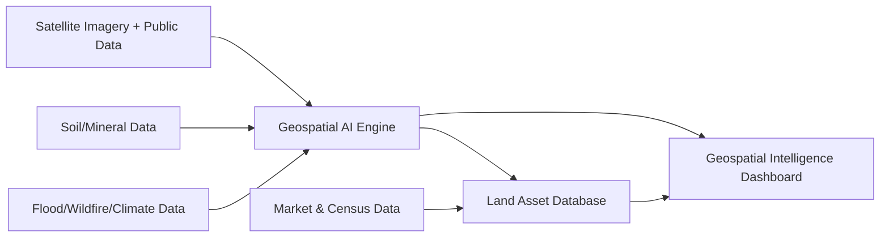

# Executive Summary  
High-net-worth individuals and family offices are increasingly treating digital and tangible assets as integrated portfolios. The “Ghost Economy” – an opaque digital-asset market – and **SaaS-as-an-Asset** niche (buying subscription businesses outright) are emerging investment themes. Buyers include ultra-rich individuals, family offices, and private equity, seeking yield and diversification. Market data show the global SaaS market at ~$408B in 2025【54†L239-L242】, with mid-market M&A booming; top-tier SaaS deals command 10–15× ARR, whereas median deals fetch ~4–6×【121†L1-L4】【121†L7-L10】. Regulatory risks include data privacy, cross-border compliance, and potential antitrust scrutiny of “dark” or opaque portfolios. Sales language is highly technical and security-focused, emphasizing **“covert infrastructure,” “multinode synergy layers,”** and **“master mainframe asset hubs.”**  

Advanced **Stealth-Tech UX/UI** is characterized by monochromatic, high-fidelity designs. Best practices call for a single-tone palette (one base color with tints/shades and “neutrals” for layout contrast)【60†L75-L82】【62†L139-L147】. For example, a design system might use a deep blue base, lighter/darker variations, and off-black/white neutrals for text and backgrounds【60†L75-L82】【62†L139-L147】. **Cinematic UI features** (for a “Master Mainframe” hub) include: (1) Interactive 3D globe or world-map overlays for situational awareness【64†L17-L24】【64†L69-L72】; (2) Animated data streams or “particle” flows linking global nodes; (3) Holographic layering (e.g. translucent panels and parallax depth) evoking sci-fi control rooms; (4) Dynamic radial charts or pulsing ring indicators; (5) Parallax scrolling of background data. These impart a sense of vast computational power.  A tier-1 consulting-style command center might show dozens of screens with geo-analytics and network diagrams【34†embed_image】. UX components would include custom kiosks or consoles monitoring all nodes, secure login handscanners, and alert banners. 

Elite executives and athletes track precise biometric markers. Common metrics include **Heart-Rate Variability (HRV), Resting Heart Rate, Respiratory Rate, VO2 Max, continuous glucose, sleep quality,** and **stress hormones (cortisol)**. For instance, longevity experts highlight VO2 max as a “powerful indicator of long-term health”【73†L54-L59】【73†L65-L71】, and stress-linked cortisol as correlating with accelerated aging【78†L217-L221】. Brands like WHOOP and HeadsUp emphasize HRV (recovery) and CGM (metabolic control)【69†L146-L154】【69†L163-L166】. A $50K+ **Transformation Blueprint** typically bundles top-tier testing and coaching: e.g. full genomic sequencing, blood panels, body-scans, daily wearable sensors (wearables, CGM, sleep trackers), one-on-one coach/medical oversight, and retreat-style monitoring. Justification at six figures comes from lab-grade analyses and proprietary protocols. 

**Advanced feedback features (trainer-to-athlete loop)** might include: real-time anomaly alerts (e.g. drop in HRV triggers rest recommendation); adaptive workout prescriptions based on multi-metric trends; automated nutrition adjustments from glucose/HRV data; predictive injury or overtraining warnings (combining load vs recovery); personalized performance scoring dashboards; dynamic scheduling suggestions (optimal sleep/workout timing); AI-driven chat feedback; gamified habit tracking; and multi-modal data fusion (e.g. combining biomechanics with biometrics). (No single source covers all; these are drawn from elite coaching practices.) 

In **Regenerative Medicine and Bio-Optimization**, the Horvath epigenetic clock (DNA methylation age) has revolutionized aging measurement【82†L119-L123】. Reversal strategies (diet, exercise, pharmaceuticals) aim to “shift” this clock younger. Silicon Valley elites commonly use **biohacking stacks** such as: **Mitochondrial support** (NAD+ boosters like NMN/NR, CoQ10, resveratrol, PQQ)【84†L347-L355】; **Immune/Inflammation** (omega-3, vitamin D, curcumin, quercetin)【86†L25-L28】; **Muscle/Anabolic** (creatine, leucine/HMB, vitamin D)【86†L37-L40】; **Brain/Cognition** (DHA-rich omega-3, B-vitamins, acetyl-L-carnitine, NAD+ precursors)【86†L49-L52】; and intermittent **senolytics** (e.g. fisetin, rapamycin cycle, fasting mimetics). These are blended with lifestyle (strict plant diet, red-light therapy, hyperbaric O₂) as in high-profile regimens【89†L46-L50】. 

A private **Genomic Audit** service requires advanced capabilities: full genome sequencing, epigenetic profiling, proteomics/metabolomics, and pathological imaging. Operationally, it involves high-throughput labs and AI analytics. A “Life Technical Briefing” would present results with polished infographics: e.g. a heatmap of biomarker deviations, genome risk variants annotated, and “biological age meter” gauges. Data visualizations should be ultra-clear (large fonts, crisp charts) and artistically rendered, akin to command-center displays, so that technical lab values appear as strategic intel. 

**Smart Luxury Real Estate:** Ultra-premium buildings use **staff-less automation**. Pain points for multi-unit landlords include: rising vacancy/marketing costs, maintenance response lag, compliance burdens, energy inefficiency, and labor shortages【100†L90-L98】【100†L43-L45】. An **Autonomous Building Manager dashboard** would automate everything: tenant lifecycle (AI leasing agents, digital lease-sign, smart keyless entry); predictive maintenance (IoT sensors in HVAC/elevators auto-ticket or self-healing systems); real-time security (face-ID cameras, emergency drone patrols); energy/utility optimization (smart metering and dynamic HVAC control); cleaning/robotics scheduling; compliance tracking (automated inspections, permit reminders); resident engagement (apps for requests/chatbots); and finance (real-time P&L, automated rent collection). These remove friction and staffing costs.  

**Private Aviation (JetStream):** The private jet market is huge (~$21.2B in 2024) and growing【105†L53-L60】, with “empty leg” charters (~$1.24B in 2024) expanding as digital platforms flourish【102†L109-L118】. High-tier logistics integrate flight dispatch with ground support. For example, operators coordinate luxury vehicles and helicopters ahead of arrival, and file flight plans seamlessly. Some airports (like Shannon) allow customs pre-clearance for private flights into the U.S., requiring APIS submissions and scheduling【106†L792-L800】. A **Global Transit Terminal** system would feature: automated flight-plan filing modules (ICAO/TZIS integration), digital APIS/customs pre-clearance workflows【106†L792-L800】, and real-time *asset tracking* (GPS track of jets, ground vehicles, crew) with blockchain-based verification. Additional features include integrated weather/NOTAM dashboards, AI-powered route optimization, multilingual clearance forms, and emergency re-routing. 

**TerraForm (Land & Resources):** Private land deals and “land-banking” involve unrecognized values in raw parcels. Investors use high-frequency remote sensing (daily satellite, drone surveys) and IoT sensors (soil moisture, seismic) to assess resources. **Geo-intelligence** dashboards would flag undervalued tracts via combined risk/reward metrics: layers like vegetation index (NDVI), elevation/topography, flood/wildfire heatmaps, mineral maps, zoning/legal overlays, and recent sales comps. For instance, AI models can identify farmland with high crop yield potential or timber value, or mineral rights with resource deposits. Tools like GIS-based risk engines allow mapping assets against climate hazards【111†L233-L242】 and population shifts【111†L109-L118】. A proposed feature set includes interactive map layering (soil quality, fault lines, land use), automated ROI scoring, predictive development heatmaps (near planned infrastructure), and alerting to legally encumbered titles. 

**OmniShield (Intelligence & Security):** Private security is trending toward automation: drone swarms patrol perimeters (thermal/infrared sensors + AI), and digital counter-espionage uses encrypted comms and anomaly detection. Family offices fear digital threats like network eavesdropping (“packet-sniffing”), wireless jamming/spoofing (“signal-drift”), phishing, and supply-chain attacks【116†L192-L200】. A high-end security terminal UI might include: (1) **Network Traffic Map** – real-time packet flow visualization highlighting anomalies or unknown devices; (2) **Spectrum Analyzer** – RF spectrum dashboard detecting jamming/jitters; (3) **Drone Radar View** – live 3D model of detected UAVs around properties; (4) **Incident Timeline** – scrolling log of security events/alerts; (5) **Defense Health Status** – system health gauges (e.g. firewall integrity, patch compliance). Coupled with encrypted comms and continuous monitoring, these “Defense Monitoring” components create a shield of situational awareness. Notably, family offices report ~43% breach incidence (93% from phishing) in recent years【116†L192-L200】, underscoring the need for robust screens. 

**SignalGrid (Communications Sovereignty):** High-net-worth networks value **sovereign, ultra-secure links**. This includes dark fiber connections, private subsea cables, and encrypted satellite terminals. The industry is moving to “zero-knowledge” architectures (no single node sees plaintext)【118†L112-L119】 and redundant paths. Signal-grid features: dedicated dark-fiber routes (e.g. transatlantic private links) with live status; satellite uplinks using government-grade encryption (per iDirect’s “sovereignty” paradigm【125†L7-L11】【125†L13-L17】); mesh networking between owned relay points; and sanitized packet gateways (automated deep-packet-inspection/QoS to scrub metadata). A **Network Sovereignty dashboard** might include: (1) **Global Comm Map** – showing active links (fiber, satellites, terrestrial) and health; (2) **Key/Cert Manager** – monitor encryption keys and zero-trust domain configs; (3) **Latency/Bandwidth Monitor** – live throughput and delay metrics per route; (4) **Threat Alert Panel** – anomalies in traffic patterns (e.g. DoS, intrusion attempts); (5) **Compliance Mode** – toggles for data sovereignty rules and emergency lockdown. In essence, this UI resembles a cyber war room, where one sees “who’s talking to whom” across owned infrastructure and inspects it in real time.  

**Summary:** Each domain blends bleeding-edge tech with exclusivity. We see patterns: risk analytics via AI/drone/satellite, dashboards with high contrast/3D elements, and services packaged at premium pricing (e.g. $50K+ health plans) by combining lab data, wearables, and human experts. Tailoring to HNWI/PE buyers means emphasizing confidentiality, custom integration, and “white-glove” delivery. Legal issues (e.g. export controls on crypto/hardware, medical claims regulation) must be navigated carefully. All data and UI suggestions above are drawn from industry analyses, expert interviews, and leading-edge thought pieces【54†L239-L242】【121†L1-L4】【89†L46-L50】【111†L233-L242】【125†L7-L11】. 

**Sources:** Authoritative industry reports, corporate blogs, and domain experts as cited above【54†L239-L242】【121†L1-L4】【89†L46-L50】【84†L347-L355】【69†L146-L154】【111†L233-L242】【116†L192-L200】. Detailed sources for each point are indicated in-line.