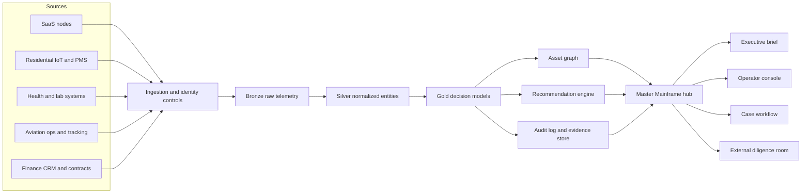
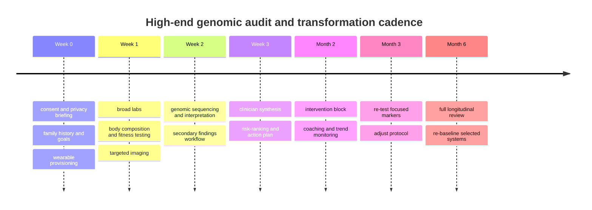

# Integrated Deep Research Report on Discreet Digital Asset Portfolios and High-Performance Operating Hubs

## Executive Summary

This report treats several of the user’s phrases as **market metaphors rather than formal industry categories**. There is no standardized market taxonomy for “Ghost Economy,” “SaaS-as-an-Asset,” “Stealth Tech,” or “JetStream,” so the analysis uses adjacent, measurable markets: online-business acquisition platforms, software M&A, family-office investment activity, control-tower/command-center operating models, premium diagnostics and longevity services, multifamily proptech, and business-aviation operations. I also interpret “covert” as **lawful discretion and privacy-conscious presentation**, not concealment from banks, counterparties, or regulators. citeturn16view2turn16view0turn15search3turn15search4

The strongest commercial pattern across these domains is that buyers pay for **structured visibility, not mystique**. In sub-$10 million SaaS transactions, profitability and revenue quality remain central to pricing; in control towers, the highest value appears when visibility is paired with orchestration and recommendations; in premium real estate and aviation, automation wins when it reduces friction while preserving auditability and safety. citeturn16view3turn28view6turn33search16turn36view4

On interface design, the current best practice for “cinematic” dashboards is not maximal ornament. It is **institutional minimalism**: dark themes with controlled contrast, sparse accent colors, obvious focus states, dense telemetry, drill-down navigation, and security-aware access boundaries. Public examples from consultancies and control-tower vendors emphasize unified dashboards, live status views, and rapid transition from overview to action. citeturn28view0turn28view2turn28view3turn29view1turn17view2turn17view3

For human performance and longevity, the most decision-useful markers remain relatively conventional: cardiorespiratory fitness or VO2max, heart-rate variability, sleep and recovery signals, blood pressure and atherogenic lipids such as apoB, and selected glucose markers. Continuous glucose monitoring can be useful, but the evidence is strongest in diabetes or clearly defined metabolic/performance use cases, not as a universal status symbol. Senolytics and regenerative interventions remain early-stage; epigenetic clocks are promising research tools, but they are not yet validated as standalone proof of “age reversal” for premium clients. citeturn31view0turn30view0turn19search1turn30view1turn30view3turn6search2turn6search12turn21search0

In smart luxury residential and private aviation, the mature path is a **staff-light operating model** rather than a truly staff-free one. Self-guided tours, AI resident agents, predictive maintenance, integrated charter booking, dispatch, tracking, APIS, and preclearance workflows are already commercially real. The winning architecture in both sectors is a central hub that coordinates access, identity, schedules, alerts, and human escalation instead of replacing human judgment outright. citeturn10search0turn33search2turn33search16turn36view3turn36view4turn37search0turn37search2

## Ghost Economy and SaaS as an Asset

A useful working definition of the “Ghost Economy” is the market for **low-headcount, high-margin, digitally native operating assets** that can be aggregated behind a discreet holding structure and sold as a portfolio. The nearest public proxy is the online-business acquisition market: entity["company","Acquire.com","online business marketplace"] says it is the largest marketplace for profitable online businesses, with 500k+ entrepreneurs, $500M+ closed deal volume, 2,000+ startups sold, and $2B+ in verified buyer funds. On the buyer side, entity["organization","Deloitte","global consulting network"] estimates 8,030 single-family offices globally with roughly $3.1 trillion in AUM today, rising further by 2030; that is important because family offices are increasingly institutionalized and professionally managed, which makes them more receptive to software-style operating assets than a purely lifestyle buyer would be. citeturn16view2turn16view0

The commercial reality, however, is more sober than the language of “stealth” suggests. The public acquisition data available from Acquire’s 2026 multiples briefing says that, in the portion of the market where many SaaS deals occur, usually below $10 million enterprise value, buyers are still anchoring valuation on profit unless the company has unusual scale, retention, and growth. That means the portfolio story needs to emphasize **quality of revenue, concentration risk, retention, operational leverage, transferability, and governance** rather than theatrics. citeturn16view3

For private buyers and private equity alike, the phrase “covert multi-node enterprise portfolio” should therefore be translated into a lawful, investable proposition: a **portfolio of discreetly branded subsidiaries sharing common control layers** for finance, identity, security, analytics, and workflow. The value of “synergy layers” is real when those layers reduce duplicate spend, tighten controls, increase cross-sell, and speed diligence; it is not real when the holding structure merely makes ownership harder to understand. FATF’s beneficial-ownership guidance and OFAC’s transaction guidance both push in the same direction: complex structures attract scrutiny unless ownership, control, and sanction exposure are legible. Cyber due diligence is increasingly treated the same way. citeturn15search3turn15search4turn15search9turn15search2

| Buyer lens | What they want to see | Language that works | What kills trust |
|---|---|---|---|
| HNWI or family office | Transferable cash flow, low staffing burden, governance clarity, optionality for hold or resale | “Quality of revenue,” “operating leverage,” “single control plane,” “downside-protected” | Opaque ownership, founder-dependent operations, weak retention, poor data hygiene |
| PE roll-up or platform buyer | Repeatable integration, shared services, clean reporting, expansion pathways | “Platform thesis,” “shared data layer,” “cross-node procurement,” “standardized controls” | No integration roadmap, mismatched KPIs, fragmented tooling, unclear customer ownership |
| Strategic operator | Product adjacency, installed workflow, high switching costs, clean customer contracts | “Mission-critical workflow,” “embedded operations,” “expansion MRR,” “defensible niche” | Heavy custom work, weak IP chain, hidden liabilities, customer concentration |

This table is a synthesis of current family-office institutionalization, current sub-$10 million SaaS acquisition behavior, and sanctions/beneficial-ownership diligence practice. citeturn16view0turn16view3turn15search3turn15search4

**Language and aesthetic trends.** The strongest current aesthetic is not “secretive cyberpunk”; it is **institutional dark minimalism**. The verbal palette is sober: platform, orchestration, resilience, observability, integration, governance, asset intelligence, control tower, recommendation engine. That vocabulary mirrors what public control-tower and dashboard literature already rewards. The same applies visually: monochrome surfaces, selectively bright status colors, dense but organized telemetry, and very visible drill-downs from global summary to case-level detail. This is an inference from acquisition and control-tower literature rather than a formal style guide. citeturn16view3turn17view1turn28view6

**Risks and compliance.** The fastest way to destroy value is to confuse discretion with concealment. Beneficial ownership, sanctions screening, code provenance, software dependency risk, customer-data handling, and transaction communications all become more—not less—important when multiple subsidiaries sit under one portfolio wrapper. A serious sale package therefore needs ownership charts, board and signatory matrices, customer-contract assignments, software bill-of-materials style cyber diligence, incident logs, and security attestation. citeturn15search3turn15search4turn15search2

**Operational checklist.**
- Build a data room around recurring-revenue quality, churn, expansion, customer concentration, contracts, and entity maps. citeturn17view0turn16view3
- Standardize shared services across finance, identity, analytics, logging, billing, and support before marketing the bundle. citeturn28view5turn28view6
- Prepare beneficial-ownership and sanctions questionnaires for counterparties and payment rails. citeturn15search3turn15search4turn15search10
- Treat cybersecurity due diligence as central, not secondary, especially for software portfolios with third-party code and customer data. citeturn15search2turn28view4

**Recommended stack.** A sale-ready portfolio hub should combine a lakehouse or warehouse for normalized KPIs, role-based identity, immutable audit logging, SIEM coverage, contract and cap-table management, and a workflow engine for diligence requests. Public list pricing is uncommon for this class of software; sub-$10 million deal pricing itself is still usually profit-anchored rather than driven by a single ARR multiple. citeturn28view5turn28view4turn16view3

## Stealth Tech UX and UI

The design center of “Stealth Tech” should be **high-trust command utility**, not decorative darkness. The best public guidance for a monochromatic, high-fidelity system comes from dark-theme and accessibility standards. IBM’s Carbon system uses Gray 90 and Gray 100 as default dark backgrounds, while WCAG 2.2 still requires at least 4.5:1 contrast for normal text and a visible focus-state change of at least 3:1. Apple’s dark-interface accessibility criteria additionally warns against gray-on-black microtext and short flashes of bright content, because the problem in dark mode is often insufficient contrast, not excessive contrast. citeturn28view0turn28view2turn28view3turn29view1

The implication is straightforward: a stealth aesthetic should use **few colors, many states**. One cool neutral field, one accent color for system identity, one high-attention alarm color, and one caution color are normally enough. Motion should express state change, confidence, or flow direction, not style for its own sake. McKinsey’s public launch-room material emphasizes intuitive navigation from a global view down to individual accounts, plus maps and forward-looking KPIs; that is a better model than overloaded “hacker” imagery. citeturn17view2turn17view1

The five cinematic features most likely to imply computational scale **without sacrificing operability** are these:

1. **A geospatial pulse layer** showing routes, sites, or markets with animated intensity halos rather than constant flashing.
2. **A temporal prediction rail** that shows current state, near-future forecast, and confidence bands in one strip.
3. **Anomaly constellations** that cluster related alerts into one object so users feel system breadth without drowning in noise.
4. **Case drawers with provenance badges** that reveal model confidence, data freshness, and responsible subsystem on demand.
5. **Ambient system respiration** such as slow luminance breathing on active modules to imply live computation without inducing fatigue.

These are recommendations derived from control-tower, accessibility, and dashboard practice. citeturn17view1turn17view2turn28view2turn29view1

**Accessibility and security tradeoffs.** A stealth hub fails if it uses low-contrast numerics, color-only status coding, or “hidden until hover” controls for critical actions. It also fails if every user gets the same panoramic picture. The right pattern is progressive disclosure on the UX side and zero-trust, role-scoped data on the security side: broad global context, but details unlocked only when role, device, and case justify them. citeturn28view2turn28view3turn28view4

| Sample component | Purpose in a stealth hub | Design rule |
|---|---|---|
| Command ribbon | Global state, time, incidents, active operators | Persistent, full-width, fixed position |
| Alert stack | Human action queue | Highest-attention colors only for action-requiring items |
| Geospatial pane | Global awareness | Default to heat and clusters; click for drill-down |
| Asset twin card | Per-node status, SLAs, health, finance | Use dense numerics plus one clear health state |
| Timeline strip | Historical vs forecast movement | Pair actuals and predicted bands |
| Evidence drawer | Audit trail and source freshness | Never force users to leave the case view |
| Palette search | Jump to asset, customer, site, flight, or property | Keyboard-first and role-aware |

Design basis: Carbon dark themes, WCAG 2.2 contrast and focus guidance, Apple dark-interface criteria, and public control-tower patterns. citeturn28view0turn28view2turn28view3turn29view1turn17view2

**Recommended stack.** Use a component system with strong tokenization, dark-first charts, fine-grained RBAC, hardware-backed SSO, session recording for privileged actions, and an event bus that separates telemetry ingestion from action execution. Avoid heavy client-side secrets and overuse of motion. citeturn28view4turn28view5

## Master Mainframe Hub

A “Master Mainframe” is best understood as a **single operating portal for a diversified portfolio**, not a literal mainframe. The reference pattern that shows up repeatedly in modern enterprise systems is a central dashboard sitting on top of event-driven ingestion, a structured data layer, identity and policy controls, and a work-orchestration engine. Public examples point in the same direction: entity["organization","McKinsey & Company","management consultancy"] describes launch rooms and spend control towers that unify dashboards, drill-down, and decision support; entity["organization","Deloitte","global consulting network"] describes command centers as centralized analytics hubs; and entity["company","AWS","cloud platform"] argues that modern command centers become meaningfully more valuable when they add orchestration and recommendation layers beyond passive visibility. Zero-trust architecture and medallion-style data layering fit naturally underneath that control surface. citeturn17view1turn17view2turn17view3turn28view6turn28view4turn28view5

image_group{"layout":"carousel","aspect_ratio":"16:9","query":["security operations center dashboard", "control tower dashboard UI", "network operations center wall screens", "flight dispatch dashboard"],"num_per_query":1}

The strategic value of “synergy layers” in this hub is that they let seemingly unrelated businesses look coherent without falsifying difference. Shared identity, shared observability, shared finance normalization, shared alerting, shared workflow, and shared recommendations are what turn a bundle into a platform. The hub should therefore present **one posture, many domains**: portfolio health above; domain-specific depth below. citeturn28view6turn28view5turn28view4

This architecture synthesizes zero-trust guidance, medallion data design, and command-center operating models. citeturn28view4turn28view5turn28view6

| Dashboard zone | Primary purpose | Typical contents |
|---|---|---|
| Global ribbon | Portfolio posture | Revenue pulse, critical incidents, liquidity, active operators |
| Domain map | Situational awareness | Markets, properties, assets, routes, customers, alerts |
| KPI spine | Executive scan | ARR, occupancy, readiness, dispatch status, risk score |
| Case queue | Human action | SLA-breaches, escalations, diligence requests, travel disruptions |
| Recommendation pane | System-guided next actions | “Reprice,” “dispatch vendor,” “reroute,” “review biomarker anomaly” |
| Evidence drawer | Trust and auditability | Data freshness, source system, model confidence, approvals |
| Comms panel | Coordination | Internal notes, concierge updates, counterparties, client touchpoints |

This layout is optimized for rapid drill-down from posture to action. Public dashboard examples repeatedly stress unified visibility, forward-looking KPIs, and workflow orchestration. citeturn17view2turn17view3turn28view6

**Operational checklist.**
- Normalize all entities first: customer, asset, site, contract, event, owner, and operator. citeturn28view5
- Enforce zero-trust access between domains and user roles. citeturn28view4
- Log every recommendation, override, and approval path. citeturn28view4
- Design the hub as the front end of a workflow engine, not as a read-only wallboard. citeturn28view6

**Recommended stack.** A practical build uses a lakehouse or warehouse, message bus, graph or semantic layer, case-management workflow, RBAC/ABAC identity, audit logging, and observability. Enterprise pricing is usually quote-based. citeturn28view5turn28view4

## Elite Sports Science and Executive Longevity

The highest-value biometrics for elite athletes and executives overlap more than premium marketing usually admits. The strongest markers are the ones that are both **physiologically meaningful and operationally actionable**: cardiorespiratory fitness or VO2max, sleep and recovery, autonomic status such as HRV, core cardiometabolic markers including blood pressure and apoB, and targeted glucose metrics when the use case is clear. ACSM and the AHA both continue to treat cardiorespiratory fitness as a vital-sign-level measurement. HRV has real utility for training status and recovery, but it behaves differently across athletic populations and should not be treated as a standalone oracle. citeturn31view0turn30view0

Glucose is a more nuanced case. The CGM literature now clearly documents uses beyond diabetes, including metabolic wellness and elite athletics, but the evidence is strongest when glucose data is embedded into decisions about fueling, sleep, training load, or metabolic risk, not when it is treated as a vanity score. Cortisol matters, especially in stress and overtraining contexts, yet the literature also shows hormonal responses are sensitive to time of day, training state, nutrition, and context; that makes cortisol more useful as a **trend within a system** than as a hero metric on its own. ApoB deserves more attention than most executive-health packages historically gave it, because current cardiovascular literature consistently treats it as a more accurate measure of atherogenic particle burden than LDL-C alone. citeturn30view1turn31view4turn19search1

| Marker | Priority | Best use | Important caveat |
|---|---|---|---|
| VO2max or CRF | Very high | Mortality risk, endurance capacity, executive health baseline | Best measured with high-quality protocols |
| HRV | High | Readiness, recovery, training adjustment | Interpret as trend, not single-day truth |
| Sleep quantity and quality | High | Recovery, mood, decision quality, performance | Environment and behavior matter as much as sensors |
| Blood pressure and apoB | Very high | Cardiovascular risk and long-horizon executive health | Often underemphasized in “optimization” programs |
| Glucose or CGM-derived patterns | Medium to high | Fueling, dysglycemia detection, selected performance use cases | Not every non-diabetic user benefits equally |
| Cortisol | Medium | Stress trend, overtraining context, endocrine review | High biological variability; poor standalone KPI |

This ranking synthesizes current sports-science and cardiometabolic evidence rather than reproducing a single guideline. citeturn31view0turn30view0turn30view1turn31view4turn19search1turn18search2

A $50,000+ “Transformation Blueprint” is only defensible when the product is not just coaching but a **decision system**. Public list prices show the baseline building blocks are actually far cheaper: a broad lab membership can begin around the mid-hundreds of dollars annually; a whole-body MRI commonly prices around $2,499; a smart ring starts around $349 plus membership; WHOOP plans start around $199 to $239 annually; and Dexcom’s Stelo OTC biosensor starts as low as $55. That means the premium is not the hardware. The premium has to come from physician oversight, repeated diagnostics, CPET or specialized exercise testing, body-composition scans, integration, travel/privacy, individualized programming, rapid follow-up, and the labor of turning raw signals into accountable actions. Bay Area luxury longevity memberships in the high four to low five figures already exist; crossing $50,000 requires an intentionally high-touch, concierge, multi-diagnostic model. That final point is an inference from public component prices and current premium-clinic pricing. citeturn22search11turn25search1turn34search4turn34search13turn34search8turn34search11turn34search6turn26news39

**Ten logic-based trainer-to-athlete feedback features.**
1. Recovery gate that changes session type when rolling HRV and sleep both fall below the athlete’s normal band.  
2. Fueling trigger that adjusts pre-session carbohydrate targets when CGM patterns and planned intensity imply under-fueling risk.  
3. Load governor using acute-to-chronic workload relationships and recent soreness or wellness inputs.  
4. Travel penalty model that reduces intensity after east-west travel, poor sleep, or circadian disruption.  
5. Drift detector that flags unusual HR or pace decoupling during standardized efforts.  
6. Cortisol-context rule that escalates only when cortisol changes align with load, sleep, and mood changes.  
7. Compliance audit comparing prescribed session to completed intensity distribution and stoppage events.  
8. Injury-risk sentinel integrating workload spikes, asymmetry, and reduced recovery.  
9. Coach override trail that records why the coach overruled the model and what happened next.  
10. Weekly adaptation score that weights trend, not noise, across VO2-related work, HRV, sleep, and subjective readiness.  

These features are consistent with the current literature on HRV-guided training, sleep-performance links, workload monitoring, and contextual glucose use. citeturn30view0turn18search18turn20search2turn30view1turn18search2

**Risks and compliance.** If the client is an athlete subject to anti-doping rules, hormone and peptide-heavy “optimization” rapidly becomes a legal and career risk. WADA’s 2026 prohibited list continues to ban many peptide hormones, growth factors, anabolic agents, and gene or cell doping methods, and therapeutic use exemptions are narrow, not marketing loopholes. citeturn35search0turn35search1turn35search4

**Recommended stack.** Pair a wearable layer, validated exercise testing, periodic labs, body composition, sleep auditing, and a coach console with explicit thresholds and audit trails. Commodity wearables are cheap; the premium product is the algorithmic and clinical operating model around them. citeturn34search4turn34search8turn31view0

## Regenerative Medicine and Bio-Optimization

The current state of regenerative medicine is one of **high scientific velocity and uneven clinical maturity**. Regenerative medicine as a research field spans therapeutic stem cells, tissue engineering, cellular products, and biologically derived interventions, but the commercial anti-aging layer often outruns the evidence. On epigenetic aging, Horvath-style DNA methylation clocks remain important biomarker tools and are evolving quickly, yet current reviews still debate how much they are measuring, how sensitive different clocks are to short interventions, and whether they can function as reliable surrogate endpoints in trials. In plain English: they are useful for research and longitudinal context, but they are not yet a stable luxury retail proof point for “reversal.” citeturn21search15turn6search4turn6search2turn6search12

Senolytics are in a similarly transitional phase. Early human work on dasatinib plus quercetin showed feasibility and preliminary signs of benefit in some disease contexts, but the National Institute on Aging’s 2025 summary of a Phase 2 bone trial in older women described the signal as limited and subtle. ClinicalTrials.gov shows active senolytic studies, but there is still no approved anti-aging senolytic standard of care, and current official messaging remains cautious. entity["organization","National Institute on Aging","nih aging institute"] underscores that more research is needed before broad healthy-aging claims are justified. citeturn30view3turn6search5turn7search6turn7search10turn7search22

The regulatory backdrop matters even more for HNWI-facing services. The FDA continues to warn consumers that many products marketed as regenerative medicine, including stem cells and exosomes, are unapproved, and recent warning letters in 2025 show ongoing enforcement around exosome and perinatal-tissue products. So a credible “Bio-Optimization” business should present itself as **evidence-graded, medically supervised, and transparent about what is investigational**. citeturn21search0turn21search12turn21search4turn21search8turn21search16

A practical way to answer the request for “top five stacks” is to describe the **current premium stack archetypes** marketed to affluent longevity buyers in technology hubs, rather than claim exact private usage patterns that public sources cannot verify:

- **Broad biomarker surveillance stack:** deep labs, repeat testing, clinician review, trend analysis, often exemplified by entity["company","Function Health","lab testing service"]-style offerings. citeturn22search5turn22search11
- **Whole-body imaging stack:** annual or periodic MRI-based screening, typified by entity["company","Prenuvo","whole body mri service"]. citeturn25search4turn25search1turn25search25
- **Plaque-centric cardiometabolic stack:** coronary CTA plus AI plaque phenotyping, represented by entity["company","Cleerly","ccta analysis"]. citeturn25search2turn25search20
- **Always-on wearable recovery stack:** sleep, HRV, stress, readiness, with providers such as entity["company","Oura","smart ring company"] and entity["company","WHOOP","wearable company"]. citeturn24search10turn34search13turn34search11
- **Clinician-plus-coach hormone and performance stack:** recurring biomarkers with coaching and tele-clinical support, visible in offerings from entity["company","Life Force","longevity medicine company"] and similar platforms. citeturn24search1turn26search2turn26search6

**Genomic Audit service requirements.**

| Domain | Hard requirement | Why it matters |
|---|---|---|
| Laboratory quality | CLIA-certified testing and appropriate complexity controls | Basic clinical validity and reportability |
| Variant interpretation | ACMG-aligned reporting, including secondary-findings policy | Prevents ad hoc or marketing-driven interpretation |
| Privacy and security | HIPAA privacy and security controls where applicable | Genomic data is regulated health information |
| Anti-discrimination counseling | GINA-aware consent and counseling | Clients need realistic expectations about protections and limits |
| Clinical workflow | Physician review plus genetic counseling or referral pathway | Prevents raw-data dumping onto clients |
| Data access and retention | Clear policy for client access, raw files, and downstream sharing | Essential for trust, portability, and informed consent |

This table is drawn directly from current CMS, ACMG, HHS, and genomics-policy guidance. citeturn8search0turn8search1turn8search2turn8search10turn8search11turn8search18turn8search22

A high-end **Life-Technical Briefing** should not present labs as a wall of numbers. It should present a risk architecture: executive summary, system-by-system status cards, longitudinal deltas, confidence and evidence grades, clear red-flag triage, and an intervention ledger showing what changed, why, and what will be re-measured. The persuasive frame is “engineering a health program,” but the ethical frame must remain “clinical interpretation under uncertainty.” citeturn22search11turn25search20turn24search20turn8search10turn8search22

**Operational checklist.**
- Separate research-grade novelty from clinically reportable results. citeturn8search0turn8search1
- Make every client sign informed consent that covers privacy, uncertainty, secondary findings, and sharing. citeturn8search10turn8search11
- Use longitudinal presentation, not one-off shock-value reporting. citeturn6search12turn22search11
- Do not market unapproved regenerative products as established anti-aging medicine. citeturn21search0turn21search12

## Smart Luxury Residential

There is no single official “smart luxury residential” market category, but the operational demand signal is clear. Multifamily operators are already living with fragmented tech stacks: NMHC’s customer-experience report says many operators use **10 to 20 different solution providers**, and 87% of survey respondents offered tour self-scheduler technology. At the same time, Buildium and AppFolio research shows operators still prioritize growth but are increasingly worried about occupancy, maintenance efficiency, and response speed, while AI adoption is accelerating. JLL’s facilities and smart-building work adds the institutional case: predictive maintenance, IoT telemetry, and prescriptive analytics can cut downtime, reduce lifecycle cost, and support higher-performing assets. citeturn10search2turn10search0turn9search5turn9search10turn9search7turn9search3turn33search16turn33search4

The main pain points for multi-unit landlords are therefore less glamorous than the sales copy suggests. They are **fragmentation, response latency, leasing handoff friction, maintenance triage, vendor coordination, access control, and owner reporting**. A realistic target is not a fully “staff-less” estate with no humans in the loop. It is a **staff-light operating model** in which routine tasks are automated, exceptions are escalated with context, and residents feel service speed without seeing the machinery. citeturn32search0turn33search2turn33search14turn32search16

| Autonomous Building Manager feature | Friction removed | Core data needed |
|---|---|---|
| Identity-verified self-guided touring | Scheduling bottlenecks | CRM, ID verification, access control |
| Automated tenant onboarding | Manual move-in tasks | Lease status, access, utility and package setup |
| AI resident agent | Repetitive questions and after-hours lag | Knowledge base, resident records, policies |
| Smart maintenance triage | Slow issue routing | Work orders, sensor data, asset registry |
| Predictive equipment alerts | Reactive breakdowns | IoT vibration, temperature, runtime, BMS |
| Occupancy and renewal risk scoring | Late retention response | Leasing history, contact patterns, service history |
| Package and visitor orchestration | Lobby and concierge drag | Access logs, delivery events, visitor passes |
| Energy and comfort optimization | Tradeoff between savings and satisfaction | HVAC telemetry, occupancy, weather |
| Vendorless routine dispatch | Phone and email chains | Rate cards, SLAs, geolocation, approval rules |
| Owner and portfolio cockpit | Reporting delays | NOI, occupancy, maintenance backlog, capex forecast |

This feature set is a synthesis of current multifamily automation, access-control, AI resident support, and predictive-maintenance capabilities. citeturn32search2turn32search5turn32search8turn33search2turn33search14turn33search16

Representative commercial layers already exist in products from entity["company","AppFolio","property software"], entity["company","RealPage","rental housing software"], entity["company","ButterflyMX","property access control"], and entity["company","SmartRent","multifamily smart home"]. Public materials now openly market self-guided tours, AI resident support, maintenance automation, and connected-building controls as mainstream operational features rather than experiments. Pricing is mostly quote-based, but JLL case studies report outcomes such as over 5x ROI and materially lower unplanned downtime when predictive and AI-enabled operations are implemented at scale. citeturn33search13turn32search1turn32search2turn33search7turn33search4

**Operational checklist.**
- Consolidate identity, access, leasing, and maintenance under one orchestration policy. citeturn32search5turn32search16
- Set response-time and escalation SLAs before adding AI agents. citeturn32search0turn33search2
- Instrument major assets before promising predictive maintenance. citeturn33search16turn33search20
- Keep a visible human escalation path for safety, billing disputes, and resident distress. citeturn33search2turn33search9

## Private Aviation and JetStream

Private aviation logistics reward the same design principle as the other domains in this report: one control plane, many specialized subsystems. On the regulatory side, the U.S. Federal regime for charter and related operations still revolves around Part 135 and adjacent authorities, with requirements covering manuals, insurance, management personnel, training, TSA security programs, maintenance, drug and alcohol programs, and certification readiness. Operational control remains a defined responsibility, not a branding concept. entity["organization","Federal Aviation Administration","us aviation regulator"] makes that clear, and software vendors now build their products around planning, scheduling, trip support, and tracking in one workflow. citeturn36view0turn36view3turn36view4

On the market side, business-jet activity remained above the prior year in early April 2026, according to WingX, which is enough to support the continued digitization of charter sales, dispatch, and real-time tracking. Empty legs remain commercially attractive because they monetize repositioning flights, but the legal framing matters: NBAA guidance warns that advertising fixed seats, routes, and times too aggressively can raise questions about whether an operation is still truly on-demand. citeturn12search15turn13search15turn13search9

For global-travel clients, the operational chokepoints are permits, weather, slotting, crew legality, airport intelligence, customs and immigration, and ground transport synchronization. U.S. Customs rules still require APIS-linked processes and permission-to-land workflows for international GA arrivals, while preclearance remains available at designated foreign airports and facilities. entity["organization","U.S. Customs and Border Protection","us border agency"] continues to describe preclearance as inspection before boarding U.S.-bound flights and notes specialized handling for general aviation. citeturn37search0turn37search2turn37search6turn37search7turn37search10

| Global Transit Terminal feature | Operational value | Compliance or data dependency |
|---|---|---|
| Flight-plan filing workspace | Faster dispatch preparation | ICAO/ANSP filing formats, NOTAMs, weather |
| Charter booking and quoting | Commercial speed | Aircraft availability, contracts, payments |
| Live aircraft tracking map | Situational awareness | ADS-B and flight-status integrations |
| Airport intelligence card | Fewer briefing gaps | Runway, FBO, procedures, customs contacts |
| Crew legality monitor | Safety and fatigue control | Duty and rest rules, roster, aircraft type |
| Customs and preclearance tracker | Border friction reduction | APIS, port permissions, preclearance logic |
| Ground transport synchronizer | Door-to-door continuity | ETAs, chauffeurs, security escorts |
| Asset and baggage chain | Reduced VIP uncertainty | GPS or scan events, custody logging |
| Disruption recommendation engine | Better recovery | Weather, maintenance, slot delays, alternates |
| Audit and approval trail | Charter governance | Contract, policy, insurance, signoff data |

This is the recommended feature set for a “JetStream” module designed as a lawful dispatch-and-concierge terminal rather than a consumer booking toy. citeturn36view3turn36view4turn36view5turn37search0turn37search2

Commercial building blocks already exist. entity["company","Avinode Group","bizav software"] markets a fully connected charter workflow across brokers, operators, quoting, contracting, payments, and scheduling, while entity["company","ForeFlight","flight planning software"] integrates scheduling, flight planning, trip support, and live tracking. These are strong reference points for a Global Transit Terminal. Public pricing is mostly custom, but the operational pattern is mature: centralize planning, tracking, and communication so operators can act before the passenger sees the disruption. citeturn36view5turn36view3turn36view4

**Risks and compliance.** The sensitive areas are charter legality, operational control, customs clearance, sanctions exposure for counterparties, and crew-duty compliance. If the product surface makes a charter operation look like scheduled transport when it is not, legal risk rises quickly. citeturn13search9turn36view0

**Operational checklist.**
- Keep schedules, manifests, and tracking in one system of record. citeturn36view3turn36view4
- Treat crew legality and operational control as core product logic, not side notes. citeturn36view0
- Build customs and APIS workflows directly into the dispatch layer. citeturn37search0turn37search6
- Make ground transport and security status visible in the same hub as flight status. This is an inference from current integrated dispatch products and trip-support workflows. citeturn36view3turn36view4turn36view5