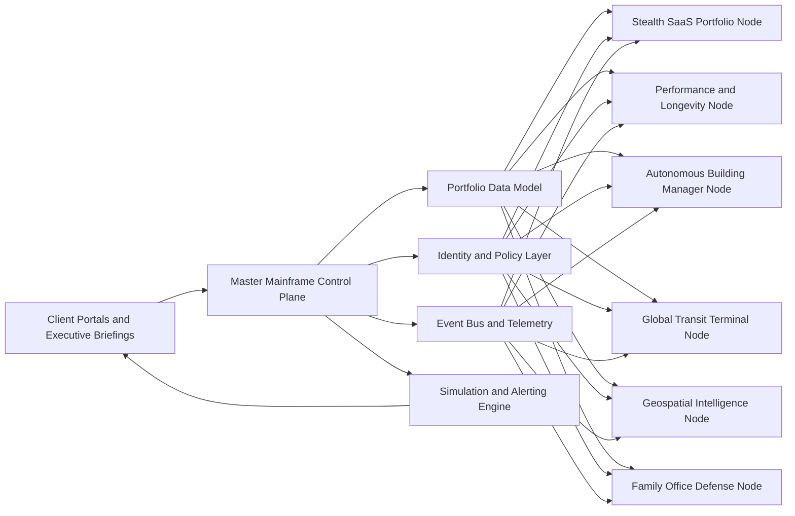

# Integrated Operating Model for Premium Confidential Asset Platforms

## Executive summary

**Assumption used throughout this report:** terms such as “Ghost Economy,” “Stealth Tech,” “covert,” and “Master Mainframe” are treated here as shorthand for **confidential, low-publicity, legally operated, diligence-heavy businesses and interfaces**—not concealment from regulators, investors, counterparties, or law enforcement.

The commercial opportunity is real, but the market is less tolerant of mystique than it was in the zero-rate software era. Current buyout and software-M&A research shows that buyers are rewarding **durable recurring revenue, operational margin expansion, vertical workflow depth, and credible Day‑1 execution plans** more than narrative alone. At the same time, family offices and HNWI allocators continue to show meaningful interest in alternatives and direct private markets, which makes a “software plus operating system” portfolio sellable **if** it is presented as a governed platform with measurable cash flow, not as an opaque black box. citeturn25view0turn25view1turn25view2turn20search1turn20search5turn1search14turn1search0

Across the brief, the strongest pattern is this: premium buyers pay for **orchestrated certainty**. In software portfolios that means common data models, shared identity and reporting, and instrumented value creation. In elite health offerings it means clinician-grade baselines, longitudinal review, and tightly controlled data rights. In real estate, aviation, land intelligence, and family-office security it means command-center visibility over fragmented vendors, assets, permits, and risks. The right “Master Mainframe” is therefore not a theatrical screen wall; it is a **federated operating cockpit** that compresses reaction time, standardizes decisions, and improves auditability. citeturn25view3turn25view5turn29search6turn26view0turn26view1turn25view8turn25view9turn36view0turn36view1turn36view3

The health and longevity portion of the brief requires the most caution. Cardiorespiratory fitness, autonomic recovery, inflammation, lipid particle burden, body composition, and glycemic control all matter, but several prestige-market offerings still sit somewhere between wellness theater and evidence-based medicine. The current state of regenerative medicine and senolytics is especially uneven: some diagnostics are mature, some interventions are pilot-stage, and many aggressively marketed stem-cell or exosome products remain unapproved. Epigenetic clocks are useful research tools and increasingly commercialized, but recent reviews still emphasize inconsistent clinical validation and uncertainty about their practical superiority over direct health-outcome models. citeturn32view0turn31view0turn31view1turn30view2turn33view0turn35view0turn35view1turn35view3turn35view4turn35view6turn35view7

The implication for go-to-market is straightforward. Sell these platforms to HNWIs, family offices, and private equity firms as **high-trust operating systems** with explicit governance, selective exclusivity, and measurable performance improvement. Avoid language that implies invisibility, secrecy, or hiddenness as a value proposition. Replace it with **confidentiality, controlled access, policy-driven automation, privileged intelligence, and evidence-backed intervention**. That is the language premium buyers can underwrite, insure, diligence, and scale. citeturn25view0turn25view1turn25view2turn36view3turn24search0turn24search1turn24search2turn24search3

## Market language and go-to-market positioning

The clearest lesson from current software and private-capital research by entity["company","Bain & Company","management consulting firm"], entity["company","McKinsey & Company","management consulting firm"], and entity["company","Software Equity Group","software m and a advisor"] is that buyers now price **evidence, not aura**. They want recurring and retained revenue, vertical workflow stickiness, integration leverage, better EBITDA, and execution plans that begin before close. On the allocator side, reporting from entity["organization","UBS","banking group"] and entity["organization","Capgemini","consulting company"] shows continued family-office and HNWI interest in alternatives and direct private investments, but with rising emphasis on governance, risk control, and reporting maturity. citeturn25view0turn25view1turn25view2turn20search1turn20search2turn20search5turn1search14turn1search0

The practical consequence is that most of the brief’s invented vocabulary needs translating into investor-safe language. The table below is a synthesis of what present-day buyers will actually diligence and pay for. citeturn25view0turn25view1turn25view2turn20search1turn20search5

| Non-standard phrase | Investor-safe wording | What sophisticated buyers will ask next |
|---|---|---|
| Ghost Economy | Low-publicity private digital cash-flow assets | Entity map, beneficial ownership, revenue concentration, customer retention |
| Covert multi-node enterprise portfolio | Confidential federated holdco with multiple operating subsidiaries | Shared services design, data rights, intercompany agreements, integration roadmap |
| SaaS-as-an-Asset | Contracted recurring-revenue software business with operational leverage | ARR quality, GRR/NRR, gross margin, churn drivers, Rule-of-40 trajectory |
| Synergy Layers | Shared identity, data, RevOps, procurement, compliance, and reporting layers | Quantified cost takeout, CAC reduction, retention uplift, faster add-on integration |
| Master Mainframe hub | Portfolio operating cockpit or secure control plane | Source systems, role-based access, audit logs, alert quality, decision workflows |
| Stealth Tech | Discreet, high-trust, low-noise enterprise UX | Accessibility, contrast, keyboarding, incident response, evidence of operator adoption |

For HNWIs and family offices, the winning pitch is not “secret complexity”; it is **discreet control**. Position the portfolio as a private operating environment that raises decision quality while minimizing public noise, vendor sprawl, and information leakage. For PE firms, the winning pitch is different: **instrumented value creation**. They want underwritable sources of gain—pricing, cross-sell, margin lift, procurement, shared data infrastructure, add-on integration, and compliance reduction—packaged into a dashboard and post-close operating cadence. citeturn25view0turn25view1turn25view2turn36view3turn1search14

A useful way to frame the go-to-market split is this:

| Buyer type | Primary buying motive | Message that works | Message that fails |
|---|---|---|---|
| HNWI / family office | Privacy, optionality, concierge access, downside control | “One secure cockpit for cash flow, mobility, property, health, and risk” | “Hidden empire” |
| Private equity / strategic buyer | Operational leverage, add-on readiness, KPI control, margin expansion | “Shared control plane with measurable synergy capture and Day‑1 governance” | “Mystique-driven roll-up” |
| Corporate principal / founder-owner | Time compression, asset visibility, trusted delegation | “Executive briefing surface with exceptions-first workflow” | “Aesthetic futurism without workflow depth” |

The monetization architecture should mirror that split. A high-end offer works best as a **stacked commercial model**: an initial diligence or configuration fee, a recurring platform license or retainer, premium modules for regulated workflows and reporting, and transaction-based economics where the workflow naturally creates them—such as charter movements, property turnovers, or parcel acquisition events. Shared-savings pricing can work in predictive maintenance or procurement, but only if baseline measurement is agreed before launch. citeturn25view0turn25view1turn36view0turn10search9turn10search20

## Interface architecture and stealth-tech design

If “Stealth Tech” is meant to signal elite discretion, the visual system should read as **quietly authoritative rather than aggressively militarized**. The strongest public patterns come from dashboard guidance and operational-command examples: establish a strict hierarchy, place the most important metrics at the top, preserve consistent color meanings, link charts so filters propagate across views, display the operative timezone, design for keyboarding and focus order, and avoid horizontal scrolling at standard operator resolutions. Monochrome is effective when it is built from a gray-token system with a single accent reserved for state changes, not when it becomes low-contrast theater. Guidance from entity["company","IBM","technology company"] and entity["company","Microsoft","technology company"] is especially useful here, as is operational dashboard practice from public cloud and SOC tooling. citeturn25view7turn26view4turn27view1turn25view8turn25view9turn26view3

image_group{"layout":"carousel","aspect_ratio":"16:9","query":["operations command center video wall dashboard", "smart city command center dashboard wall", "network operations center dark dashboard", "airport operations control center screens"], "num_per_query":1}

The command-center examples below show what actual tier‑1 deployments emphasize in public materials. The common pattern is not visual excess. It is **end-to-end visibility, linked workflows, predictive signals, and administrative control over access and collaboration**. citeturn25view3turn25view5turn29search0turn29search6turn26view0turn26view1turn25view8turn25view9turn26view3

| Public example | Publicly documented signal | Design takeaway |
|---|---|---|
| entity["organization","Deloitte","consulting network"] operational intelligence center | End-to-end visibility, real-time situational awareness, predictive action, AI plus human expertise | The premium cue is **clarity under load**, not ornamental chrome. citeturn25view3 |
| entity["organization","PwC","consulting network"] command-and-control maturity framework | Governance, operations, and technology are all first-class layers; AI, digital twins, IoT, AR/VR move centers from traditional to predictive to “moonshot” | Buyers value a cockpit that can be audited as an operating model, not a screen collection. citeturn25view5 |
| entity["organization","Accenture","consulting company"] command centre / digital command center use cases | Lifecycle control through a shared data lake and unified project or facilities oversight | “Single pane” is credible only when the data model is shared underneath. citeturn29search0turn29search6 |
| entity["company","Palantir","software company"] dashboard and control-plane documentation | Chart-to-chart filtering, fullscreen presentation mode, PDF export, audit logs, third-party management, network egress policies | A stealth hub must combine **operator UX and admin governance**. citeturn26view0turn26view1 |
| entity["company","Amazon Web Services","cloud provider"] operational dashboard guidance | Put summary metrics first, use larger charts for key signals, expose timezone, fit expected screen sizes | The dashboard must support fatigue-resistant operations at bad hours, on bad days. citeturn25view8 |
| entity["company","Splunk","observability company"] SOC operations dashboard | MTTT, workflow efficiency, investigations and responses on track | Elite UI reads “serious” when it shows throughput and decision latency, not just anomalies. citeturn25view9 |

The five cinematic features that actually imply scale and computational power—without drifting into gimmickry—are best expressed as operational motifs rather than animations for their own sake. citeturn25view3turn25view5turn26view0turn25view8turn25view9turn27view1

| Cinematic feature | Why it feels powerful | Implementation rule |
|---|---|---|
| Global topology canvas | Suggests total network or asset awareness across regions | Use it as a drill-down surface tied to real workflows, not a decorative globe |
| Persistent event ribbon | Conveys uninterrupted computational monitoring | Reserve motion for state change, severity escalation, or acknowledgment |
| Time-scrubbable mission timeline | Signals replay, foresight, and operational memory | Let operators move from “what happened” to “what changed” in one gesture |
| Layered geospatial stack | Implies multisource fusion across weather, security, aviation, land, and health assets | Keep layers sparse and toggleable; default to one core view plus exceptions |
| Simulation drawer | Reads as “massive compute” because it offers what-if routing, staffing, or intervention scenarios | Limit outputs to confidence-banded choices, not cinematic pseudo-forecasts |

A strong “Master Mainframe” architecture should also be **federated, not monolithic**: one shared identity and policy layer, one event and telemetry layer, and modular domain nodes for each business line. That direction aligns closely with published zero-trust and governance guidance. citeturn24search0turn24search1turn24search2turn24search3turn26view1

## Human performance and longevity products

The elite performance market converges on a relatively stable biomarker hierarchy. The highest-priority measures are those that are either **causally tied to performance**, **highly predictive of health outcomes**, or **useful in longitudinal decision-making**. Public guidance and recent reviews make VO2max/cardiorespiratory fitness, autonomic markers such as HRV, cardiovascular risk markers such as apoB and hsCRP, body composition, sleep, and context-aware glucose monitoring far more defensible than generic “biohacking scores.” citeturn32view0turn31view0turn31view1turn30view8turn34search2turn30view4turn33view0turn33view2

The marker table below is a synthesis from entity["organization","American College of Sports Medicine","sports medicine society"], the entity["organization","American Heart Association","cardiovascular charity"], the entity["organization","U.S. Food and Drug Administration","us regulator"], and athlete-monitoring reviews, with one important qualifier: data become premium only when interpreted **against an individual baseline** and a specific decision context. citeturn32view0turn31view0turn31view1turn30view2turn33view0turn34search2turn34search1turn33view3

| Marker | Why high performers care | Practical caveat |
|---|---|---|
| HRV | Tracks autonomic recovery, adaptation, and maladaptation risk | Best interpreted as deviation from personal baseline, not a universal score |
| Resting heart rate / HR recovery | Cheap, stable readiness and conditioning signal | Needs consistent collection conditions |
| VO2max / CRF | One of the strongest markers of performance capacity and long-term health risk | Gold-standard testing is still resource-intensive |
| Sleep duration, efficiency, regularity | Recovery, cognition, hormonal regulation, training response | Wearable estimates are useful, but not equivalent to polysomnography |
| Continuous glucose profile | Useful for athlete fueling experiments and metabolic context | Evidence in non-diabetics is still limited; use FDA-cleared devices only |
| Salivary or timed cortisol | Stress-load context, overreaching signal, circadian disruption | Nonspecific; must be interpreted with sleep, symptoms, and workload |
| Body composition and visceral fat | Lean-mass preservation and visceral-fat control matter for both performance and longevity | Avoid scale-weight monoculture |
| ApoB and Lp(a) | Residual cardiovascular risk not visible in standard LDL-C alone | Lp(a) is largely genetic; apoB matters especially in CKM and TG-rich contexts |
| hsCRP | Residual inflammatory risk and preventive-cardiology signal | Must rule out acute illness or other transient causes |
| HbA1c / fasting glucose / fasting insulin | Core metabolic-health trendline | Useful complement to—not replacement for—behavioral and training data |

For a $50,000+ “Transformation Blueprint” to be credible, the pricing has to come from **service intensity, diagnostic breadth, longitudinal review, specialist access, and privacy engineering**, not from branded supplement bundles. Prestige-longevity reviews and current public pricing in the market show that comprehensive memberships routinely span the low five figures, and in some cases reach far above that when imaging, advanced diagnostics, regenerative add-ons, and concierge continuity are included. citeturn21search6turn21search5turn21search14turn21news40turn21news42

| Blueprint phase | Deliverables | Why it supports premium pricing |
|---|---|---|
| Precision baseline | Intake, physician review, CRF/VO2 assessment, body composition, cardiometabolic labs, sleep/autonomic baseline, optional imaging | Creates a defensible “before” state with clinical traceability |
| Data calibration | Device setup, data-rights consent, baseline-range creation, exception thresholds | Prevents dashboard spam and improves decision quality |
| Intervention design | Personalized training block, nutrition architecture, sleep protocol, stress modulation plan, medication/supplement review | Converts data into action with named accountability |
| High-touch execution | Weekly coach review, monthly clinician or sports-science review, adaptive programming, nutrition adjustments | The premium is in tight feedback loops, not static plans |
| Quarterly executive board review | Red/yellow/green risk map, compliance summary, trend deltas, intervention yield, next-quarter priorities | Board-style reporting is what makes the service feel institutional rather than boutique |
| Annual re-baseline | Repeat key diagnostics, re-score risk, re-segment priorities | Converts a one-off experience into a durable operating retainer |

The most defensible trainer-to-athlete feedback loop is logic-based and exception-driven. It should never pretend that one sensor “knows” the athlete; instead, it should link multiple signals into interpretable actions. Recent monitoring reviews explicitly recommend minimal-but-accurate multidimensional frameworks rather than maximalist data collection. citeturn30view4turn23search5turn23search2turn33view3turn34search2

| Logic-based feature | System logic | Recommended action |
|---|---|---|
| Recovery downgrade engine | HRV suppression plus poor sleep plus high previous-day load | Auto-suggest lower-intensity or skill-focused session |
| Fueling alert | Unstable intra- or post-session glucose pattern alongside heavy workload | Trigger nutrition message and coach review |
| Adaptation plateau detector | Stable compliance but flat CRF/performance trend over several blocks | Recommend programming change rather than more volume |
| Stress-convergence alert | Elevated cortisol context plus low subjective wellness plus HRV decline | Escalate to recovery, travel, or psychosocial review |
| Injury-risk nudger | Workload spike plus movement asymmetry or soreness recurrence | Flag physiotherapy screen before next high-speed session |
| Heat/dehydration risk board | Training environment plus body-mass change plus heart-rate drift | Trigger hydration and environmental modifications |
| Sleep-debt governor | Consecutive nights below individualized sleep target | Shift session timing or reduce decision-heavy work |
| Illness sentinel | Elevated inflammation context plus fatigue and degraded readiness | Recommend medical screening before load continuation |
| Compliance drift monitor | Repeated missed logs, meals, or recovery tasks | Coach intervention focused on behavior, not just physiology |
| Executive-travel reconciler | Flight/travel load plus circadian shift plus performance needs | Adjust timing, session intensity, and briefing expectations |

Regenerative medicine and anti-aging medicine demand stricter language. The science base is mixed. FDA consumer warnings make clear that many marketed stem-cell, placental, Wharton’s Jelly, and exosome products are unapproved, and in some cases associated with serious harm. Meanwhile, the foundational Horvath Clock remains a landmark in biological-age measurement, but newer comparative work shows different clocks have different disease associations, and recent criticism argues that clinical validation and uncertainty quantification remain inadequate for overconfident consumer claims. Senolytics are promising, but the human literature is still early-stage and heavily pilot-oriented. citeturn35view0turn35view1turn8search0turn35view3turn35view4turn35view6turn35view7

A careful market-facing language rule follows from that evidence: **sell these services as early-detection, risk-stratification, and longitudinal optimization programs—not as age reversal guarantees**. Publicly visible premium stacks in the affluent tech-longevity market illustrate what is actually being bundled today. The stack list below is framed as **publicly marketed or publicly discussed**, not as a verified census of what “Silicon Valley elite” privately use. citeturn9search4turn9search3turn21search5turn21news40turn21search6

| Public premium stack | Typical components | What it does well | Evidence status |
|---|---|---|---|
| entity["company","Oura","smart ring maker"] sleep-autonomic stack | Sleep, HRV, resting HR, readiness trend | Daily recovery visibility and habit feedback | Mature for trend monitoring, not diagnosis citeturn9search2turn9search9turn34search2 |
| entity["company","Dexcom","medical device company"] metabolic loop | FDA-cleared CGM plus app coaching, sometimes integrated with wearables | Fueling experiments, glycemic awareness, time-in-range context | Strong for diabetes care; mixed for non-diabetic outcomes citeturn9search4turn30view2turn33view0turn33view2 |
| entity["company","Function Health","lab testing service"] lab-first stack | Large lab panels, repeat testing, action plans, optional imaging | Broad biomarker surveillance with recurring cadence | Useful for trend analysis; quality depends on clinical interpretation citeturn9search3turn9search10turn9search6 |
| entity["company","Fountain Life","longevity clinic company"] imaging-and-membership stack | Membership model, advanced diagnostics, imaging, physician guidance | Premium continuity and early-detection theater backed by real diagnostics | Stronger for diagnostics than for many optimization claims citeturn21search5turn21search8turn21search14turn21news42 |
| Genome-and-clock stack | Whole-genome or targeted sequencing, methylation clock, counseling, periodic re-reads | Trait/risk screening and longitudinal aging narrative | Valuable for risk discussion; clocks still have validation limits citeturn18search0turn18search4turn35view3turn35view4 |

A high-end “Genomic Audit” service is operationally credible only if it behaves like a regulated information service, not a luxury lifestyle add-on. At minimum, that means physician-ordered or properly supervised testing where required, a CLIA-certified laboratory path, explicit consent for secondary findings, named ownership of raw and interpreted data, counsel on discrimination and insurance implications, versioned reinterpretation policies, and health-data security that respects the fact that genetic and biometric data are treated as especially sensitive under multiple privacy regimes. Guidance from entity["organization","Centers for Medicare & Medicaid Services","us health agency"] and related U.S./EU privacy authorities makes that governance layer non-optional. citeturn18search0turn18search4turn18search1turn18search5turn19search3turn19search4turn19search12

The best presentation format for affluent clients is a **Life-Technical Briefing**: a one-page executive summary first, followed by system-level sections for cardiovascular, metabolic, inflammatory, sleep/recovery, body composition, genomic, and aging-clock observations; each item should show baseline, current state, confidence, probable significance, and the next best action. The visual language should mirror command-center practice: tabular figures, sparse accent color, red/amber/green reserved for action priority, and a hard distinction between **screening signal**, **confirmed diagnosis**, and **investigational implication**. citeturn25view7turn25view8turn27view1turn18search0turn19search3turn19search4

## Built environment and mobility operations

The “Smart Luxury” residential market is best understood as a workflow-compression problem. Property managers identify vacancies, operating-cost inflation, rising resident expectations, move-in friction, fraud, and unreliable legacy systems as current pain points, while facilities-management leaders are moving from reactive to predictive maintenance and toward portfolio-wide optimization. Public commercial-real-estate and property-management research therefore supports a **staff-less by default, human-on-escalation** operating model for high-value residences and estates. citeturn36view0turn10search0turn10search1turn10search9turn10search20turn10search6

The feature set of an Autonomous Building Manager should remove friction at the highest-cost points in the resident lifecycle. entity["company","AppFolio","property software company"], entity["company","CBRE","real estate services company"], and entity["company","JLL","real estate services company"] all point toward the same logic: unify leasing, maintenance, finance, and resident service around one operating surface. citeturn36view0turn10search1turn10search9turn10search20turn10search0

| Autonomous Building Manager feature | Human friction removed |
|---|---|
| AI lease-funnel and vacancy board | Manual tracking of lead-to-lease leakage |
| Application-fraud screening | Document-by-document manual review |
| Move-in readiness orchestrator | Utility, access, deposit, amenity, and service setup confusion |
| Resident identity and access wallet | Front-desk or property-manager mediation for routine access |
| Predictive maintenance anomaly grid | Reactive repair after failure |
| Vendor SLA and compliance board | Chasing trades, insurance, permits, and certifications |
| NOI and cost-variance cockpit | Spreadsheet lag between operations and owner reporting |
| Energy-water anomaly layer | Late discovery of leaks and waste |
| Resident sentiment and service queue | Fragmented complaints across channels |
| Turnover command lane | Manual coordination of cleaning, inspection, repair, and re-listing |

For this domain, the minimum viable data flow is: CRM/leasing system → resident identity and payments → IoT/BMS/access-control telemetry → work-order engine → vendor and finance systems → owner reporting. The minimum security posture is role-based access, privileged-event logging, vendor segmentation, backup and disaster recovery, and a privacy model that separates staff, resident, guest, and contractor entitlements. A lean delivery team usually needs a domain PM, product designer, full-stack engineer, integrations/data engineer, and facilities-operations lead. Commercially, the cleanest model is setup plus recurring software fee, with optional per-unit pricing or shared-savings overlays for maintenance and utilities. citeturn36view0turn10search9turn10search20turn10search4

The private-aviation portion of the brief follows the same orchestration logic, but under a much tighter regulatory and operational envelope. Empty-leg inventory exists because aircraft repositioning creates otherwise unused sectors, and public guidance from entity["organization","National Business Aviation Association","business aviation trade group"] and aviation regulators makes clear that charter, broker, and “by-the-seat” practices carry real compliance distinctions. At the top end of the market, dispatching is not just routing; it is the coordinated management of flight plans, handlers, customs, passenger manifests, permits, fueling, weather, crew legality, and ground transportation. citeturn11search4turn12search7turn12search6turn12search4turn12search20

A Global Transit Terminal should therefore present logistics as a synchronized chain, not a trip calendar. Public process guidance from the entity["organization","Federal Aviation Administration","us aviation regulator"], entity["organization","U.S. Customs and Border Protection","us border agency"], the entity["organization","International Civil Aviation Organization","un aviation agency"], the entity["organization","International Business Aviation Council","business aviation body"], and entity["organization","EUROCONTROL","european air navigation body"] points to a control surface with tightly linked subflows for filing, screening, and trip support. citeturn36view1turn11search5turn11search17turn11search14turn11search2turn12search4turn12search20turn12search5turn12search18

| Global Transit Terminal feature | Operational value |
|---|---|
| Flight-plan composer with ICAO/FAA validation | Reduces filing errors and dispatch back-and-forth |
| Customs and eAPIS tracker | Makes passenger/crew readiness visible before departure |
| Preclearance status lane | Prevents last-minute border surprises |
| Handler/FBO coordination board | Links air arrival to ground execution |
| Crew legality and rest dashboard | Keeps premium service aligned with safety and compliance |
| Aircraft health and MEL/defect pane | Connects movement planning to maintenance reality |
| Empty-leg opportunity engine | Monetizes repositioning sectors without hiding compliance needs |
| Ground-transport convoy board | Treats air and surface mobility as one itinerary |
| Permit and route-risk map | Adds geopolitical and operational foresight |
| Principal briefing card | Gives assistants and principals one concise travel picture |

The staffing and commercial model here typically separates into platform and operations: software product, compliance/configuration, and dispatch service. Pricing works best as a base platform fee plus per-tail, per-base, or per-movement pricing, with premium modules for international operations, customs, and risk screening. Core buyer personas are principals, chiefs of staff, executive assistants, charter operators, and fleet managers. citeturn36view1turn12search2turn12search6turn12search14turn11search7

## Land intelligence and family-office defense

Land, mineral-rights, and “land-banking” workflows become investable when three layers are fused: **rights certainty, surface and subsurface data, and forward-looking risk overlays**. Public guidance from the entity["organization","Bureau of Land Management","us land agency"] confirms that surface and mineral rights can diverge and that ownership must be verified through title and land records; open geospatial programs from the entity["organization","U.S. Geological Survey","us science agency"], entity["organization","NASA","us space agency"], the entity["organization","Natural Resources Conservation Service","usda conservation agency"], entity["organization","FEMA","us emergency agency"], the entity["organization","Copernicus Land Monitoring Service","eu earth observation service"], and entity["organization","NOAA","us oceanic agency"] provide the raw components for parcel-level scoring. citeturn13search1turn13search5turn13search8turn13search16turn13search3turn13search7turn13search2turn13search6turn14search0turn14search12turn14search3turn14search15turn14search17turn14search2

That means a Geospatial Intelligence dashboard should not begin with pretty map layers. It should begin with **investment questions**: Do we control the surface? Do we control the minerals? What can be built or extracted? What environmental or climate losses are likely? Which parcel is mispriced because a key dataset has not been integrated into local comps? The table below is the feature set that most directly serves those questions. citeturn13search1turn13search5turn13search8turn13search3turn14search0turn14search3turn14search17

| Geospatial Intelligence feature | Data logic |
|---|---|
| Parcel radar | Aggregates title, ownership, parcel geometry, zoning, tax, and transaction history |
| Mineral-rights ledger | Separates surface, mineral, leasehold, and servitude/split-estate status |
| Hyperspectral anomaly layer | Flags mineralogical patterns or critical-mineral signatures |
| Soil and agronomy panel | Uses soil surveys to identify agricultural or development constraints/opportunity |
| Flood-fire-heat-risk stack | Integrates hazard layers into underwriting, not just insurance afterthoughts |
| Ground-motion and subsidence monitor | Captures assets at risk from settlement, water extraction, or terrain instability |
| Water and vegetation trendline | Tracks drought, moisture, and land-cover change over time |
| Scenario engine | Compares hold, develop, lease, extract, or resell cases under different risk assumptions |
| Acquisition queue | Moves parcels from discovery to diligence to bid status |
| Executive map briefing | Converts dense geodata into parcel-level “buy / wait / discard” decisions |

The operating requirements are demanding but clear: a geospatial data engineer, land and title analyst, remote-sensing capability, transaction-database access, and a legal or land-administration function for rights verification. The commercial model can be subscription plus diligence fee, or retainer plus success fee on identified acquisitions. Buyers are resource investors, land-rich family offices, agriculture operators, infrastructure investors, and strategic land-bankers. citeturn13search1turn13search5turn13search8turn13search3turn14search0turn14search3

For family-office security, the evidence points toward **cyber-physical convergence** as the central design principle. Deloitte’s family-office research shows cyberattacks are common, that phishing dominates, and that many offices still lack robust incident planning. Public guidance from entity["organization","CISA","us cyber agency"] and the entity["organization","ASIS International","security standards body"] reinforces the need to join executive protection, device security, vendor management, Wi‑Fi hygiene, and converged incident response. Packet sniffing, rogue access points, smart-estate compromise, RF interference or “signal drift,” vendor compromise, and unauthorized drones should all be treated as **defensive monitoring problems**, not as a prompt for aggressive countermeasures outside legal authority. citeturn36view3turn16search12turn15search1turn15search2turn15search7turn15search15turn17search0turn17search1turn17search5

| Defense Monitoring UI component | What it should show |
|---|---|
| Identity and vendor trust panel | Privileged accounts, third-party connections, MFA gaps, anomalous access |
| Network anomaly and rogue-AP map | Unauthorized SSIDs/APs, unusual traffic patterns, segmentation breaks |
| RF spectrum health strip | Interference spikes, degraded channels, unusual drift across protected systems |
| Airspace awareness pane | Detection of drone activity, geofence entry, escalation path and legal constraints |
| Cyber-physical incident chain | A single timeline linking digital alerts, access events, camera triggers, and operator actions |

For this domain, the minimum staffing model is a security lead, cyber engineer or MSP, physical-security integrator, and legal/privacy counsel on call. Pricing usually takes the form of base monitoring plus premium incident-response retainers and optional estate or travel overlays. The buyer is typically the family office itself, not the individual principal, because governance, insurance, and vendor oversight all sit there. citeturn36view3turn17search0turn17search5turn15search1turn15search7

## Cross-domain operating model

The most scalable version of the brief is a **federated control-plane business**. Each vertical node keeps its own domain logic and regulated workflows, but all nodes share common services for identity, policy, logging, reporting, alerting, billing, and executive briefing. Published guidance from entity["organization","National Institute of Standards and Technology","us standards agency"], together with broadly adopted assurance frameworks, supports that structure: resource-first security, least privilege, continuous verification, auditable controls for security/availability/confidentiality/privacy, and a formal information-security management system. citeturn24search0turn24search1turn24search2turn24search3

The matrix below is a synthesis of the operational, data, security, staffing, pricing, and buyer requirements across the domains in the brief. citeturn24search0turn24search1turn24search2turn24search3turn36view0turn36view1turn13search1turn36view3

| Domain | Core operating requirements and data flows | Security / privacy / regulatory focus | Typical staffing and tech stack | Pricing and buyer persona |
|---|---|---|---|---|
| Confidential SaaS portfolio / holdco cockpit | ERP + CRM + product telemetry + finance + shared KPI model | Zero trust, audit logs, board reporting, data-room readiness, entity governance | Product lead, FP&A, data engineer, full-stack app, operating partner | Retainer + platform fee + implementation; buyers are HNWIs, family offices, PE firms |
| Elite performance and longevity | Wearables + labs + training load + nutrition + physician/trainer workflow | Health-data segmentation, informed consent, clinical-scope limits, breach response | Sports scientist, physician, nutrition lead, coach, data integrator | Membership / retainer; buyers are athletes, CEOs, UHNW families |
| Genomic Audit / Life-Technical Briefing | Lab ordering → sequencing or methylation → interpretation → counseling → monitoring | CLIA path, genetic-data consent, discrimination risk counseling, special-category data handling | Medical director, genetic counselor, lab ops lead, privacy lead | Audit fee + annual review; buyers are HNWIs, employers, longevity clinics |
| Autonomous Building Manager | Leasing → identity/access → IoT/BMS → work orders → vendor ops → owner reporting | Resident privacy, payments, camera/access governance, vendor segregation, DR | PM, designer, integrations engineer, FM lead, support | Setup + per-unit or monthly SaaS; buyers are multi-unit landlords and estate operators |
| Global Transit Terminal | Trip request → flight planning → customs/APIS → handlers/FBO → crew/ground → asset tracking | Aviation, customs, broker/operator compliance, passenger-data security | Dispatch lead, aviation ops, integrations engineer, compliance specialist | Base fee + per movement / tail; buyers are family offices, operators, principals |
| Geospatial Intelligence | Parcel/title data + remote sensing + hazards + comps + diligence queue | Land-record integrity, rights verification, jurisdictional land-use rules | GIS engineer, title analyst, land/legal ops, acquisitions lead | Subscription + diligence / success fee; buyers are land investors and resource acquirers |
| Family Office Defense node | Identity + endpoint/network + RF + cameras/access + travel/estate incident chain | Privacy, surveillance law, drone/airspace law, incident logging, vendor governance | Security director, cyber engineer/MSP, physical integrator, legal/privacy support | Monitoring retainer + incident surge pricing; buyers are family offices and principals |

The underlying product strategy should therefore be to sell **one premium operating doctrine expressed through several vertical nodes**. The doctrine is consistent across every domain: collect only what changes decisions; privilege baselines over vanity metrics; show exceptions before raw data; make identity, policy, and auditability universal; and translate every dashboard element into either **a workflow, a forecast, or a fiduciary explanation**. citeturn24search0turn24search1turn25view8turn25view9turn30view4

The final strategic conclusion is simple. Premium buyers will pay sustained premiums for **governed intelligence, decision speed, and institutional polish**. They will not pay sustained premiums for vague secrecy. The most effective positioning for the combined brief is therefore not a “covert empire.” It is a **private, high-trust operating system for concentrated assets and high-consequence decisions**—with clean data rights, strict access control, sober visual language, and evidence-backed claims. That framing is both more defensible and more valuable. citeturn25view0turn25view1turn36view3turn24search0turn35view1turn35view4