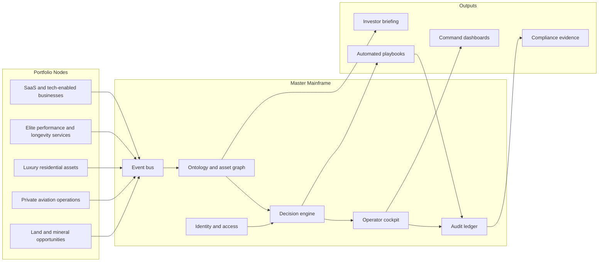
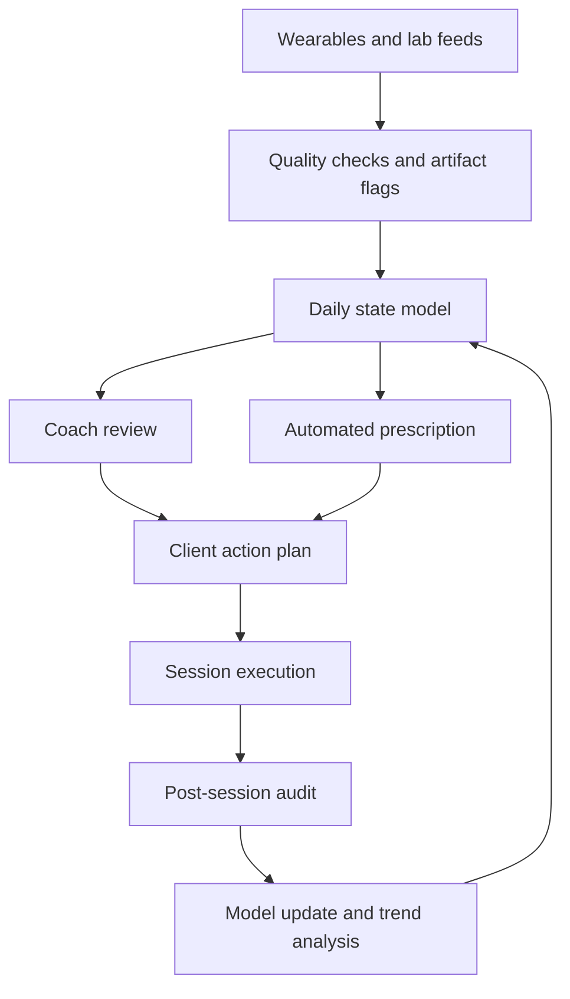
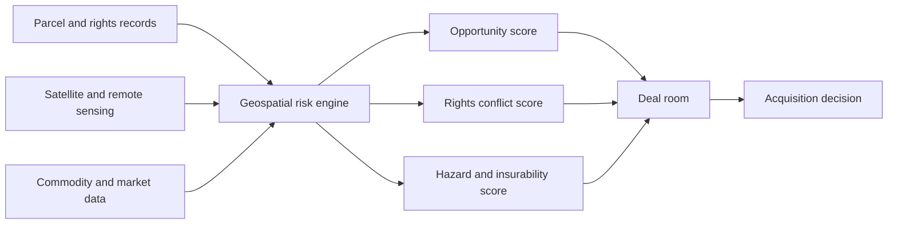

# Covert Portfolio Operations, Stealth Interfaces, Human Performance Systems, and Autonomous Asset Control

## Executive Summary

The common thread across all seven domains is not secrecy for its own sake, but the conversion of fragmented assets into a single, governed operating system. In software and tech-enabled services, that means packaging recurring revenue, control rights, data exhaust, and integration capability so that buyers see a portfolio as an institutional asset rather than a collection of small businesses. That framing sits in a large and still-active market: the public cloud software benchmark tracked by entity["organization","Bessemer Venture Partners","venture capital firm"] shows roughly $1.7 trillion in aggregate market capitalization and an average public revenue multiple of 5.9x, while its 2025 Cloud 100 benchmark reported average ARR multiples around 20x for the top cohort; meanwhile, entity["organization","Bain & Company","consulting firm"] reported technology rising to 22% of North American private-equity deals in the first half of 2025, and entity["organization","Capgemini","consulting firm"] reported that global HNWI wealth rose 4.2% in 2024 with an estimated $83.5 trillion intergenerational transfer ahead. citeturn26view1turn26view0turn26view2turn26view3

For the user’s terms “ghost economy,” “covert portfolio,” “stealth offerings,” and “synergy layers,” the commercially viable interpretation is **confidential, off-market, diligence-ready ownership and operations** rather than concealment of beneficial ownership, sanctions exposure, or control. That distinction matters because U.S. securities disclosure, sanctions screening, and M&A compliance diligence remain material even after FinCEN’s March 2025 interim rule exempted U.S. companies and U.S. persons from CTA beneficial-ownership filing. Serious buyers will tolerate privacy; they will discount opacity. entity["organization","Securities and Exchange Commission","us securities regulator"], entity["organization","Financial Crimes Enforcement Network","us treasury bureau"], entity["organization","Office of Foreign Assets Control","us treasury sanctions office"], and the entity["organization","U.S. Department of Justice","us justice department"] all point in the same direction: acquisition value rises when governance, third-party diligence, and integration controls are explicit and auditable. citeturn26view4turn26view5turn26view6turn26view7

Across command-center UX, the mature pattern is also now clear. The best public examples do not stop at visualization. entity["organization","Accenture","consulting firm"] frames control towers as personalized dashboards with real-time visibility and autonomous execution; entity["organization","McKinsey & Company","consulting firm"] describes “nerve centers” that sense shocks earlier and compute better responses; entity["organization","Deloitte","professional services firm"] emphasizes 24/7 cyber intelligence centers; entity["organization","PwC","consulting firm"] highlights AI, digital twins, and real-time dashboards in command-and-control centers; and entity["organization","EY","consulting firm"] explicitly describes operational war rooms surfacing live operational, financial, and experience KPIs. The implication is that a “Master Mainframe” hub should be designed as an orchestration layer with identity, policy, eventing, ontology, simulation, and replay, not as a decorative dashboard. citeturn29view2turn29view3turn29view1turn29view4turn29view5

In human performance, the highest-signal client markers are still fairly conservative: cardiorespiratory fitness and VO2max are among the strongest predictors of morbidity and mortality; glucose metrics have well-defined diagnostic thresholds and increasingly usable CGM-based pattern metrics; HRV is valuable when treated as an individualized baseline trend rather than a universal score; and cortisol is directionally informative but weaker as a standalone “optimization” target. The premium price point in executive longevity comes not from adding more biomarkers, but from turning them into a repeatable operating cadence with clinician interpretation, tightly audited data capture, and decisions that save time, preserve productivity, and reduce downside risk. citeturn34view1turn39view1turn39view2turn39view4turn37view0turn34view6

In regenerative medicine, the market is split between real translational progress and aggressive consumer overclaiming. The entity["organization","Food and Drug Administration","us medicines regulator"] now maintains a substantial list of approved cell and gene therapies, and RMAT designation demand accelerated sharply in 2025, but the agency continues to warn consumers about unapproved stem-cell and exosome products. Likewise, entity["people","Steve Horvath","epigenetic clock researcher"]’s clock remains foundational for biological-age measurement, and newer clocks are becoming more predictive, but genuine age-reversal claims in humans remain early, small, and heterogeneous. Senolytics remain scientifically important and commercially overmarketed. citeturn40view5turn40view6turn40view7turn40view8turn40view0turn40view2turn42view2turn41view0

For smart residences, private aviation, and land banking, the commercial advantage comes from collapsing latency across fragmented workflows: building systems into predictive control, dispatching and preclearance into one travel command surface, and cadastral plus satellite plus hazard data into an underwriting interface. The enabling standards are already visible: BACnet, semantic tagging, Matter, OpenADR, Part 135, digital flight filing, preclearance workflows, public mineral-land records, multi-sensor earth observation, and hazard overlays. The strategic opportunity is less about inventing new infrastructure than about integrating proven rails into one operator-grade control plane. citeturn43view3turn43view4turn43view5turn43view6turn43view7turn43view8turn43view11turn43view13turn43view14turn43view15turn43view16turn43view19

## Assumptions and Method

This report uses a **U.S.-first regulatory baseline** for securities, charter aviation, genomics, and mineral-rights diligence because those domains are highly jurisdiction-specific. Where the evidence base is weak or the terminology is non-standard, I state that explicitly. In particular, “ghost economy,” “SaaS-as-an-Asset,” “synergy layers,” “bio-optimization stack,” and “Life-Technical Briefing” are **not** formal industry taxonomies; they are treated here as shorthand for confidential portfolio packaging, recurring-revenue software acquisition, shared operating layers across bundled assets, concierge longevity protocols, and high-end client reporting formats. Because the user asked about “covert” positioning, this report deliberately stays on the lawful side of confidentiality and does **not** provide tactics for hiding ownership, evading sanctions, misleading buyers, or bypassing healthcare and aviation regulation. FinCEN’s current U.S. BOI exemption is noted where relevant, but it does not eliminate disclosure, diligence, or recordkeeping duties in other regimes. citeturn26view5turn26view4turn26view6turn26view7

The research priority was official and primary material first, then major consultancies, then peer-reviewed papers, then industry operating examples with public documentation. Publicly visible company and clinic pages were used mainly to anchor product, workflow, and pricing examples rather than to validate clinical efficacy claims. citeturn29view2turn29view3turn29view4turn29view5turn34view6turn34view7turn34view8

## Enterprise Portfolio Markets and Mainframe Hubs

### Ghost Economy and SaaS-as-an-Asset

There is no standard “ghost economy” market definition in finance, so the most defensible working definition is: **a low-profile portfolio of cash-flowing digital or tech-enabled businesses marketed through confidential process, concentrated information control, and a premium on operational discretion**. Under that definition, the real market is the overlap between software valuation, private-equity deal flow, search-fund or acquisition-entrepreneurship demand, and HNWI/family-office appetite for recurring revenue and defensible control. The clearest buyer-side evidence is that software remains both liquid enough to trade and strategic enough to integrate: public cloud valuations still materially exceed many traditional sectors, private-equity activity remains high, and next-generation wealth is massive and increasingly looking for direct, differentiated private-market exposure. citeturn26view1turn26view0turn26view2turn26view3

The core buyer personas are not especially mysterious. HNWIs and family offices typically want predictable cash generation, low manager count, trusted operators, and asymmetry relative to public markets. PE firms want platformability: repeatable integration, measurable synergies, data rights, compliance hygiene, and a path to multiple expansion. Search-fund and acquisition-entrepreneurship buyers sit in between, often preferring smaller but sticky B2B software or tech-enabled services with low churn and clear operational levers. That matters because the sales narrative shifts from “hidden empire” theater to “institutional-quality private control surface.” The strongest marketing language is therefore not underground or elusive. It is: **mission-critical, operator-led, control-plane, governed, resilient, audit-ready, cash-generative, low-churn, and extensible**. citeturn26view3turn26view2turn25search11turn29view2turn33search11

The legal boundary is sharp. If the portfolio touches U.S. public securities, crossing 5% beneficial ownership can trigger Schedule 13D/13G reporting. In sanctions-sensitive geographies or customer sets, OFAC expects risk-based assessments that explicitly include M&A. DOJ expects pre- and post-acquisition diligence and timely integration into controls. FinCEN’s 2025 rule change means domestic U.S. entities are no longer filing CTA BOI reports, but that does **not** reduce the need for diligence in PE processes, banking, sanctions screening, contractual representations, source-of-funds checks, or cross-border holding structures. A “covert” pitch that implies hidden control is therefore value destructive for serious buyers. A “confidential process” pitch that shows clean governance is value accretive. citeturn26view4turn26view5turn26view6turn28view0

| Buyer type | What they actually buy | Evidence they will expect | Main discount triggers |
|---|---|---|---|
| HNWI / family office | Stable cash yield, optionality, low-overhead control | Cohort retention, owner earnings or EBITDA bridge, legal structure map, operator continuity | Opaque cap table, unclear reps and warranties, founder dependence |
| Lower-middle-market PE | Platform plus tuck-in thesis | Clean M&A diligence, data room discipline, integration playbook, customer concentration analysis | Weak compliance, poor data lineage, no shared systems |
| Search fund / acquisition entrepreneur | Durable niche software or tech-enabled service | ARR or repeat revenue quality, manageable support burden, clear operating levers | Churn volatility, bespoke code debt, non-transferable sales motion |
| Strategic buyer | Product adjacency and data leverage | API posture, roadmap fit, identity/access model, cross-sell feasibility | Architecture sprawl, contract incompatibility, regulatory baggage |

The valuation model should therefore be **layered**, not singular. Public default anchors can come from the BVP cloud benchmark, but private transactions need a haircut for concentration, code quality, and services load. In 2025, BVP’s public cloud index showed an average revenue multiple of 5.9x, while the Cloud 100 benchmark cited average ARR multiples near 20x for top-tier growth assets. Public comparables are therefore useful as ceiling signals, not transaction truths. In lower and middle market software, reported private-equity median EV/revenue multiples in Q1 2025 were 4.8x and EV/EBITDA 18.2x, while Stanford’s 2024 search-fund observations showed that EV/ARR became less dominant as a primary metric in 2022–2023, falling to 18% of acquisitions. The practical takeaway is that smaller portfolios get priced on a blend of revenue quality, EBITDA conversion, renewal durability, and transferability of operating control. citeturn26view1turn26view0turn25search10turn25search11

| Valuation lens | Best use case | Main driver | Helpful when | Dangerous when |
|---|---|---|---|---|
| EV / ARR | Pure or near-pure SaaS | Renewal quality and growth | High gross margins, low services load, clean retention | Services-heavy businesses disguised as SaaS |
| EV / Revenue | Tech-enabled services, mixed software | Commercial momentum | Comparable comps exist but EBITDA is noisy | Low-margin delivery work inflates top line |
| EV / EBITDA | Mature portfolio packages | Cash conversion | OpEx is normalized and owner costs are adjusted | Underinvestment is masking future capex or hiring |
| Sum-of-the-parts | Multi-node portfolios | Different risk classes | Nodes vary materially by margin, geography, or legal structure | Shared overhead and liabilities are not allocated correctly |
| Strategic-synergy premium | Bundled portfolio sale | Shared control plane | Cross-sell, identity, billing, procurement, and data reuse are already real | “Synergies” are aspirational slides rather than operating facts |

What the user called **“synergy layers”** should be presented as explicit shared-control assets. In practice, these are the reusable layers that make a bundle worth more than the nodes: shared identity and access, billing, customer reporting, analytics, procurement, support knowledge, compliance controls, and an operational graph that tracks entities, assets, events, and permissions. This idea is strongly aligned with how Palantir describes ontology as an operational layer and how Accenture and McKinsey describe control towers graduating from visibility to orchestration. My inference is that “synergy layers” become credible only when they are already instrumented as shared systems, not merely projected as future savings. entity["organization","Palantir Technologies","data software company"] turns this into an “operational layer,” while Accenture and McKinsey frame it as the shift from dashboarding to execution. citeturn33search11turn29view2turn29view3

### Stealth Tech UX and the Master Mainframe Hub

The strongest public references for a “Master Mainframe” hub converge on a small set of design principles: central visibility, policy-based activation, multi-domain event fusion, replayability, scenario simulation, and a very disciplined approach to visual hierarchy. Anduril’s public descriptions of Lattice emphasize sensor fusion, distributed command and control, and one operator overseeing a much larger machine network; Palantir’s ontology emphasizes the connection between data assets and their real-world counterparts; Deloitte’s cyber centers emphasize 24/7 fusion; PwC’s command-center maturity material emphasizes digital twins, AI, and real-time situational dashboards; EY’s operational war rooms explicitly center live operational and financial intervention. That cluster defines the commercial frontier for “stealth” enterprise UI: **dark discipline, sparse copy, dense context, and obvious control.** entity["organization","Anduril Industries","defense technology company"], Palantir, Deloitte, PwC, EY, and McKinsey all converge on this orchestration logic. citeturn32view1turn33search11turn29view1turn29view4turn29view5turn29view3

image_group{"layout":"carousel","aspect_ratio":"16:9","query":["high security command center dashboard dark interface", "global operations center world map dashboard dark ui", "cyber fusion center dashboard monochrome ui", "geospatial intelligence dashboard dark monochrome"], "num_per_query": 1}

Visually, the current premium pattern is **monochromatic with selective signal color**, not true black-on-black maximalism. The most credible enterprise command surfaces use charcoal, graphite, smoke, or deep navy as base fields; reserve color for status changes rather than decoration; rely on motion only when it conveys liveness; and treat typography as architecture. The aesthetic vocabulary across defense-tech, cyber, and control-tower examples is also linguistically consistent: “operators,” “mission,” “signal,” “control plane,” “ontology,” “coordination,” “resilience,” “real time,” “autonomous execution,” and “fusion.” These are useful because they imply infrastructure and governance, whereas luxury adjectives alone imply marketing theater. citeturn32view1turn33search0turn33search2turn29view2turn29view1

A credible “Master Mainframe” should therefore be built around five visual strata:

1. **Position layer** — world map, air/ground/network topology, portfolio node status, and jurisdiction overlays. The model here is multi-domain situational awareness rather than BI chart stacks. citeturn29view4turn32view1turn33search1  
2. **Event layer** — incident stream, anomaly queue, expiring obligations, and threshold alerts, prioritized by actionability. Darktrace’s public positioning around AI triage is a useful reference for compressing noise into investigation-ready items. entity["organization","Darktrace","cybersecurity company"] citeturn33search2turn33search17  
3. **Decision layer** — recommended interventions, operator confirmation, rule provenance, and simulation. McKinsey’s nerve-center logic belongs here. citeturn29view3  
4. **Audit layer** — immutable decision log, user override trail, model versioning, and counterparty screening status. This is what converts “stealth” from style to bankable governance. citeturn26view6turn28view0  
5. **Replay layer** — temporal ghosts, branch comparisons, and “what changed since last watch” views. This is one of the most underused “cinematic” enterprise features because it makes power visible without adding clutter. The best public analogs are mission replay and automated incident investigation patterns rather than traditional dashboards. citeturn32view1turn33search17

The public command-center examples most relevant to the user’s goal are worth cataloging explicitly. PwC’s latest CCC material highlights centers such as entity["organization","Singapore POCC","operations command center"], entity["organization","Antwerp Police CCC","police command center"], and the entity["point_of_interest","Rio Operations Centre","Rio de Janeiro, RJ, BR"], and frames global leaders in terms of capabilities, operations, technology, and governance. EY’s healthcare report describes operational war rooms for cross-functional interventions. Deloitte positions cyber intelligence centers as jontelligence hubs. These are not identical use cases, but they share the same UX truth: the best command surfaces turn many feeds into one version of reality. citeturn29view4turn30view0turn29view5turn29view1

The architecture above is the right abstraction because it treats the “hub” as a control plane. That is far closer to Palantir ontology, Anduril Lattice, Accenture control towers, and McKinsey nerve centers than a conventional executive dashboard. citeturn33search11turn32view1turn29view2turn29view3

## Human Performance and Bio-Optimization

### Elite Sports Science and Executive Longevity

If the target buyer is an elite athlete, executive, or HNWI household, the biomarker set should be structured around three questions: **Can this person perform? Can they recover? Can they compound healthspan?** The common mistake in premium programs is to expand the lab menu faster than the decision system. The evidence hierarchy is stronger for CRF/VO2max, blood pressure, glucose control, and sleep patterns than for cortisol theater or exotic wellness proxies. Continuous data only justifies premium pricing when it improves decisions or reduces time risk. citeturn34view1turn39view1turn22search9turn22search10turn22search11

| Marker | Why elite clients care | Preferred measurement | High-performance interpretation |
|---|---|---|---|
| HRV | Recovery, autonomic stress, readiness | Morning ECG/chest strap or validated short PPG; RMSSD / LnRMSSD | Use against rolling personal baseline; trend matters more than universal cutoff |
| Resting heart rate | Recovery, fitness, illness flag | Morning wearable or ECG | Lower can be favorable in trained clients; context matters |
| VO2max / CRF | Performance ceiling and longevity | CPET gold standard; validated treadmill/cycle estimate as backup | One of the strongest healthspan-linked markers |
| Glucose | Metabolic flexibility, sleep and meal response, insulin-risk surveillance | Fasting plasma glucose, HbA1c, optional CGM patterning | For non-diabetics, evaluate both fasting lab values and post-meal behavior |
| Cortisol | Stress-system context, adrenal work-up when clinically indicated | Serum morning cortisol; salivary cortisol when protocolized | Useful context marker, but not a standalone performance north star |
| Blood pressure | Executive risk, vascular load | Validated home cuff or clinical reading | Fundamental risk-control metric, especially with travel stress |
| ApoB / lipids | Long-horizon cardiovascular risk | Standard blood draw | More actionable for longevity than many fashionable biomarkers |
| hs-CRP | Residual inflammatory risk | High-sensitivity blood test | Helpful risk-enhancing signal, not a diagnosis by itself |
| Sleep regularity | Resilience, cognition, metabolic stability | Wearable plus behavior logs | Consistency often matters as much as duration |
| Body composition | Muscle reserve, sarcopenia risk, power-to-weight ratio | DEXA or equivalent | Best read longitudinally with training context |

The table above synthesizes official or peer-reviewed guidance that matters operationally. ADA diagnostic thresholds still anchor fasting plasma glucose interpretation; Dexcom’s Stelo framing is useful for non-diabetic CGM pattern-reading; the American Heart Association notes that athletes can legitimately sit below 60 bpm at rest; Garmin’s published Cooper Institute tables are still a practical reference frame for VO2max categories; and current sports-HRV literature continues to favor RMSSD/LnRMSSD and individualized baselines over rigid population cutoffs. Cortisol remains more useful as a contextual endocrine signal than as a universal “optimize me” variable. entity["organization","American Diabetes Association","medical association"], entity["organization","American Heart Association","medical association"], entity["organization","WHOOP","wearable company"], entity["organization","Dexcom","medical device company"], and entity["organization","Mayo Clinic","academic medical center"] anchor most of the relevant public evidence and practice language here. citeturn39view1turn39view2turn39view3turn39view4turn39view0turn37view0turn34view3turn34view1

A $50,000+ **Transformation Blueprint** is justified only if it behaves like a premium operating system, not a fancy annual physical. Official consumer and clinic benchmarks make this clear. Function sells large-panel lab access at a few hundred dollars annually; Prenuvo sells premium imaging in the low-thousands; Fountain Life starts materially higher and adds longitudinal diagnostics; Northwestern’s Human Longevity Clinic positions advanced testing, imaging, biomarker analysis, VO2max, epigenetic clocks, pulse-wave velocity, and specialist interpretation; and executive-health programs at Mayo and Cleveland are built on convenience, concentration of expertise, and time efficiency. The pricing gap between sub-$5k diagnostics and $50k+ concierge transformation is therefore not about test count. It is about **dedicated interpretation, continuous monitoring, operator time savings, travel integration, rapid access, and measurable risk reduction over 6–12 months**. entity["organization","Function Health","health testing company"], entity["organization","Prenuvo","medical imaging company"], entity["organization","Fountain Life","longevity clinic company"], entity["organization","Northwestern Medicine","academic medical center"], entity["organization","Cleveland Clinic","academic medical center"] are the clearest public comparators. citeturn34view7turn34view8turn21search5turn21search9turn34view6turn21search0turn21search4

| Blueprint phase | Timeframe | Deliverables | Why it supports premium pricing |
|---|---|---|---|
| Diagnostic baseline | Weeks 0–2 | Intake, medical history, labs, VO2max, body composition, BP, sleep and recovery snapshot, optional MRI/CGM | Compresses months of fragmented testing into one governed baseline |
| Systems model | Weeks 2–4 | Risk model, limiting-factor map, decision rules, KPI dashboard, escalation thresholds | Converts data into a client-specific operating doctrine |
| Intervention build | Months 1–3 | Training plan, nutrition timing, sleep/travel protocol, medication review, calendar integration | Creates daily behavior change with executive-friendly cadence |
| Continuous control | Months 3–9 | Live readiness scoring, coach and clinician review, alerts, monthly briefings, anomaly investigation | Saves time and reduces drift between intention and execution |
| Re-underwrite | Months 9–12 | Repeat VO2max, glucose, ApoB, body composition, sleep/HRV review, action-priority reset | Demonstrates ROI with before/after movement, not anecdote |

The most defensible ROI metrics for such a blueprint are **time-to-recovery, missed-training days, travel disruption days, VO2max change, fasting glucose or CGM stability, blood-pressure control, body-composition movement, sleep regularity, and adherence rate**. For executives, add calendar stability, cognitive-energy self-ratings, and avoided downtime. For athletes, add session completion rate, training monotony, and race-readiness windows. These are more commercially defensible than “feeling younger.” citeturn34view1turn39view1turn22search11turn34view6

Ten logic-based trainer-to-athlete feedback features fit this operating model particularly well:

1. **Readiness windowing** — combine HRV delta, resting HR, sleep debt, and prior strain to assign today’s recommended intensity band.  
2. **Session override ledger** — every coach override must log reason, operator, and downstream outcome for later audit.  
3. **Post-session attribution** — separate fatigue from glycogen depletion, dehydration, travel load, and illness signals.  
4. **Meal-response feedback** — connect CGM excursions to workout timing and sleep quality rather than meal judgment alone.  
5. **Travel compensation engine** — automatically reduce volume or shift circadian cues around long-haul travel.  
6. **Recovery breach alerts** — trigger when readiness stays below threshold for a defined rolling window.  
7. **Injury precursor sentinel** — watch for falling HRV with rising RPE, declining sleep, and asymmetrical workload.  
8. **Evidence lock** — raw device payloads, timestamp normalization, and artifact flags stored before any scoring layer.  
9. **Model-governance console** — score version, threshold changes, and false-positive review history visible to staff.  
10. **Client briefing generator** — daily human-readable summary with rationale, confidence score, and action hierarchy.

These features are feasible because current wearables already track sleep, strain, cardiac signals, and in some cases ECG and blood-pressure estimates, while validated HRV methods can be captured via ECG, chest straps, or practical short-duration PPG with known tradeoffs. The premium differentiator is not sensor novelty; it is **audited logic and controlled intervention**. citeturn34view4turn34view5turn38search3turn38search11turn38search16

This loop matters because it prevents the most common premium-service failure: sensors generating endless data while the prescription layer remains generic. citeturn38search11turn34view4turn35search14

### Regenerative Medicine, Bio-Optimization Stacks, and the Genomic Audit

The current regenerative-medicine landscape is simultaneously real and overclaimed. On the real side, the FDA maintains an expanding list of approved cellular and gene therapies, and RMAT activity accelerated sharply, with 91 RMAT requests received in fiscal 2025. On the overclaimed side, the FDA continues to warn consumers about stem-cell and exosome products marketed without approval or adequate evidence. The practical commercial implication is that any HNWI-facing regenerative service needs **strict indication discipline** and evidence-tier labeling. “Advanced” is not enough. The service must distinguish between approved therapy, clinical-trial access, observational screening, and experimental wellness. citeturn40view5turn40view6turn40view7turn40view8

For epigenetic age, Horvath’s original 2013 clock remains foundational because it generalized across tissues using thousands of samples and 353 CpG loci. Newer clocks are increasingly predictive of functional outcomes and mortality associations, but the state of the field is still measurement-rich and intervention-poor. A small diet/lifestyle trial reported a short-term decrease in Horvath DNAmAge, and the TRIIM line of work remains an important early signal, but neither result justifies consumer claims of generalized age reversal as an established medical outcome. The right commercial stance is: **epigenetic clocks are useful for longitudinal risk tracking and intervention hypothesis testing, but they are not yet a regulated clinical endpoint for “rejuvenation.”** citeturn40view0turn40view2turn41view0

Senolytics sit in a similar place. The field is biologically plausible and strategically important. Mayo-led work summarizes senolytics as agents that selectively eliminate senescent cells and notes promising early translational signals, while agents such as dasatinib plus quercetin, fisetin, and navitoclax remain active reference points in the literature. But the mature conclusion in 2026 is still that human evidence is early, indication-specific, and far from supporting routine consumer anti-aging programs. That makes senolytics suitable for **research watchlists and specialist discussion**, not for casual high-end upselling. citeturn42view2turn9search10turn8search5

The most credible “bio-optimization stacks” visible in Silicon Valley and HNWI prevention markets are best described as **stack archetypes**, not prescriptions:

| Stack archetype | Public exemplars | Core components | Evidence position |
|---|---|---|---|
| Wearable + recovery stack | Oura, WHOOP | Sleep, HRV, stress, strain, recovery, sometimes ECG/BP | Strong for monitoring behavior and trend detection; not a substitute for diagnosis |
| Metabolic stack | Oura + Stelo / Dexcom, Function | Fasting glucose, HbA1c, insulin-related labs, meal-response tracking | Strong for screening and habit feedback when clinically framed |
| Imaging and early-detection stack | Prenuvo, Northwestern Longevity | Whole-body imaging, organ-focused imaging, body composition | Strong for discovery adjuncts; risk of incidentalomas and overtesting remains |
| Supplement-forward protocol stack | Bryan Johnson’s Blueprint | Structured diet, supplements, sleep, exercise, sauna, transparency language | Useful as a public protocol archetype; efficacy varies component by component |
| Clinician-supervised longevity stack | Fountain Life, academic longevity clinics | Multi-specialty interpretation, labs, imaging, VO2max, epigenetic clocks, vascular aging tests | Strongest commercial model when tied to governance, not hype |

entity["known_celebrity","Bryan Johnson","longevity entrepreneur"]’s publicly visible Blueprint is important here because it shows how affluent longevity marketing currently packages protocols: radical transparency, ingredient testing, quantified routines, and system coherence. But even there, the strongest commercial lesson is presentation architecture, not doctrinal correctness of every component. On the pharmaceutical side, anti-aging enthusiasm around metformin, rapamycin, NAD boosters, and hormone modulation greatly exceeds the quality of current human evidence for generalized longevity use, and endocrine guidance remains clear that testosterone is not a routine anti-aging therapy and requires diagnosis plus monitoring. citeturn10search0turn10search8turn10search12turn24search0turn24search21turn24search10turn37view2

A premium **Genomic Audit** service should therefore look like a real clinical workflow:

| Requirement | Why it matters |
|---|---|
| Clinical-grade lab pathway | CLIA quality standards still anchor accuracy, reliability, and timeliness |
| Consent framework | Must address primary findings, secondary findings, data retention, family implications, and recontact policy |
| Secondary-findings policy | ACMG SF v3.3 and ClinGen actionability frameworks are the correct backbone |
| Confirmatory pathway | DTC or screening-style results need validation before major medical decisions |
| Genetic counseling | Required for actionability, not optional polish |
| PRS caveat layer | Polygenic scores can be informative but remain ancestry-sensitive and do not define baseline or timing |
| Privacy and discrimination controls | GINA/EEOC issues must be addressed, especially for executive employers |
| Data-governance model | Variant labeling, reinterpretation triggers, access control, and audit logs need explicit ownership |

That workflow is not overbuilt. It is the minimum credible standard. entity["organization","Centers for Medicare & Medicaid Services","us health agency"] defines CLIA’s quality purpose; the entity["organization","American College of Medical Genetics and Genomics","genetics society"] now points users to SF v3.3; the entity["organization","Clinical Genome Resource","genomic standards group"] provides actionability criteria; the FDA warns about overinterpreting DTC outputs; the entity["organization","Equal Employment Opportunity Commission","us civil rights agency"] anchors GINA; and the entity["organization","National Institutes of Health","medical research agency"] and NIH-backed groups continue warning that PRS performance differs across ancestries. citeturn40view10turn40view9turn40view15turn40view11turn40view12turn40view13turn40view14

The best reporting format for HNWI clients is not a dense PDF of raw labs. It is a **Life-Technical Briefing** structured like an operations packet:

1. **Executive page** — top risks, not top biomarkers.  
2. **System pages** — cardiometabolic, inflammatory, endocrine, sleep/recovery, neurocognitive, musculoskeletal, genomic.  
3. **Actionability ladder** — urgent clinical, specialist referral, behavior change, monitor only, no action.  
4. **Uncertainty box** — what is signal, what is exploratory, what is weak evidence.  
5. **Change log** — what moved since last quarter, and what likely caused it.  
6. **Data appendix** — raw values, method, lab, specimen date, reference range, device version.

That style borrows the best parts of executive dashboards and clinical rigor: it preserves luxury polish without collapsing into pseudo-precision. citeturn34view6turn34view7turn34view8turn40view13turn40view15

## Autonomous Asset Operations

### Smart Luxury and the Autonomous Building Manager

The central pain point in high-value residential operations is **human friction under conditions of high expectation**. Luxury tenants and owners want hotel-grade responsiveness, near-invisible service delivery, privacy, low operational noise, and no dependency on unreliable front-desk or maintenance chains. Owners want lower labor drag, fewer preventable failures, less vendor sprawl, and better retention. Public CRE and FM material points in the same direction: JLL positions smart buildings around lower maintenance and labor cost plus reduced energy use; its 2025 FM report notes rapid AI adoption; IBM frames predictive maintenance as a way to extend asset life and avoid downtime; and NIST continues to frame IoT security as a foundational trust issue. entity["organization","JLL","real estate services firm"] and entity["organization","National Institute of Standards and Technology","us standards institute"] are especially relevant here. citeturn43view0turn43view1turn13search1turn43view2

The right building dashboard is therefore not just BMS telemetry. It is an **Autonomous Building Manager** with ten automation primitives:

| Feature | What it removes | Integration requirement |
|---|---|---|
| Frictionless digital onboarding | Manual lease and move-in coordination | PMS / CRM / e-sign / KYC / payment rails |
| Unified access graph | Key handoffs and access confusion | Locks, intercom, visitor system, IAM |
| Predictive maintenance queue | Reactive dispatch | BMS, sensors, work orders, vendor routing |
| Energy and comfort autopilot | Manual tuning and waste | HVAC, lighting, occupancy, tariff signals |
| Privacy-aware security console | Camera overreach and fragmented alerts | Access control, video analytics, policy engine |
| Resident self-service command | Phone/email bottlenecks | App, ticketing, payment, amenity booking |
| Vendor performance scorecard | Opaque contractor quality | Procurement, SLA tracking, incident log |
| Incident replay | “What happened?” ambiguity | Event bus, immutable log, timestamp sync |
| Unit health score | Surprise capex | Sensor telemetry, historical fault data |
| Renewal-risk predictor | Lease churn surprises | Resident behavior, service history, issue trends |

None of this works cleanly without a standards-based integration layer. entity["organization","ASHRAE","building standards body"]’s BACnet still matters for building-control interoperability; entity["organization","Project Haystack","iot standards initiative"] matters because semantic tagging prevents data-swamp chaos; the entity["organization","Connectivity Standards Alliance","iot standards alliance"]’s Matter standard matters at the device edge for secure, IP-based interoperability; and the entity["organization","OpenADR Alliance","grid standards alliance"] matters if the property is serious about automated energy response and DER participation. citeturn43view3turn43view4turn43view5turn43view6

The architectural pattern is straightforward: device layer, semantic layer, event layer, decision layer, resident/staff interface, audit layer. The real failure mode is usually somewhere else: poor data naming, weak API contracts, and no privacy model. For high-end estates specifically, security and privacy should be intertwined. Cameras and access logs should be treated as sensitive operational intelligence, not convenience gadgetry. citeturn43view2turn43view3turn43view4

### JetStream and the Global Transit Terminal

At the highest tiers of private aviation, the real work sits between booking and wheels-up: certificate compliance, route feasibility, crew legality, slot and permit management, passenger documentation, APIS/preclearance, handler coordination, fuel, catering, security, and ground transfer timing. The FAA’s current public materials still center formal flight-plan filing through Flight Service and on-demand unscheduled Part 135 authority, while NBAA’s preclearance guidance shows how procedural the process becomes for private aircraft using facilities such as entity["point_of_interest","Shannon Airport","Shannon, County Clare, IE"]. Honeywell’s 2025 outlook points to record demand and 740 expected new-aircraft deliveries in 2025, which reinforces why dispatch-grade software has become a strategic control surface rather than a back-office tool. entity["organization","Federal Aviation Administration","us aviation regulator"], entity["organization","National Business Aviation Association","business aviation association"], and entity["organization","Honeywell","industrial technology company"] provide the relevant public rails. citeturn43view7turn43view8turn43view11turn43view12

A “Global Transit Terminal” should therefore include:

1. **Certificate and mission eligibility engine** — verifies Part 91/135, aircraft type, crew duty, and route legality.  
2. **Flight-plan orchestration** — interfaces with filing services and service-provider guidance.  
3. **Permit/slot workspace** — overflight, landing, handling, and curfew dependencies.  
4. **APIS and customs console** — passenger manifests, document status, preclearance workflow, exception routing.  
5. **Ground transfer binding** — chauffeur ETAs, curbside security, FBO handoff, baggage chain.  
6. **Asset-tracking surface** — fleet position, diversion risk, maintenance holds, weather/NOTAM dependencies.  
7. **Passenger watchboard** — discreet but actionable updates for principals, assistants, and security staff.  
8. **Delay and recovery simulator** — what-if options across aircraft swap, airport swap, and customs fallback.  
9. **Vendor/SLA view** — handlers, caterers, fuelers, customs brokers, chauffeurs.  
10. **Journey replay** — post-mission audit, cost attribution, and service-quality review.

The user asked specifically about empty-leg logic. The critical point is that empty-leg inventory is **a byproduct of fleet repositioning and schedule asymmetry**, not a separate luxury magic trick. A credible system should therefore predict empty-leg opportunity from upcoming aircraft positioning, maintenance windows, owner preferences, and lead-time elasticity. That is a yield-management problem wrapped inside dispatch. The “stealth” version is not to make those legs mysterious. It is to expose them only to qualified buyer pools with the right operational constraints already priced in. citeturn15search8turn43view8turn43view12

### TerraForm and the Geospatial Intelligence Dashboard

Land banking only becomes an “intelligence” business when parcel evaluation stops relying on static broker narrative and starts combining ownership, rights, hazards, infrastructure, and resource signal. In U.S.-oriented land/mine due diligence, the key public systems already exist: the entity["organization","Bureau of Land Management","us land agency"]’s MLRS for land and mineral records, BLM split-estate guidance for surface/mineral-right conflicts, the entity["organization","United States Geological Survey","us earth science agency"] for mineral-resource datasets, the entity["organization","U.S. Department of Agriculture","us agriculture agency"] for land-value baselines, and high-frequency earth-observation feeds from Copernicus Sentinel and Landsat. citeturn43view13turn43view18turn43view19turn43view14turn43view15turn43view16

The economics are attractive precisely because the data cadence is better than many private-market assumptions. Sentinel-2 now offers a designed revisit frequency of five days at the equator, while Landsat 8 and 9 together acquire about 1,500 scenes daily and make scenes available within roughly six hours of acquisition. That means parcel underwriting can move closer to live monitoring for flood, crop, encroachment, burn scar, or development-signal analysis. entity["organization","European Space Agency","space agency"] is the easiest public frame for Copernicus mission capability. citeturn43view15turn43view16

A geospatial intelligence dashboard for undervalued parcels should include:

| Feature set | What it answers |
|---|---|
| Ownership and encumbrance map | Who controls surface, minerals, easements, liens, and access? |
| Split-estate detector | Can subsurface rights override surface-use assumptions? |
| Hazard/risk stack | Flood, wildfire, drought, storm, resilience, insurability |
| Infrastructure adjacency | Roads, transmission, substations, pipelines, rail, ports |
| Resource potential layer | Mineral occurrence, geology, geochemistry, land-use history |
| Temporal-change engine | Vegetation shifts, disturbance, earthwork, water stress, nearby development |
| Comparative valuation screen | Price vs local land-value trend, use class, and rights complexity |
| Zoning / use scenario tool | What can plausibly be done with the parcel under current and probable regimes? |
| Community / permitting watch | Social risk, protected areas, permitting friction, indigenous or local-rights issues |
| Underwriting room | Evidence pack, parcel score, red flags, and diligence tasks |

The highest-value “undervalued parcel” opportunities usually come from **rights complexity, information latency, or hazard mispricing**, not from magical satellite alpha. BLM’s split-estate guidance is especially important here because mineral rights can take precedence over surface assumptions. USDA land-value data provide useful broad valuation baselines, but intelligence advantage comes from integrating them with hazard, rights, and infrastructure layers. citeturn43view18turn43view14turn17search10turn17search2

That logic is the land equivalent of the Master Mainframe idea: fuse public and proprietary signals into one operator-facing decision surface. citeturn43view13turn43view19turn43view15turn43view16

## Compliance Architecture and Ethical Risk Matrix

Across the seven domains, the same pattern repeats: the premium multiple comes from control plus evidence, and the downside comes from style outrunning governance. The matrix below is the practical center of gravity for a credible launch.

| Risk category | Why it is material | Minimum control |
|---|---|---|
| Ownership opacity | Buyers will discount unclear beneficial control and source-of-funds risk | Clean structure chart, counterparty KYC, representation package, securities review where relevant |
| Sanctions and jurisdiction | Cross-border nodes can inherit OFAC exposure through acquisition or counterparties | Risk-based screening, geography mapping, post-close integration controls |
| M&A compliance failure | Weak pre/post-close diligence can preserve misconduct and destroy value | Formal diligence workstream, integration timetable, control inheritance map |
| Medical overclaiming | Longevity or regenerative offers can drift into unsupported claims | Evidence tiers, clinical governance, physician oversight, no disease-claim inflation |
| Genomic privacy misuse | Executive employers and insurers are highly sensitive to genetic data handling | Consent, least-privilege access, counseling, GINA-aware policy, audit logging |
| Aviation safety and gray charter risk | Premium travel software touching charter decisions must stay inside regulated boundaries | Certificate validation, duty limits, manifest control, documented dispatch chain |
| Building surveillance overreach | Luxury properties can become privacy liabilities if “smart” means invasive | Policy engine for retention, access separation, camera minimization, resident notice |
| Land-rights conflict | Split-estate and mineral conflicts can invalidate surface assumptions | Rights chain review, title and access diligence, community and environmental review |

This matrix is not bureaucratic overhead. It is part of the product. DOJ explicitly views acquisition diligence and integration as core compliance-program evidence, OFAC expects risk-based sanctions controls that include M&A, the FDA warns against unapproved regenerative claims, and genomic services need clinically sound and privacy-aware operating models. citeturn28view0turn26view6turn40view8turn40view10turn40view11turn40view12

A practical operational checklist for launch therefore looks like this:

| Domain | Go-live checklist |
|---|---|
| Portfolio sale | Structure chart, diligence-ready KPI room, legal/compliance memo, customer-concentration pack, integration map |
| Master Mainframe | Identity model, event taxonomy, ontology design, audit ledger, operator-playbook library |
| Human performance | Device validation policy, clinician escalation rules, data-retention mode, consent and override logging |
| Regenerative / genomic | CLIA pathway, counseling workflow, ACMG secondary-findings policy, claim-review committee |
| Building | BACnet/Haystack schema, zero-trust IoT segmentation, incident replay, resident-access controls |
| Aviation | Part 135 / route validation, APIS workflow, handler directory, diversion and recovery playbooks |
| Land | Rights audit, hazard overlays, mineral/surface conflict review, parcel evidence binder |

## Cinematic UI Mockup Concepts and Priority Roadmap

The user asked for five cinematic UI concepts that imply massive computational power and global situational awareness. The public references above point to a consistent answer: **cinematic should mean computationally plausible, not sci-fi decorative**.

**The Orbital Board**  
A monochrome globe or regional sphere with animated route arcs, asset pings, and jurisdiction halos. Primary use: portfolio HQ, aviation, and land overlays in one map layer. The computation implied is global asset indexing and live geospatial conflict detection. Visual references: Anduril’s mission-style command-and-control language, Palantir’s operational ontology, and PwC’s command-center district examples. citeturn32view1turn33search11turn29view4

**The Event Spine**  
A single vertical “pulse lane” showing high-priority changes across companies, clients, buildings, flights, and parcels, with each event expandable into provenance and action. The cinematic effect comes from compression: dozens of systems reduced to one authoritative queue. Visual references: Darktrace investigation triage, Deloitte cyber fusion, and EY operational war rooms. citeturn33search17turn29view1turn29view5

**The Latency Veil**  
A semi-transparent overlay that paints where the system is uncertain: stale sensor windows, low-confidence model outputs, unconfirmed customs status, or ambiguous genomic interpretation. This is a sophisticated design move because it signals seriousness. True power is not pretending certainty; it is showing where certainty breaks. Visual basis: PwC’s governance maturity framing, ClinGen actionability rigor, and DOJ-style audit expectations. citeturn29view6turn40view15turn28view0

**The Replay Ghost**  
A timeline mode in which prior states remain visible as faint “ghosts” behind the current view, making drift and intervention effects instantly legible. In sports, this shows readiness drift. In buildings, it shows failure precursors. In aviation, it shows schedule slippage. In land, it shows temporal parcel change. The cinematic effect is subtle and credible because it comes from replay, not gimmick motion. citeturn32view1turn33search17turn43view16

**The Command Matrix**  
A dense but elegant matrix where rows are assets or principals and columns are control domains: capital, compliance, status, health, travel, security, rights, energy, or risk. Each cell is monochrome until action is needed. This is the most “executive PE” concept because it turns many business units into one controllable machine, closer to Accenture’s control-tower logic and McKinsey’s nerve-center framing than to conventional BI. citeturn29view2turn29view3

The recommended build order is:

| Priority band | What ships first | Why |
|---|---|---|
| P0 | Identity, audit ledger, event taxonomy, operator cockpit shell | Without this, the hub is only a visual demo |
| P1 | Ontology / asset graph, replay engine, decision rules, investor briefing layer | This creates cross-domain leverage and “synergy layer” reality |
| P2 | Simulation, predictive scoring, scenario branching, autonomous playbooks | This is where the platform begins to justify premium multiples |
| P3 | Cinematic polish, ambient motion, advanced map effects, immersive replay | Valuable only after the operational substrate is trusted |

The commercial conclusion is simple. The most valuable version of this combined concept is **not** a mysterious empire dressed as software. It is a **governed operating system for high-value assets and high-value clients**, presented with defense-grade UX discipline, private-markets diligence readiness, premium clinical skepticism, and automation that genuinely removes latency. That is the version sophisticated HNWI buyers, PE firms, and institutional partners can underwrite. citeturn26view2turn26view3turn29view2turn29view3turn40view10turn43view3turn43view7turn43view13